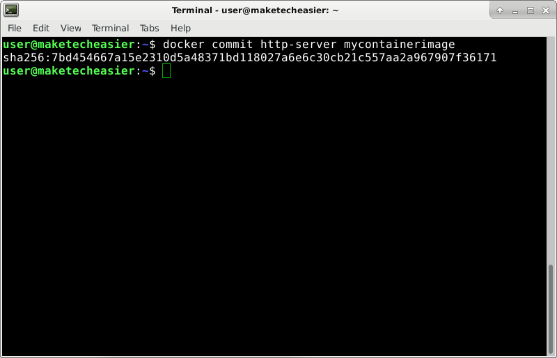

Since Docker containers are little boxes of software, so to speak, you can copy and move them around from computer to computer. However, this is not often discussed, probably because larger organizations set up their own repositories, where they can customize their own images and distribute across their servers as they see fit. But you shouldn’t have to go through the trouble of setting up your own line of distribution if you occasionally need to move one or more containers around.

It may be that you worked on a Docker instance on your local computer and decided to move it to a more powerful server. Or maybe you just want to deploy your customized container on multiple computers, “copy and paste” it around. Other times you may be dissatisfied with a cloud-computing provider and want to switch to a different one. Whatever the situation, there’s a rather simple procedure to do this which will be detail below.

## Save Container Image from Source Host

It’s not required to stop the container first, but it’s highly recommended that you do so. You will take a snapshot of the data in your Docker instance. If it’s running while you do this, there’s a small chance some files might end up being incomplete in your snapshot. Imagine someone uploading a 500MB file. When 250MB has been uploaded, you issue the `docker commit` command. The upload then continues, but when you restore this Docker image on another host, only 250MB out of the 500MB might be available.

So, if you can, first stop the instance.

docker stop NAME\_OF\_INSTANCE

A Docker container is built out of a generic, initial image. Over time, you add your own changes to this base image. Processes running inside the container might also save their own data or make other changes. To preserve all of this, you can commit this new state to a new image.

Note that if the instance is currently running, this action will pause it while its contents are saved. If you added a lot of data to your container, this operation will take a longer time to complete. If this is a problem, you can avoid this pause by entering `docker commit -p=false NAME_OF_INSTANCE mycontainerimage` instead of the next command. However, don’t do this unless absolutely necessary. The odds of creating an image with inconsistent/incomplete data increase in this case.

In this tutorial, a generic name has been chosen for the resulting image, `mycontainerimage`. You can change this name if you want to. If you do so, remember to replace it in all subsequent commands where you encounter it.

docker commit NAME\_OF\_INSTANCE mycontainerimage

Now, save this image to a file and compress it.

docker save mycontainerimage | gzip > mycontainerimage.tar.gz

Next, use your preferred [file transfer method](https://www.maketecheasier.com/use-sftp-transfer-files-linux-servers/) and copy `mycontainerimage.tar.gz` to the host where you want to migrate your container.

## Load Container Image on Destination Host

After you log in to the host where you transferred the image, import it to Docker.

gunzip -c mycontainerimage.tar.gz | docker load

Since you never initialized this container here, you cannot start it with `docker start` yet. Instead, issue the same command you used in the past, when you first ran this Docker instance. The only difference now is that you will use “mycontainerimage” at the end instead of whatever image you used in the past.

The next command is just an example; don’t copy and paste this unless it applies to you. (No special parameters were required when you ran the image for the first time)

docker run -d --name=PICK\_NAME\_FOR_CONTAINER mycontainerimage

As contrast, the following is an example of a command where parameter `--publish` was required to forward port 80 on the host machine to port 80 on the container:

docker run -d --name=http-server --publish 80:80 mycontainerimage

Afterwards, you can stop and start this container normally, with `docker stop` and `docker start` commands.

## Transfer Image without Creating a File

Sometimes you may want to skip creating a `mycontainerimage.tar.gz` file. Maybe you don’t have enough disk space since the container has a lot of data in it. You can save, compress, transfer, uncompress and load the image on the destination host in one command. After running the `docker commit` command discussed in the first section, you can use this:

docker save mycontainerimage | gzip | ssh root@203.0.113.1 'gunzip | docker load'

It should work from Windows, too, since it [now has a built-in SSH client](https://www.maketecheasier.com/use-windows10-openssh-client/) (PuTTY not necessary anymore).

Afterwards, continue with the `docker run` command that applies to your situation.

## Conclusion

`docker save` and `docker load` are great as an ad hoc solution for moving containers around occasionally. But remember, if you do this often, you might want to set up your own private repository instead.

Image Credit: [Air Force Medical Service](https://www.airforcemedicine.af.mil/News/Photos/igphoto/2000870605/)

Is this article useful?