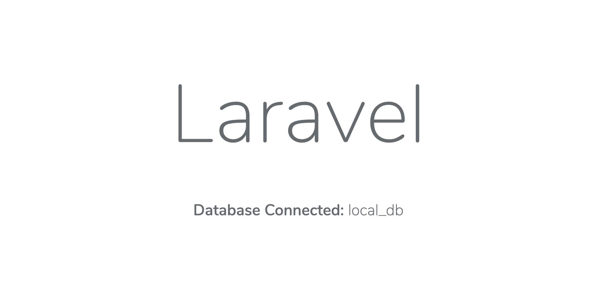
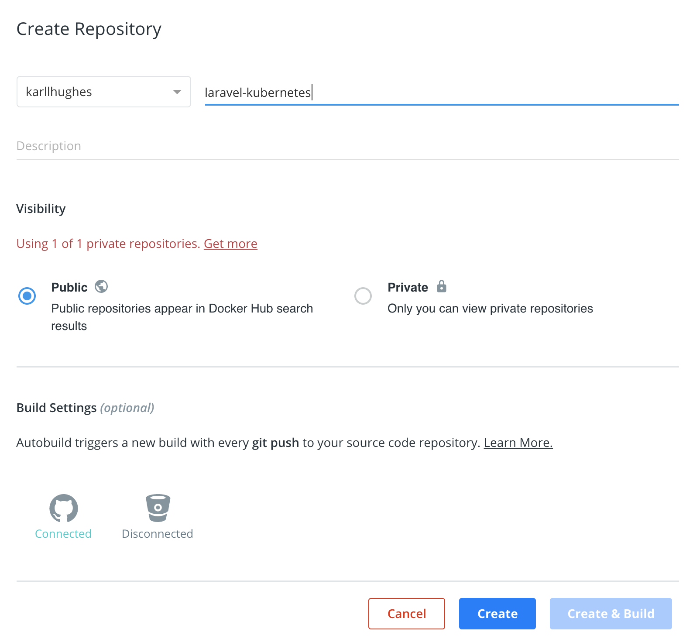
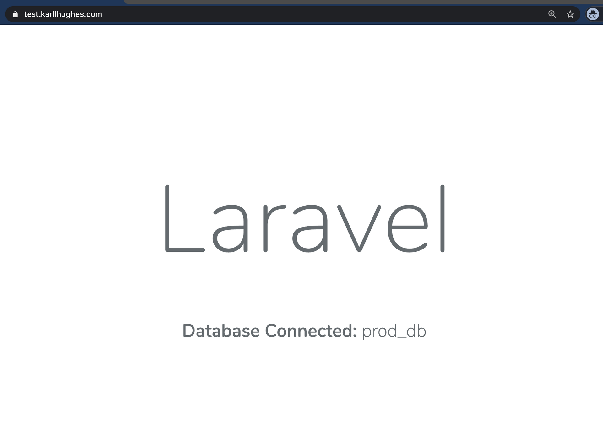

*The author selected the [Diversity in Tech Fund](https://www.brightfunds.org/funds/diversity-in-tech) to receive a donation as part of the [Write for DOnations](https://do.co/w4do-cta) program.*

### Introduction

[Laravel](https://laravel.com/) is one of the most popular open-source PHP application frameworks today. It is commonly deployed with a [MySQL](https://www.mysql.com/) database but can be configured to use a variety of backend data storage options. Laravel prides itself on taking advantage of many of PHP’s modern features and extensive package ecosystem.

[Kubernetes](https://kubernetes.io/) is a container orchestration platform that can be hosted on [DigitalOcean Kubernetes clusters](https://www.digitalocean.com/products/kubernetes/) to take much of the administration work out of setting up and running containers in production. [Helm](https://helm.sh/) is a Kubernetes package manager that makes configuring and installing services and pods on Kubernetes easier.

In this guide, you will create a Laravel PHP application, build your app into a Docker image, and deploy that image to a DigitalOcean Kubernetes cluster using the [LAMP Helm chart](https://github.com/helm/charts/tree/master/stable/lamp). Next, you’ll set up an Ingress Controller to add SSL and a custom domain name to your app. When completed, you will have a working Laravel application connected to a MySQL database that is running on a Kubernetes cluster.

## Prerequisites

- Docker installed on the machine that you’ll access your cluster from. You can find detailed instructions on [installing Docker for most Linux distributions here](https://www.digitalocean.com/community/tutorial_collections/how-to-install-and-use-docker) or on [Docker’s website](https://docs.docker.com/install/) for other operating systems.
- An account at [Docker Hub](https://hub.docker.com/) for storing Docker images you’ll create during this tutorial.
- [A DigitalOcean Kubernetes 1.17+ cluster](https://www.digitalocean.com/products/kubernetes/) with your connection configuration set as the `kubectl` default. To learn how to create a Kubernetes cluster on DigitalOcean, see [Kubernetes Quickstart](https://www.digitalocean.com/docs/kubernetes/quickstart/). To learn how to connect to the cluster, see [How to Connect to a DigitalOcean Kubernetes Cluster](https://www.digitalocean.com/docs/kubernetes/how-to/connect-to-cluster/).
- The Helm 3 package manager installed on your local machine. Complete the first step and add the `stable` repo from the second step of the [How To Install Software on Kubernetes Clusters with the Helm 3 Package Manager](https://www.digitalocean.com/community/tutorials/how-to-install-software-on-kubernetes-clusters-with-the-helm-3-package-manager) tutorial.
- A fully registered domain name with an available A record. This tutorial will use `your_domain` throughout. You can purchase a domain name on [Namecheap](https://www.namecheap.com/), get one for free on [Freenom](https://www.freenom.com/en/index.html?lang=en), or use the domain registrar of your choice. Don’t worry about associating your domain’s A record with an IP at this time. Once you reach Step 5 and your Ingress controller is in place, you will connect `your_domain` to the proper IP.

## Step 1 — Creating a New Laravel Application

In this step, you’ll use Docker to create a new Laravel 7 application, but you should be able to go through the same process with an existing Laravel application that uses MySQL as the backing database. The new application you build will verify that Laravel is connected to the database and display the name of the database.

First, move to your home directory and then create a new Laravel application using a `composer` Docker container:

Once the container is done and all the Composer packages have been installed, you should see a fresh installation of Laravel in your current directory called `laravel-kubernetes/`. Navigate to that folder:

You’ll execute the rest of this tutorial’s commands from here.

The purpose of this application is to test your database connection and display its name in your browser. In order to test the database connection, open up the `./resources/views/welcome.blade.php` file in a text editor:

Find the section `<div class="links">...</div>` and replace its contents with the following:

./resources/views/welcome.blade.php

Save and close the file.

That’s all the customization you’ll need to make to the default Laravel app for this tutorial. Once completed, this brief snippet of PHP will test your database connection and display the database’s name on the Laravel splash screen in your web browser.

In the next step, you’ll use [Docker](https://www.docker.com/) to build an image containing this Laravel application and [Docker Compose](https://docs.docker.com/compose/) to test that it runs locally and connects to a MySQL database.

## Step 2 — Containerizing Your Laravel Application

Now that you have created a new Laravel application, you’ll need to build your code into a Docker image and then test the image with Docker Compose. While the goal of this tutorial is to deploy your application to a Kubernetes cluster, Docker Compose is a convenient way to test your Docker image and configuration locally before running it in the cloud. This fast feedback loop can be useful for making and testing small changes.

First, using `nano` or your preferred text editor, create a file in the root of your Laravel application called `Dockerfile`:

Add the following content. Docker will use this file to build your code into an image:

./Dockerfile

Save and close the file.

This Dockerfile starts with the [PHP 7.4 Apache Docker Image found on Docker Hub](https://hub.docker.com/_/php), then installs several Linux packages that are commonly required by Laravel applications. Next, it creates Apache configuration files and enables header rewrites. The Dockerfile installs several common PHP extensions and adds an environment variable to ensure that Laravel’s logs are streamed to the container via `stderr`. This will allow you to see Laravel logs by tailing your Docker Compose or Kubernetes logs.

Finally, the Dockerfile copies all the code in your Laravel application to `/var/www/tmp` and installs the Composer dependencies. It then sets an `ENTRYPOINT`, but you’ll need to create that file, which we will do next.

At the root directory of your project, create a new file called `docker-entrypoint.sh`. This file will run when your container is run locally or in the Kubernetes cluster, and it will copy your Laravel application code from the `/var/www/tmp` directory to `/var/www/html` where Apache will be able to serve it.

Now add the following script:

./docker-entrypoint.sh

The final line, `exec "$@"` instructs the shell to run whatever command was passed in as an input argument next. This is important because you want [Docker to continue running](https://stackoverflow.com/questions/32255814/what-purpose-does-using-exec-in-docker-entrypoint-scripts-serve/32261019#32261019) the Apache run command (`apache2-foreground`) after this script executes. Save and close the file.

Next, create a `.dockerignore` file in your app’s root directory. This file will ensure that when you build your Docker image it won’t become polluted with packages or environment files that shouldn’t be copied into it:

./.dockerignore

Save and close the file.

The last file that you need to create before you can run your app locally using Docker Compose is a `docker-compose.yml` file. But during the configuration of this YAML file, you will need to enter the `APP_KEY` that Laravel generated during installation. Find this by opening and searching the `./.env` file, or by running the following `cat` and `grep` commands:

You will see an output like this:

```
OutputAPP_KEY=base64:0EHhVpgg ... UjGE=

```

Copy your key to your clipboard. Be sure to include the `base64:` prefix. Now create the `docker-compose.yml` file in your app’s root directory:

Here we will include your Laravel application’s PHP image as well as a MySQL container to run your database. Add the following content:

./docker-compose.yml

Use the `APP_KEY` variable that you copied to your clipboard for the `your_laravel_app_key` variable, and use your Docker Hub username for the `your_docker_hub_username` variable. Save and close the file.

You’ll create the first image locally using `docker build`. The second image is the official [MySQL Docker image](https://hub.docker.com/_/mysql) available on Docker Hub. Both require several environment variables, which you’ll include when you run the containers.

In order to build the Docker image containing your Laravel application, run the following command. Make sure to replace `your_docker_hub_username` with your username or your team’s username at Docker Hub where this image will be stored:

Next, you can run the two containers with Docker Compose with the required database credentials:

The four environment variables used here (`DB_ROOT_PASSWORD`, `DB_DATABASE`, `DB_USERNAME`, `DB_PASSWORD`) can be modified if you’d like, but since you are only testing your application locally, you don’t have to worry about securing them yet.

It may take up to 30 seconds for your MySQL database to initialize and your containers to be ready. Once they are, you can view your Laravel application on your machine at `localhost:8000`.



Your PHP application will connect to your MySQL database. After a successful connection, the text “Database Connected: local_db” will appear beneath the Laravel logo.

Now that you’ve tested your Docker image locally using Docker Compose, you can bring the containers down by running `docker-compose down`:

In the next section, you’ll push your Docker image to Docker Hub so that your Helm chart can use it to deploy your application to your Kubernetes cluster.

## Step 3 — Pushing Your Docker Image to Docker Hub

The LAMP Helm Chart that you’ll use to deploy your code to Kubernetes requires that your code be available in a container registry. While you can push your image to a private or self-hosted registry, for the purposes of this tutorial you’ll use a publicly available and free Docker registry on Docker Hub.

Access your account on [Docker Hub](https://hub.docker.com/) using your web browser and then create a new repository called `laravel-kubernetes`.



Next, if you haven’t connected to Docker Hub from your local machine, you’ll need to log into Docker Hub. You can do this through the command line:

Enter your login credentials when prompted. This typically only needs to be done once per machine as Docker will save your credentials to the `~/.docker/config.json` in your home directory.

Finally, push your image to Docker Hub:

It may take a few minutes to upload your app depending on your connecti  
on speed, but once Docker is done, you’ll see a final digest hash and the size of your image in the terminal. It will look something like this:

```
Outputlatest: digest: sha256:df4bdeda91484c8c26a989b13b8f27ab14d93ab2e676e3c396714cb3811c4086 size: 4918

```

Now that your Laravel application is containerized and you’ve pushed an image to Docker Hub, you can use the image in a Helm Chart or Kubernetes deployment. In the next step, you’ll set custom values based on the LAMP Helm Chart and deploy it to your DigitalOcean Kubernetes cluster.

## Step 4 — Configuring and Deploying the Application with the LAMP Helm Chart

Helm provides a number of [Charts](https://helm.sh/docs/topics/charts/) to help you set up Kubernetes applications using preset combinations of tools. While you could write your own [Kubernetes service files](https://www.digitalocean.com/community/tutorials/how-to-deploy-a-php-application-with-kubernetes-on-ubuntu-16-04) to accomplish a similar deployment, you’ll see in this section that using a Helm Chart will require much less configuration.

First, you’ll need a directory to store all your Helm configuration files. Create a new directory in the root of your Laravel project called `helm/`:

Inside the `helm/` directory, you will create two new files: `values.yml` and `secrets.yml`. First create and open `values.yml`:

The `values.yml` file will include non-secret configuration options that will override the default values in the LAMP Helm chart. Add the following configurations, making sure to replace `your_docker_hub_username` with your own username:

./helm/values.yml

Save and close the file.

Now create a `secrets.yml` file:

`secrets.yml` will not be checked into version control. It will contain sensitive configuration information like your database password and Laravel app key. Add the following configurations, adjusting as needed to fit your credentials:

./helm/secrets.yml

Be sure to use strong username and password combinations for your production database, and use the same `your_laravel_app_key` as above, or open a new terminal window and generate a new one by running the following command. You can then copy the new value Laravel sets in your `.env` file:

Save and close `secrets.yml`.

Next, in order to prevent your `secrets.yml` file from being built into the Docker image or saved to version control, make sure to add the following line to both your `.dockerignore` and `.gitignore` files. Open and append `/helm/secrets.yml` to each file, or run the following command to add both:

Now that you’ve created Helm configuration files for your application and the Docker image, you can install this Helm chart as a new release on your Kubernetes cluster. Install your chart from your application’s root directory:

You will see an output like this:

```
OutputNAME: laravel-kubernetes
LAST DEPLOYED: Mon May 18 13:21:20 2020
NAMESPACE: default
STATUS: deployed
REVISION: 1

```

Your application will take a minute or two to become available, but you can run this command to monitor the Kubernetes services in your cluster:

Look for the name of your application:

```
OutputNAME                        TYPE            CLUSTER-IP          EXTERNAL-IP     PORT(S)
laravel-kubernetes-lamp     LoadBalancer    your_cluster_ip      your_external_ip   80:32175/TCP,3306:32243/TCP

```

When your new `laravel-kubernetes-lamp` service displays an IP address under `EXTERNAL-IP`, you can visit `your_external_ip` to see the application running on your Kubernetes cluster. Your app will connect to your database and you will see the name of the database below the Laravel logo, like you did when running your app locally on Docker Compose.


Running a web application on an unsecured IP address might be okay for a proof of concept, but your website isn’t production-ready without an SSL certificate and a custom domain name. Before you set that up in the next step, uninstall your release via the command line:

In the next step you’ll expand on this first Helm configuration to add an Ingress controller, SSL certificate, and custom domain to your Laravel application.

## Step 5 — Adding an Ingress Controller and SSL to Your Kubernetes Cluster

In Kubernetes, an [Ingress Controller](https://kubernetes.io/docs/concepts/services-networking/ingress/) is responsible for exposing your application’s services to the internet. In the previous step, the LAMP Helm chart created a DigitalOcean Load Balancer and exposed your application directly via the load balancer’s IP address.

You could terminate SSL and your domain name [directly on the load balancer](https://www.digitalocean.com/docs/networking/load-balancers/how-to/ssl-termination/), but because you’re working in Kubernetes, it might be more convenient to manage it all in the same place. For much more about Ingress Controllers and details about the following steps, read [How To Set Up an Nginx Ingress on DigitalOcean Kubernetes Using Helm](https://www.digitalocean.com/community/tutorials/how-to-set-up-an-nginx-ingress-on-digitalocean-kubernetes-using-helm).

The LAMP Helm chart includes a configuration option for supporting Ingress. Open up your `helm/values.yml` file:

Now add the following lines:

./helm/values.yml

This instructs your deployment not to install a load balancer and instead to expose the application to the Kubernetes cluster’s port 80 where the Ingress Controller will expose it to the internet. Save and close `values.yml`.

Now run the `helm install` command you ran previously to get your Laravel application running again. Make sure to run the command from your app’s root directory:

Next, install the `nginx-ingress` controller on your Kubernetes cluster using the Kubernetes-maintained [Nginx Ingress Controller](https://github.com/kubernetes/ingress-nginx):

After installation, you will see an output like this:

```
OutputNAME: nginx-ingress
LAST DEPLOYED: Mon May 18 13:28:34 2020
NAMESPACE: default
STATUS: deployed
REVISION: 1

```

You also need an Ingress Resource to expose your Laravel app’s deployment. Create a new file in your app’s root directory called `ingress.yml`:

This file defines your application’s host, SSL certificate manager, and backend service and port name. Add the following configurations, replaceing your_domain with the domain of your choice:

./ingress.yml

Save and close the file.

Next, you should install [Cert-Manager](https://cert-manager.io/) and create an issuer that will allow you to create production SSL certificates using [Let’s Encrypt](https://letsencrypt.org/). Cert-Manager requires [Custom Resource Definitions](https://kubernetes.io/docs/concepts/extend-kubernetes/api-extension/custom-resources/) that you can apply from the [Cert-Manager repository](https://github.com/jetstack/cert-manager) using the command line:

This will create a number of Kubernetes resources that will be displayed in the command line:

```
Outputcustomresourcedefinition.apiextensions.k8s.io/certificaterequests.cert-manager.io created
customresourcedefinition.apiextensions.k8s.io/certificates.cert-manager.io created
customresourcedefinition.apiextensions.k8s.io/challenges.acme.cert-manager.io created
customresourcedefinition.apiextensions.k8s.io/clusterissuers.cert-manager.io created
customresourcedefinition.apiextensions.k8s.io/issuers.cert-manager.io created
customresourcedefinition.apiextensions.k8s.io/orders.acme.cert-manager.io create

```

Cert-Manager also requires [a namespace](https://kubernetes.io/docs/concepts/overview/working-with-objects/namespaces/) to isolate it in your Kubernetes cluster:

You will see this output:

```
Outputnamespace/cert-manager created

```

Because Jetstack’s Cert-Manager is not one of the Kubernetes-maintained charts, you will need to add the [Jetstack Helm repository](https://charts.jetstack.io/) as well. Run the following command to make it available in Helm:

A successful addition will output the following:

```
Output"jetstack" has been added to your repositories

```

Now you’re ready to install Cert-Manager into the `cert-manager` namespace on your Kubernetes cluster:

When complete, you’ll see a summary of the deployment like this:

```
OutputNAME: cert-manager
LAST DEPLOYED: Mon May 18 13:32:08 2020
NAMESPACE: cert-manager
STATUS: deployed
REVISION: 1

```

The last file you’ll need to add to your Laravel application’s root directory is a `production_issuer.yml` Kubernetes configuration file. Create the file:

Now add the following:

Save and close the file.

Let’s Encrypt will send `your_email_address` any important notices and expiration warnings, so be sure to add an address that you’ll check regularly. Save this file and create a new resource for both your Ingress resource and production issuer in your Kubernetes cluster:

Finally, update your domain name’s DNS records to point an A record to your load balancer’s IP address. To find the IP address for your Ingress Controller enter:

```
OutputNAME                       TYPE           CLUSTER-IP      EXTERNAL-IP     PORT(S)                      AGE
nginx-ingress-controller   LoadBalancer   your_cluster_ip      your_external_ip   80:30187/TCP,443:31468/TCP   6m10s

```

Use the `your_external_ip` address as the IP address for your DNS A Record. The process for updating your DNS records varies depending on where you manage your domain names and DNS hosting, but if you’re using DigitalOcean you can reference our guide on [How to Manage DNS Records](https://www.digitalocean.com/docs/networking/dns/how-to/manage-records/).

Once your DNS records update and your SSL certificate is generated, your application will be available at `your_domain` and SSL will be enabled.



While your PHP application and database are already connected, you will still need to run database migrations. In the last step, you’ll see how to run [Artisan commands](https://laravel.com/docs/7.x/artisan) on your Kubernetes pod to perform database migrations and other common maintenance tasks.

## Step 6 — Running Remote Commands

While your Laravel application is running and connected to the MySQL database in Kubernetes, there are several common operations that you should run on a new Laravel installation. One common task that you should perform is [database migrations](https://laravel.com/docs/7.x/migrations#running-migrations).

Before you can run an Artisan command on your Laravel application, you need to know the name of the [pod](https://kubernetes.io/docs/concepts/workloads/pods/pod/) that is running your Laravel application container. Using the command line, you can view all the pods in your Kubernetes cluster:

You will see an output like this:

```
OutputNAME                                             READY   STATUS    RESTARTS   AGE
laravel-kubernetes-lamp-77fb989b46-wczgb         2/2     Running   0          16m

```

Select the pod for your `laravel-kubernetes-lamp-...` deployment. Make sure to use the name in your output and not the one listed above. Now you can run `kubectl exec` on it. For example, run a database migration using the `artisan migrate` command. You will add the `--force` flag because you’re running the pod in production:

This command will produce an output:

```
OutputMigration table created successfully.
Migrating: 2014_10_12_000000_create_users_table
Migrated:  2014_10_12_000000_create_users_table (0.16 seconds)
Migrating: 2019_08_19_000000_create_failed_jobs_table
Migrated:  2019_08_19_000000_create_failed_jobs_table (0.05 seconds)

```

You have now successfully deployed Laravel 7 and MySQL to Kubernetes and performed an essential database maintenance task.

## Conclusion

In this tutorial, you learned how to containerize a Laravel PHP application, connect it to a MySQL database, push a Docker image containing your code to Docker Hub, and then use a Helm chart to deploy that image to a DigitalOcean Kubernetes cluster. Finally, you added SSL and a custom domain name and learned how to run command line tools on your running pods.

Kubernetes and Helm offer you a number of advantages over traditional LAMP stack hosting: scalability, the ability to swap out services without logging into your server directly, tools to perform rolling upgrades, and control over your hosting environment. That said, the complexity of initially containerizing and configuring your application makes the barrier to getting started quite high. With this guide as a starting point, deploying Laravel to Kubernetes becomes more attainable. From here you might consider learning more about the power of [Laravel](https://laravel.com/docs/7.x/) or adding monitoring tools to Kubernetes like Linkerd, which you can [install manually with our guide](https://www.digitalocean.com/community/tutorials/how-to-install-and-use-linkerd-with-kubernetes) or with a [DigitalOcean 1-Click](https://marketplace.digitalocean.com/apps/linkerd).