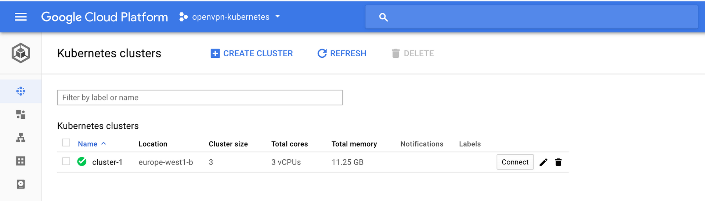
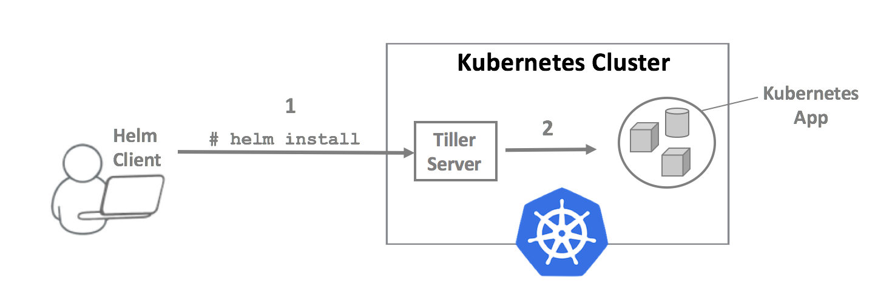

During development it could be useful to access your applications (pods) inside your Kubernetes cluster without creating an external (public) endpoint. This can be achieved by using OpenVPN. We will use the Kubernetes package manager Helm to install OpenVPN inside our Kubernetes environment.

*This tutorial was performed on* [*Google Cloud which offers $300 free credit*](https://cloud.google.com/free/) *to get started with any GCP product.*

- [Install kubectl](https://kubernetes.io/docs/tasks/tools/install-kubectl/#install-kubectl)
- [Install helm](https://github.com/kubernetes/helm/blob/master/docs/install.md)
- [Install gcloud SDK](https://cloud.google.com/sdk/downloads) (if you are using Google Cloud)
- Create a Google Cloud account (if you are using Google Cloud)
- Link billing account in Console (if you are using Google Cloud Free tier)

I’ll explain how to set up Kubernetes on GCP. If you have already a full working Kubernetes cluster you can skip these steps.

The [official Google Cloud documentation](https://cloud.google.com/sdk/gcloud/reference/container/clusters/create) explains how to create a more advanced cluster than I’m explaining below, but this is out of scope for now.

\# Configure your cli to connect with your Google Cloud account  
$ gcloud init\# List project  
$ gcloud projects list  
PROJECT\_ID          NAME                PROJECT\_NUMBER  
openvpn-kubernetes  openvpn-kubernetes  xxx\# Create a basic cluster inside your project and desired region  
$ gcloud container clusters create cluster-1 --zone europe-west1-b --project openvpn-kubernetes

Wait a few minutes till the cluster is up and running! Then click “Connect” to get the command which is necessary to configure [kubectl](http://kubernetes.io/docs/user-guide/kubectl-overview/) CLI access.

$ gcloud container clusters get-credentials cluster-1 --zone europe-west1-b --project openvpn-kubernetes

Now we can already check the IP ranges. You are probably going to see different values.

$ gcloud container clusters describe cluster-1 --zone europe-west1-b

Let’s keep those values in mind.  
Now we will configure Kubernetes dashboard access.

We will create a ServiceAccount as workaround to access the dashboard.  
This is explained in great detail in [this blog](https://blog.heptio.com/on-securing-the-kubernetes-dashboard-16b09b1b7aca). It’s a slight abuse of the ServiceAccount mechanism.

\# Create ServiceAccount  
$ kubectl create serviceaccount my-dashboard-sa\# Create role binding  
$ kubectl create clusterrolebinding my-dashboard-sa \  
  --clusterrole=cluster-admin \  
  --serviceaccount=default:my-dashboard-sa\# Get the secret  
$ kubectl get secrets\# Describe the my-dashboard-sa-token-xxx  
\# Copy the token  
$ kubectl describe secret my-dashboard-sa-token-xxx\# Open the kubectl proxy to visit the dashboard  
$ kubectl proxy

Now we can visit the dashboard on [http://127.0.0.1:8001/ui](http://127.0.0.1:8001/ui).  
Paste the token which you copied before:

Access the Kubernetes dashboard:

We will deploy a very basic sample app in a namespace called ‘sample-app’. The deployment will contain 2 pods which run a web server (Nginx). We will create a Service above which will function as a load balancer above the pods. Pods can go down and up again which can lead to different pod IP’s while Services are immortal and a Service IP will never change.

There are [3 important types of services](https://kubernetes.io/docs/concepts/services-networking/service/#publishing-services---service-types):

- `ClusterIP`: Exposes the service on a **cluster-internal IP**. Choosing this value makes the service only reachable from within the cluster. This is the default `ServiceType`.
- `NodePort`: Exposes the service on each Node’s IP at a static port (the `NodePort`). A `ClusterIP` service, to which the `NodePort` service will route, is automatically created. You’ll be able to contact the `NodePort` service, **from outside the cluster**, by requesting `<NodeIP>:<NodePort>`.
- `LoadBalancer`: Exposes the service **externally** using a cloud provider’s load balancer.

We do not want to make our Service publicly available. We will create a Service of type `ClusterIP`. The `ClusterIP` will be in the range of the `servicesIpv4Cidr`.

\# Create namespace for sample app  
$ kubectl create ns sample-app\# Create a deployment object and an associated ReplicaSet object.   
\# The ReplicaSet has 2 pods.  
$ kubectl run my-nginx --image=nginx --replicas=2 --port=80 --namespace=sample-app\# Create a Service object of type ClusterIP that exposes the deployment:  
$ kubectl expose deployment my-nginx --namespace=sample-app --type=ClusterIP

Verify by checking the dashboard:

The 2 pods are running

Check the Service. There is no external endpoint (public IP) and it’s created inside the expected range.

The Service is only available from inside the cluster.

This scheme summarizes the setup (kube-proxy ignored)

How can we visit our pods without defining an external endpoint (public IP)? Here for we will use OpenVPN. We will install OpenVPN inside our cluster using Helm and connect with it. It will route all network traffic to kubernetes pods and services through the VPN. This will make it possible for us to access the `ClusterIP` of our Nginx Service inside our browser!

We will prepare persistent storage for our OpenVPN pod because we don’t want to loose data if the pod is scaled down and up again. New certificates are generated with each deployment. If persistence is enabled certificate data will be persisted across pod restarts. Otherwise new client certs will be needed after each deployment or pod restart.

I’ll prepare the storage in the Google Cloud Platform.  
Open a new terminal:

\# Create disk  
$ gcloud compute disks create --size 1GB openvpn-disk --zone europe-west1-b

Create our Kubernetes namespace in which we will deploy the OpenVPN pod.

\# Create namespace  
$ kubectl create ns openvpn

Write a template for the persistent volume claim: `openvpn-pv-claim.yaml`.  
This will claim the Google Cloud storage. The claim is called `openvpn-data-claim`.

Create the claim:

\# Create disk  
$ kubectl create -f openvpn-pv-claim.yaml

We can verify in our dashboard. Don’t forget to choose the right namespace.

Helm is the package manager for Kubernetes. It has two parts: a client ( *helm* ) and a server ( *tiller* ) Tiller runs inside your Kubernetes cluster.

\# Create ServiceAccount  
$ kubectl create serviceaccount --namespace kube-system tiller\# add cluster role cluster-admin to ServiceAccount  
$ kubectl create clusterrolebinding tiller-cluster-rule --clusterrole=cluster-admin --serviceaccount=kube-system:tiller\# Install tiller in Kubernetes  
$ helm init --service-account tiller

Now we will use the [Helm Chart to install OpenVPN](https://github.com/kubernetes/charts/tree/master/stable/openvpn). Here for we need to write a `values.yaml` which contains our configuration. It’s based on the `values.yaml` from the [GitHub repository](https://github.com/kubernetes/charts/blob/master/stable/openvpn/values.yaml).

$ mkdir helm-openvpn/  
$ cd helm-openvpn/  
$ vi values.yaml

Add the following values. Define your `OVPN_K8S_POD_NETWORK`:

Start the Helm install. We will point to our `values.yaml` and we reference the chart `stable/openvpn`.

$ helm install --name openvpn -f values.yaml stable/openvpn --namespace openvpn

This can take some time because the Docker image needs to be pulled during the deployment.

Access the dashboard to check if the OpenVPN pod is up and running:

After the `helm install` some commands will pop up. Those commands need to be executed to create the OpenVPN certificates. Verify by printing the content of the environment variables.

\# execute each line separately  
\# Get pod name  
$ POD_NAME=$(kubectl get pods --namespace openvpn -l type=openvpn -o jsonpath='{ .items\[0\].metadata.name }')  
$ echo $POD_NAME\# Get Service name  
$ SERVICE_NAME=$(kubectl get svc --namespace openvpn -l type=openvpn  -o jsonpath='{ .items\[0\].metadata.name }')  
$ echo $SERVICE_NAME\# Get Service IP (this can take a while, wait till deployment is finished)  
$ SERVICE\_IP=$(kubectl get svc --namespace openvpn $SERVICE\_NAME -o go-template='{{ range $k, $v := (index .status.loadBalancer.ingress 0)}}{{ $v }}{{end}}')  
$ echo $SERVICE_IP\# Define key name (different for each key!)  
$ KEY_NAME=kubeVPN  
$ echo $KEY_NAME

If the output of the variables contains the right values, you can start creating the `kubeVPN.ovpn`.

$ kubectl --namespace openvpn exec -it $POD\_NAME /etc/openvpn/setup/newClientCert.sh $KEY\_NAME $SERVICE_IP  
$ kubectl --namespace openvpn exec -it $POD\_NAME cat /etc/openvpn/certs/pki/$KEY\_NAME.ovpn > $KEY_NAME.ovpn

A `kubeVPN.ovpn` file is created!

The file is also stored inside the OpenVPN pod. This pod is persistent so there should be no fear to loose the `kubeVPN.ovpn`.  
Before we’re going to install and configure our VPN client we will stop the `kubectl proxy` command. Execute it again after you’ve connected successfully with the VPN to access your dashboard.

Now we need to install a VPN client. Windows users can install the [OpenVPN client](https://openvpn.net/index.php/open-source/downloads.html). [Tunnelblick](https://tunnelblick.net/) is a good option for OSX users. Drag the .ovpn file inside Tunneblick and click connect:

Now we’re connected.  
Let’s check the output of `ifconfig` .

I have received an IP between the range which we defined inside the `values.yaml` during the `helm install`.

Let’s go back to the Nginx Service we’ve created in the sample app:

Copy the `ClusterIP` and paste it in your browser. Now you’re ‘load balanced’ between the two pods.

You can also access your pod without using the Service but by connecting to the pod IP.

It works! We can visit a service of type `ClusterIP` inside our browser.  
Remember the explanation about this type of Service: *“Choosing this value* `*(ClusterIP)*` *makes the service only reachable from within the cluster”.*

By using OpenVPN we are able to visit the Service in our browser without using an external endpoint! We can even ignore the Service and visit our pods directly. When you disconnect from the VPN it won’t be possible to visit the Service or pods anymore.

Hope you enjoyed it!