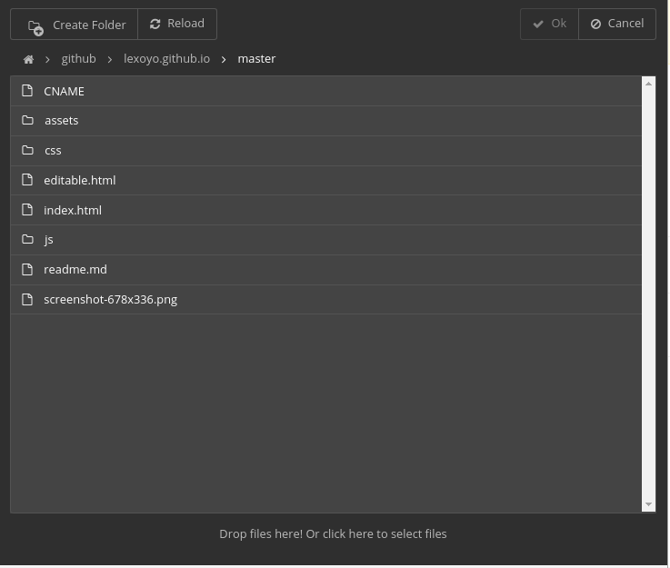

Manage your users' cloud services from your application.

[](https://user-images.githubusercontent.com/715377/31186578-a357a146-a8f4-11e7-8650-f95d16f643b0.png)

## <a id="user-content-install"></a>[](#install)Install

```
$ npm install --save cloud-explorer

```

## <a id="user-content-use"></a>[](#use)Use

Here is an example on how to use Cloud Explorer's router to expose an API used by the front end to list files, read and write - [see this file for a complete example](https://github.com/silexlabs/CloudExplorer2/blob/master/lib/index.js)

// before this create an express application

const CloudExplorer = require('cloud-explorer');

const router = new Router({
  dropbox: {
    clientId: '8lxz0i3aeztt0im',
    clientSecret: 'twhvu6ztqnefkh6',
    redirectUri: `${rootUrl}/ce/dropbox/oauth_callback`,
    state: 'abcd'
  },
  ftp: {redirectUri: `${rootUrl}/ce/ftp/signin`},
});

app.use('/ce', router);

There is also an [example of use in Silex website builder here](https://github.com/silexlabs/Silex/blob/develop/dist/server/CloudExplorerRouter.js).

### <a id="user-content-client-side"></a>[](#client-side)Client side

For a complete example see the dist folder.

On the client side, the HTML:

<iframe id="ceIFrame" class="container" src="/ce/cloud-explorer/cloud-explorer.html" />

And the Javascript:

const ce = document.querySelector('#ceIFrame').contentWindow.ce;
ce.showThumbnails(true);
ce.openFile(\['.jpg', '.jpeg', '.png', '.gif'\])
.then(fileInfo => {
    if(fileInfo) alert('you chose:' + fileInfo.path);
    else alert('you canceled');
})
.catch(e => alert('an error occured: ' + e.message));

In order to know what are the possible options, please [read the code](https://github.com/silexlabs/CloudExplorer2/blob/master/src/js/App.jsx)

### <a id="user-content-server-side-config"></a>[](#server-side-config)Server side config

When creating CE2 router, your app can pass it options, please see the example in `lib/index.js`. This is how you are supposed to enable or disable cloud services, or features.

Also you can add custom services and image banks, for this you can use the methods of the Router class: `addService` and `addImageBank`.

Notes:

- if you enable only one service, CE2 will be in "single service" mode and the user will not be presented the list of services but directly enters the only service (if logged in).

## <a id="user-content-dev-setup"></a>[](#dev-setup)Dev setup

To contribute to Cloud Explorer, clone this repo and build:

```
$ git clone github:silexlabs/CloudExplorer2
$ cd CloudExplorer2
$ npm i
$ npm run build

```

This will compile the JS files from `src/` with [ReactJS](https://facebook.github.io/react/) and [Babel](https://babeljs.io/). The generated files will go in `dist/`.

You can serve `dist` on `http://localhost:6805` with

```
$ npm start

```

And then access the demo app on `http://localhost:6805/ce/cloud-explorer/`

This is what is done on heroku here: [a live demo](https://cloud-explorer2.herokuapp.com/ce/cloud-explorer/)

## <a id="user-content-docs"></a>[](#docs)Docs

Please feel free to ask in the issues, and contribute docs in the wiki.

For now, the best way to know the API is to [take a look at the `App` class which exposes all CE methods here](https://github.com/silexlabs/CloudExplorer2/blob/master/src/js/App.jsx#L106).

## <a id="user-content-env-vars"></a>[](#env-vars)Env vars

CE is configured with environment variables:

- PORT
- SERVER_URL
- DROPBOX\_APP\_ID
- DROBOX\_APP\_SECRET
- DROPBOX\_APP\_REDIRECT
- GITHUB\_APP\_ID
- GITHUB\_APP\_SECRET
- GITHUB\_APP\_REDIRECT
- UNSPLASH\_ACCESS\_KEY
- UNSPLASH\_APP\_NAME
- UNSPLASH\_OFFLINE\_TEST_PATH
- ENABLE_HYPERDRIVE