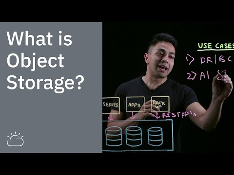
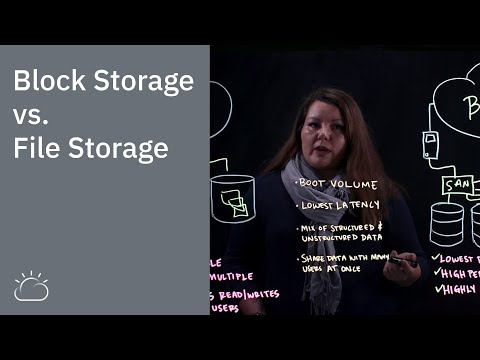

Learn how cloud-based object storage is an ideal solution for storing, archiving, backing up, and managing high volumes of static or unstructured data—reliably, efficiently, and affordably.

## What is object storage?

Object storage, often referred to as object-based storage, is a data storage architecture for handling large amounts of unstructured data. This is data that does not conform to, or cannot be organized easily into, a traditional relational database with rows and columns. Today’s Internet communications data is largely unstructured. This includes email, videos, photos, web pages, audio files, sensor data, and other types of media and web content (textual or non-textual). This content streams continuously from social media, search engines, mobile, and “smart” devices.

Market research firm IDC estimates that unstructured data is likely to represent as much as 80% of all data worldwide by the year 2025.

Enterprises are finding it challenging to efficiently (and affordably) store and manage this unprecedented volume of data. Object-based storage has emerged as the preferred method for data archiving and backup. It offers a level of scalability not possible with traditional file- or block-based storage. With object-based storage, you can store and manage data volumes on the order of terabytes (TBs), petabytes (PBs), and even greater.

*[Discover how IBM can help you on your object storage journey.](https://www.ibm.com/cloud/object-storage)*

Anirup Dutta, an IBM Cloud Architect, goes over the basics in our video, "What is Object Storage?":

What is Object Storage?

## How it works

Objects are discrete units of data that are stored in a structurally flat data environment. There are no folders, directories, or complex hierarchies as in a file-based system. Each object is a simple, self-contained repository that includes the data, metadata (descriptive information associated with an object), and a unique identifying ID number (instead of a file name and file path). This information enables an application to locate and access the object. You can aggregate object storage devices into larger storage pools and distribute these storage pools across locations. This allows for unlimited scale, as well as improved data resiliency and disaster recovery.

Object storage removes the complexity and scalability challenges of a hierarchical file system with folders and directories. Objects can be stored locally, but most often reside on [cloud servers](https://www.ibm.com/cloud/learn/cloud-server), with accessibility from anywhere in the world.

Objects (data) in an object-storage system are accessed via Application Programming Interfaces (APIs). The native API for object storage is an HTTP-based RESTful API (also known as a RESTful Web service). These APIs query an object’s metadata to locate the desired object (data) via the Internet from anywhere, on any device. RESTful APIs use HTTP commands like “PUT” or “POST” to upload an object, “GET” to retrieve an object, and “DELETE” to remove it. (HTTP stands for Hypertext Transfer Protocol and is the set of rules for transferring text, graphic images, sound, video, and other multimedia files on the Internet).

You can store any number of static files on an object storage instance to be called by an API. Additional RESTful API standards are emerging that go beyond creating, retrieving, updating, and deleting objects. These allow applications to manage the object storage, its [containers](https://www.ibm.com/cloud/learn/containers), accounts, multi-tenancy, security, billing, and more.

For example, suppose you want to store all the books in a very large library system on a single platform. You will need to store the contents of the books (data), but also the associated information like the author, publication date, publisher, subject, copyrights, and other details (metadata). You could store all of this data and metadata in a relational database, organized in folders under a hierarchy of directories and subdirectories.

But with millions of books, the search and retrieval process will become cumbersome and time-consuming. An object storage system works well here since the data is static or fixed. In this example, the contents of the book will not change. The objects (data, metadata, and ID) are stored as “packages” in a flat structure and easily located and retrieved with a single API call. Further, as the number of books continues to grow, you can aggregate storage devices into larger storage pools, and distribute these storage pools for unlimited scale.

## Benefits

There are many reasons to consider an object-storage-based solution to store your data, particularly in this era of the Internet and digital communications that is producing large volumes of web-based, multimedia data at an increasing rate.

### Storing/managing unstructured data

Object storage is seeing wide adoption in the era of [cloud computing](https://www.ibm.com/cloud/learn/cloud-computing) and for the management of unstructured data which analysts estimate will represent the vast majority of all data worldwide in the near future. The volume of web-generated content—emails, videos, social media, documents, sensor data produced by the Internet of Things (IoT) devices, and more—is massive and growing. Unstructured data is typically static (unchanging) but may be required at any time, anywhere (like images and video files, for example, or archived data backups).

Cloud-based object storage is ideal for long-term data retention. Use object storage to replace traditional archives, such as Network Attached Storage (NAS), reducing your IT infrastructure. Easily archive and store mandated, regulatory data that must be retained for extended periods of time. Cost-effectively preserve large amounts of rich media content (images, videos, etc.) that is not frequently accessed.

### Scalability

Unlimited scale is perhaps the most significant advantage of object-based data storage. Objects, or discrete units of data (in any quantity), are stored in a structurally flat data environment, within a storage device such as a server. You simply add more devices/servers in parallel to an object storage cluster for additional processing and to support the higher throughputs required by large files such as videos or images.

### Reduced complexity

Object storage removes the complexity that comes with a hierarchical file system with folders and directories. There is less potential for performance delay and you will realize efficiencies when retrieving data since there are no folders, directories or complex hierarchies to navigate. This improves performance, particularly when managing very large quantities of data.

### Disaster recovery/availability

You can configure object storage systems so that they replicate content. If a disk within a cluster fails, a duplicate disk is available, ensuring that the system continues running with no interruption or performance degradation. Data can be replicated within nodes and clusters and among distributed data centers for additional back-up off-site and even across geographical regions.

Object storage is a more efficient alternative to tape backup solutions, which require tapes that need to be physically loaded into and removed from tape drives and moved off-site for geographic redundancy. You can use object storage to automatically back up on-premises databases to the cloud and/or to cost-effectively replicate data among distributed data centers. Add additional back-up off-site and even across geographical regions to ensure disaster recovery.

For a deeper dive on disaster recovery, check out "[Backup and Disaster Recovery: A Complete Guide](https://www.ibm.com/cloud/learn/backup-disaster-recovery)."

### Customizable metadata

Remember that each object is a self-contained repository that includes metadata or descriptive information associated with it. Objects use this metadata for important functions such as policies for retention, deletion and routing, disaster recovery strategies (data protection), or validating content authenticity. You can also customize the metadata with additional context that can be later extracted and leveraged to perform business insights and analytics around customer service or market trends, for example.

### Affordability

Object storage services use pay-as-you-go pricing that incurs no upfront costs or capital investment. You simply pay a monthly subscription fee for a specified amount of storage capacity, data retrieval, bandwidth usage, and API transactions. Pricing is usually tiered-based or volume-based, which means that you will pay less for very large volumes of data.

Additional cost savings come from the use of commodity server hardware since object storage solutions have limited hardware constraints and can be deployed on most properly configured commodity servers. This limits the need to purchase new hardware when deploying an object storage platform on-premises. You can even use hardware from multiple vendors.

### Cloud compatibility

Object storage goes hand in hand with cloud or hosted environments that deliver multi-tenant storage as a service. This allows many companies or departments within a company to share the same storage repository, with each having access to a separate portion of the storage space. This shared storage approach inherently optimizes scale and costs. You will reduce your organization’s on-site IT infrastructure by using low-cost [cloud storage](https://www.ibm.com/cloud/learn/cloud-storage) while keeping your data accessible when needed. Your enterprise, for example, can use a cloud-based object storage solution to collect and store large amounts of unstructured IoT and mobile data for your smart device applications.

## Object vs. File vs. Block Storage

Storage methods have evolved to meet the changing nature of data. Data can be transactional and collected in smaller volumes that are neatly stored in a database on a disk drive on a server. File-based storage and block-based storage are well-suited to this type of structured data and continue to work well in certain scenarios. But the Internet has changed everything. Organizations struggle to manage mounting volumes of web-based, digital content (unstructured data). Object-based storage can meet this challenge.

Your company likely has differing storage needs, depending on the speed and performance requirements of your IT operations. Look carefully at file-, block- and object-based storage methods, as each has its own advantages and disadvantages. You may find that a combination of these architectures will best fulfill your data storage needs.

### File storage

[File storage](https://www.ibm.com/cloud/file-storage) organizes and stores data inside a folder. Files are named, tagged with metadata (typically the file name, file type, and when it was created and last updated) and organized in folders under a hierarchy of directories and subdirectories. You can think of file storage in the same way you store physical paper files in a filing cabinet. There are multiple drawers (directories) and labeled file folders inside each drawer (subdirectories). To locate a particular file folder in your file cabinet, you pull out the proper drawer and view the folder labels. In the same way, to access the data in a file storage system, your computer system only requires the path (directories and subdirectories) in which to find it. A hierarchical storage system like this works well with relatively small, easily organized amounts of data. However, as the number of files grows, the search and retrieval process can become cumbersome and time-consuming.

"[File Storage: A Complete Guide](https://www.ibm.com/cloud/learn/file-storage "File Storage")" provides a full overview of block storage.

### Block storage

[Block storage](https://www.ibm.com/cloud/block-storage) offers an alternative to file-based storage—one with improved efficiency and performance. Block storage breaks a file into equally-sized chunks of data and stores these data blocks separately under a unique address. You don't need a file-folder structure. Instead, you can store the collection of blocks anywhere in the system for maximum efficiency.

To access a file, a server operating system uses the unique address to pull the blocks back together, assembling these into the file. You will gain efficiencies as the system does not need to navigate through directories and file hierarchies to access the data blocks. Block storage works well for critical business applications, transactional databases and virtual machines that require low-latency (minimal delay), granular or more detailed access to data, and consistent performance.

"[Block Storage: A Complete Guide](https://www.ibm.com/cloud/learn/block-storage)" provides a full overview of block storage.

For a closer look at the differences and benefits of block and file storage, see our video "Block Storage vs. File Storage":

Block Storage vs. File Storage

### Object storage

Object-based storage has emerged as a preferred method for data archiving and back-up today’s digital communications—unstructured media, web content (email, videos, image files, and web pages), and sensor data produced by IoT devices. Instead of breaking files into blocks stored on disks in a file system, this storage system treats objects as discrete units of data stored in a structurally flat data environment.

Object storage does not use folders, directories or complex hierarchies. Rather, each object is a simple, self-contained repository that includes the data, metadata, and a unique identifying ID number that an application uses to locate and access it. In this case, the metadata is more descriptive than with a file-based approach. You can customize the metadata with additional context that you can later extract and leverage for other purposes, such as data analytics.

Use object storage as a solution if you require cost-effective storage capacity for your unstructured data scaling far past the effective limits of block and file solutions. Object storage is also ideal for archiving data that does not change frequently or at all (static files), such as transaction records or music, image, and video files.

## Use cases

As mentioned, object-based storage is an ideal solution for storing, archiving, backing up, and managing high volumes of static or unstructured data.

Additional use cases include the following:

- **Cloud-native applications:** Cloud-based object storage goes hand in hand with cloud application development. Build new [cloud-native](https://www.ibm.com/cloud/learn/cloud-native) applications or transform legacy applications into next-generation cloud applications using cloud-based object storage as a persistent data store. Collect and store large amounts of unstructured IoT and mobile data for your smart device applications. Easily and efficiently update your application components.
- **AI and big data analytics:** Build a centralized data repository, leveraging cost-effective and scalable object storage. Collect and store unlimited amounts of data of any type, from any source. Query this data to perform big data analytics and gain valuable information about your customers, your operations and the market you serve.

Read this blog post for more info on [cloud object storage use cases](https://www.ibm.com/blogs/systems/ibm-cloud-object-storage-receives-highest-score-in-4-use-cases/).

## What is an object storage database?

We learned above that you can use simple API calls to upload and retrieve files in an object storage system. But an application also needs the object’s metadata in order to locate the proper object in storage. This is where an object storage database comes into play. This database provides a directory of sorts that uses the object’s metadata to locate the appropriate data files in a distributed storage system.

Each object storage group has an object storage database that contains two tables. One table is an object **directory** and the other table is for the object **storage**.

The object directory table contains descriptive information about each object (the metadata). This directory keeps track of all objects in the storage hierarchy by recording the collection name identifier, the object name, and other pertinent information. For example, in IBM’s object storage methodology, the object directory table includes three “indexes":

- The Object Creation Time Stamp
- The Collection Name Identifier (Name ID), Pending Action Data and Object Creation Time Stamp
- The Object Name and Collection Name Identifier

The second table in the object storage database is the object storage table, which contains the data content/file itself (the objects). The data (fixed digital content such as video and image files or large libraries of documents) sits in the object store, while the metadata (contextual information about the data, including the name ID) resides in a database/object directory table.

When an application “posts” a file, it creates the metadata and stores it in the object directory table within the object storage database, along with “putting” the file to the object storage table. To retrieve the file later, the application queries the object directory/database for the metadata and uses that descriptive, identifying information to locate or “get” the data.

## Open source solutions

Open source generally refers to a universal or non-proprietary software development model. An open source developer environment encourages collaboration. The general public has free availability to all source code, documentation, software development kits (SDKs) and application programming interfaces (APIs) within the environment. Developers and programmers can modify and improve upon source code, then share, distribute, or publish these efforts within the developer community. Other developers can then download this code or further modify it.

Open source technologies give you maximum flexibility and control over your data management and storage options. With open-source tools and access to open APIs, you can customize the code to suit your organization’s specific requirements. You are not locked into proprietary technologies as you develop, but will have the freedom to utilize existing hardware you may own (or a mix of vendor hardware). You will also benefit from other developer’s efforts within the broader community.

With regard to object-based storage systems, there are several open source solutions available, such as from Ceph, MinIO, Openio.io, and SwiftStack/OpenStack Swift. While these tout differing features, policy options, and methodologies, each has the same goal—to enable large-scale storage of unstructured, digital data.

All major open source technology solutions adhere to Amazon’s Simple Storage Service (Amazon S3) object storage protocol. First introduced in 2006, it has since become the de-facto standard for cloud storage. Each offers an open-source object storage server compatible with Amazon S3 RESTful APIs. Many also offer their own open API as an alternative. OpenStack Swift, for example, not only supports Amazon’s S3 API but also offers its own Swift Open API with some unique capabilities. Ceph Object Storage and Openio.io are S3-compatible, but also support a large subset of the OpenStack Swift API.

## Object storage and Kubernetes

As more developers compete to deploy and scale applications faster, containerization has emerged as a growing solution.

Containerization is an application packaging approach that is quickly maturing and delivering unprecedented benefits to developers, infrastructure and operations teams. "[Containerization: A Complete Guide](https://www.ibm.com/cloud/learn/containerization)" will give you a full overview of all things containerization.

Kubernetes, in turn, has become a leading container management solution. Kubernetes eases management tasks such as scaling containerized applications. It also helps you roll out new versions of applications, and provides monitoring, logging and debugging services, among other functions. Kubernetes is an open-source platform and conforms to the Open Container Initiative (OCI) standards for container image formats and runtimes.

What does Kubernetes have to do with object storage? The key term here is scale.

Kubernetes enables the management of [containers](https://www.ibm.com/cloud/learn/containers) at scale. It is capable of orchestrating containers across multiple hosts and scaling containerized applications and their resources dynamically (auto-scaling is one of the key features of Kubernetes). Object storage systems handle storage at scale. These systems are capable of storing massive volumes of unstructured data at petabyte-scale and even greater. These two scale-out approaches, used together, create an ideal environment for today’s and tomorrow’s massive and growing data workloads.

Running an object storage system on top of Kubernetes is a natural fit. Use Kubernetes for provisioning and managing distributed containerized applications. Likewise, Kubernetes can be the unified management interface to handle the orchestration of distributed object storage pools, whether these are local or distributed across data centers or even across geographical regions.

To learn all about Kubernetes, see "[Kubernetes: A Complete Guide](https://www.ibm.com/cloud/learn/kubernetes)."

To back up a bit and start from the core concepts, see our video "[Container Orchestration Explained](https://www.ibm.com/cloud/blog/new-builders/container-orchestration-explained)."

## Object storage and IBM

[IBM Cloud Object Storage](https://www.ibm.com/cloud/object-storage) is a pay-as-you-go service available for storing large volumes of data, securely and reliably. Your enterprise, for example, can use IBM Cloud Object Storage for data archiving and backup, for web and mobile applications, and as a persistent and scalable store for analytics and as a persistent and scalable store for analytics, such as using it in combination with [IBM Analytics Engine](https://www.ibm.com/cloud/analytics-engine "us-en_cloud_analytics-engine_PP") for Hadoop clusters. You will reduce your organization’s on-site IT infrastructure by using low-cost [cloud storage](https://www.ibm.com/cloud/learn/cloud-storage) while keeping your data accessible when needed.

Your data is protected with default server-side encryption. You can manage your own encryption keys or select auto-management using the [IBM Key Protect](https://cloud.ibm.com/catalog/services/key-protect) cloud-based security service. You can also set role-based policies, grant permissions, assign user roles, and control user actions with a subscription to [IBM Cloud Identity and Access Management](https://www.ibm.com/security/identity-access-management) (IAM) that supports a Single Sign-On (SSO), multifactor authentication, identity governance, and thousands of pre-built connectors and pre-built templates.

Furthermore, you are assured of storage availability on the order of 10 nines (that’s 99.99999999 percent uptime). IBM builds in data-integrity mechanisms to constantly and automatically check object state and self-apply repairs. IBM Cloud Object Storage leverages geographically dispersed erasure coding, enabling increased data durability and availability without the need for replication. And with the integrated IBM Aspera high-speed [data transfer](https://www.ibm.com/cloud/blog/data-transfer "data-transfer") option, you will be able to easily and rapidly transfer data to and from Cloud Object Storage. You can also use another [data replication tool](https://www.ibm.com/products/big-replicate "big-replicate"), IBM Big Replicate, for continuous data replication from Hadoop data clusters to IBM Cloud Object Storage.

IBM Cloud Object Storage subscription [pricing](https://www.ibm.com/cloud-computing/bluemix/pricing-object-storage?) is based on regional location, storage class, and the resiliency option selected. You can select from multiple storage classes or tiers depending on data types. These include Standard (active data accessed multiple times a month), Vault (cool data accessed less than once a month), Cold Vault (cold data rarely accessed), and Flex (dynamic data that is a mix of hot and cold workloads). Objects can also be archived into lower-cost, long-term storage.

Check out the [FAQ page](https://www.ibm.com/cloud/object-storage/faq) to learn more about IBM Cloud Object Storage.

Sign up for an IBMid and [create your IBM Cloud account](https://cloud.ibm.com/registration).