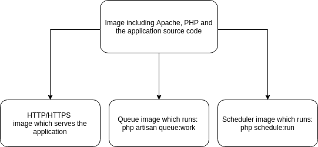

So let us talk about why would one use Docker when there are other options such as Xampp, Vagrant and many more. The most common explanation for Docker on Wikipedia is:

> An open-source project that automates the deployment of software applications inside containers by providing an additional layer of abstraction and automation of OS-level virtualization on Linux.

- Docker is a bit difficult to understand its core concepts at first, but it is really easy once you get the hang of it and it is easy to modify different stacks, add new services and this is what I like the most — in case you need for example at some point during development to use Redis, Elastic search, SFTP server or any other service, you just have to include it in the so called **docker-compose** file.
- If you build your application as a Docker image, deploy and use it in production, it is going to be **1:1** locally and in production with the source code and web server settings, so you avoid having problems like: *“oh it works locally but not in production”* because you forgot that you have not installed a PHP module in your production but you have it locally.
- On-boarding new team members or switching working machines has never been easier.
    A new team member can clone the repo of the project which contains the docker files and all he/she has to do from there is to execute **docker-compose up** and it will build the project with the necessary services.

The way I like to think about docker images is like a PHP class, which can be inherited many times. An example of such inheritance can be:

- Image of our project with its source code inherits PHP and Apache image
- Then we can have other image(s) inheriting the image built in the first step.




Which means that you can create a base image for your project or future projects, and by maintaining that core image you will have up to date application settings like PHP, Apache, Nginx or whatever your application is using.

Let us create the **Docker** file  for our project:

In the Dockerfile above, you can see the commands it runs to build the project image for Laravel in this example.

The lines 2 and 3 are important because that is how you define the php.ini settings, and they are in the git also. Feel free to use the file above to modify and improve it.

And **docker-compose** file:

In this example there are 5 services/containers:

1.  **Laravel** project source code container at line: 3
2.  **MySQL** container at line: 39
3.  **MongoDB** container at line: 50
4.  **Redis** container at line: 59
5.  **FTP server** container at line: 66

As you can see here you define easily what you need to use. All you have to do is looking up on [Docker hub](https://hub.docker.com/) to find the container/service you need for your project add it in the Docker compose file and you are done and can use it.

In the example above it is a Laravel project which consists of 1 Docker file to create the Laravel image and Docker compose file to orchestrate the other services for local development.

There is no need for custom image for other services because we can use the official ones, but if the application is a microservice architecture than it would mean that more Docker files are required and you have to include them in the Docker compose file just as you use the other services. Generally you should avoid managing services like MySQL, Redis or MongoDB so that is why we are just building the application image. It is best to use managed Database services for Production and use them as containers for local development.

To deploy this to production it is best to use CI/CD tools to build the images and run the tests, but for an easier deployment you can use the [AWS beanstalk for single containers](https://docs.aws.amazon.com/elasticbeanstalk/latest/dg/single-container-docker.html).
You can read this article about Scaling Laravel on AWS beanstalk: https://medium.com/laraveladvanced/scalable-laravel-on-aws-the-ultimate-guide-b67d9133638

Which is essentially the same, except that you have to select Docker for single containers as the type for beanstalk.

This way Beanstalk will take care of building the image for you from your source code.

Now the most important part is to have other features of Laravel like the scheduler and the Queue worker server. For this we can add in our Docker file these last 2 lines:

<a id="f1cf"></a>EXPOSE 80
CMD \["/usr/local/bin/start"\]

Which will run a start.sh bash file which we are already copying to /usr/local/bin/start on line 5 in the Docker file.

Based on what you set as your environment variables it will run the appropriate artisan commands

Feel free to use the example files above to modify and improve them. What I have discussed till now is a more narrow example of using Docker for Monolithic Laravel application for development and deploying it in AWS beanstalk for production but this does not mean by any means that this is the final answer, there are a lot of other ways for deployment and how you set up your project.

Kubernetes is one of those ways to orchestrate your containers but it is out of the scope of this story. It is up to you to decide what you want to use for your deployments and the architecture of your application.

List all running Docker containers:

```
docker ps
```

Start Docker containers for a given project:

```
docker-compose up -d
```

Execute an interactive **bash** shell on the container:

```
docker exec -it {container_id} bash
```

Stop Docker containers for given project:

`docker-compose stop`