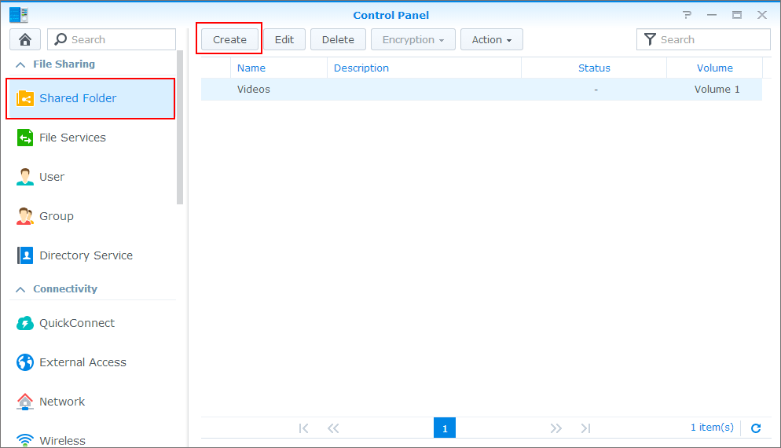
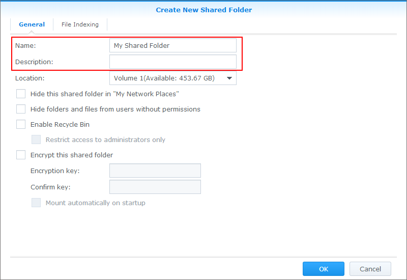
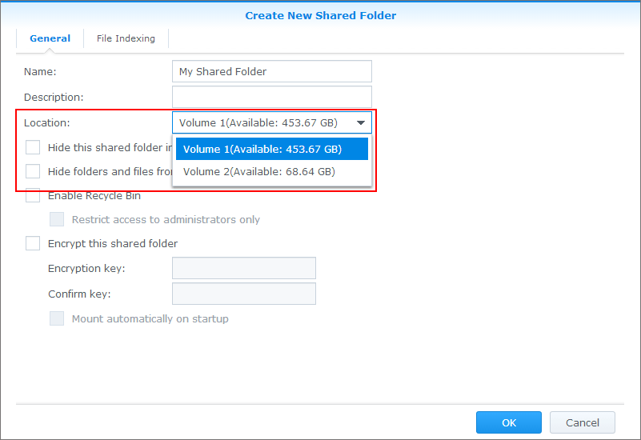
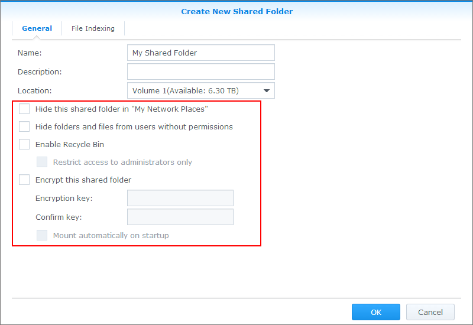

Freigegebene Ordner sind die Grundverzeichnisse, in denen Sie Dateien und Ordner auf Ihrem Synology NAS speichern und verwalten können. Bevor Sie in DSM Dateien speichern können, muss mindestens ein freigegebener Ordner erstellt werden.

#### Freigegebenen Ordner erstellen:

1.  Gehen Sie zu **Systemsteuerung** \> **Freigegebener Ordner** und klicken Sie auf **Erstellen**.

2.  Geben Sie einen Namen und eine Beschreibung für den freigegebenen Ordner an.

3.  Wählen Sie einen Speicher aus, in dem der freigegebene Ordner erstellt werden soll (überspringen Sie diesen Schritt, wenn nur ein Speicher vorhanden ist).

4.  Ändern Sie die folgenden Optionen, falls erforderlich:

    - **Diesen freigegebenen Ordner unter „Netzwerkumgebung“ ausblenden:** Verhindert, dass der freigegebene Ordner unter „Netzwerk“ in Windows Explorer angezeigt wird. Diese Option beeinflusst nicht die Berechtigungen für den Zugriff auf den freigegebenen Ordner.
        
        #### Anmerkung:
        
        - Das Ausblenden eines freigegebenen Ordners in "Netzwerkumgebung" hat keine Auswirkung auf dessen Zugriffsberechtigung. Die Zugriffsrechte für den ausgeblendeten freigegebenen Ordner bleiben unverändert. Benutzer mit den richtigen Zugriffsberechtigungen für den freigegebenen Ordner können immer noch auf diesen zugreifen, indem sie "\\\Servername\\Name des freigegebenen Ordners" eingeben.
        
    - **Unterordner und Dateien vor Benutzern ohne Berechtigungen ausblenden:** Wenn **Unterordner und Dateien vor Benutzern ohne Berechtigungen ausblenden** aktiviert ist und ein Benutzer ohne Leseberechtigungen versucht, über das Windows-Dateifreigabeprotokoll auf einen freigegebenen Ordner zuzugreifen, kann er Unterordner oder Dateien im freigegebenen Ordner nicht anzeigen. Dies vermeidet Verwirrung bei den Benutzern, wenn sie die Verbindung zum Synology-Produkt herstellen und auf eine große Anzahl von Dateien und Unterordnern treffen, die sie nicht öffnen können.
        
        #### Anmerkung:
        
        - Diese Funktion wird nur mit dem Windows-Dateifreigabeprotokoll unterstützt.
        - Sie können die Berechtigungseinstellungen von Ordnern und Dateien in File Station ändern, indem Sie mit der rechten Maustaste auf den Ordner oder die Datei klicken. Wählen Sie **Eigenschaften** aus dem Dropdown-Menü aus und klicken Sie auf die Registerkarte **Berechtigung**.
        - Der freigegebene Ordner selbst wird für Benutzer ohne Berechtigungen nicht ausgeblendet, wenn **Unterordner und Dateien vor Benutzern ohne Berechtigungen ausblenden** aktiviert ist. Es werden nur die Unterordner und Dateien in diesem freigegebenen Ordner ausgeblendet.
        
5.  **Papierkorb aktivieren:** Wenn Dateien im freigegebenen Ordner gelöscht werden, werden sie in einen Ordner namens **#recycle** verschoben. Der Zugriff auf den Papierkorb kann auf Benutzer der Gruppe **administrators** beschränkt werden.
7.  **Gemeinsames Ordnerkontingent aktivieren:** Um die maximale Kapazität für jeden freigegebenen Ordner anzugeben, setzen Sie ein Häkchen bei **Gemeinsames Ordnerkontingent aktivieren** und geben Sie im folgenden Feld die maximale Kapazität (z. B. 10 GB) ein.
    
    #### Anmerkung:
    
    - Die Option **Gemeinsames Ordnerkontingent aktivieren** ist für freigegebene Ordner nur verfügbar, wenn der Speicher das Btrfs-Dateisystem nutzt.
    - Die gesamte Speichernutzung der **home**-Verzeichnisse aller Benutzer kann das Kontingent von „**homes**“ nicht überschreiten.
    
9.  **Daten-Prüfsumme für erweiterte Dateiintegrität aktivieren:** Um einen freigegebenen Ordner mit den Strategien **CRC32-Prüfsumme** und **Kopie bei Schreibvorgang** zu schützen, können Sie bei der Erstellung des freigegebenen Ordners Daten-Prüfsumme für erweiterte Dateiintegrität aktivieren. Mit CRC32-Prüfsumme wird geprüft, ob die Daten sich noch in ihrem ursprünglichen Zustand befinden, und das System greift automatisch auf RAID-Redundanz zurück, um fehlerhafte Daten zu reparieren. Kopie bei Schreibvorgang verbessert die Datenkonsistenz beim nicht ordnungsgemäßen Herunterfahren des Systems.
    
    #### Anmerkung:
    
    - Diese Option ist nur für Volumes mit dem Btrfs-Dateisystem verfügbar.
    - Diese Option können Sie für jeden freigegebenen Ordner während der Erstellung aktivieren bzw. deaktivieren. Nach der Erstellung des freigegebenen Ordners kann diese Option nicht mehr geändert werden.
    - Wenn diese Option aktiviert wird, kann das System eine vollständige Datenbereinigung durchführen. [Weitere Informationen über Datenbereinigung](https://kb.synology.com/de-de/DSM/help/DSM/StorageManager/storage_pool_data_scrubbing?version=6)
    - Um die Qualität der Dienste sicherzustellen, empfehlen wir, Daten-Prüfsumme nicht zu aktivieren, wenn der freigegebene Ordner für folgende Dienste genutzt wird:
        - Hosting von Datenbanken oder virtuellen Maschinen
        - Speichern von Videoaufnahmen von Surveillance Station
        - Ausführen von Diensten, die kleine oder zufällige Schreiboperationen erfordern
    
11. **Dateikomprimierung aktivieren**: Um Speicherplatz zu sparen, werden die Daten im erstellten freigegebenen Ordner vom Btrfs-Dateisystem automatisch komprimiert. Wenn Daten zur Verwendung abgerufen werden, werden sie automatisch entpackt.
    
    #### Anmerkung:
    
    - Diese Option ist nur verfügbar, wenn Sie einen freigegebenen Ordner auf einem Btrfs-Volume erstellen oder wenn **Erweiterter Datenintegritätsschutz** aktiviert ist.
    - Diese Option kann nicht aktiviert werden, wenn die Verschlüsselung freigegebener Ordner aktiviert ist, und kann nach dem Erstellen des freigegebenen Ordners nicht mehr geändert werden.
    - Diese Option verringert die Leistung des freigegebenen Ordners und wird nur für Ordner empfohlen, die selten genutzte Daten enthalten.
    - Die Komprimierungsrate ist vom Datentyp abhängig: Textdateien haben die höchste Komprimierungsrate, während Multimediadateien (z. B. Bilder, Musik oder Videos) nicht sehr gut komprimiert werden können, da sie bereits für die Ausgabe komprimiert wurden.
    
12. **Diesen freigegebenen Ordner verschlüsseln:** Führen Sie zum Verschlüsseln des freigegebenen Ordners die folgenden Schritte durch:
    1.  Geben Sie einen neuen Verschlüsselungsschlüssel an und bestätigen Sie ihn. Der Verschlüsselungsschlüssel darf keine Kommas (,) oder Gleichheitszeichen (=) enthalten.
    2.  Setzen Sie bei Bedarf ein Häkchen bei **Verschlüsselungsschlüssel zu Schlüssel-Manager hinzufügen**, um den verschlüsselten Ordner automatisch bereitzustellen, wenn das System gestartet wird. Wenn diese Option nicht aktiviert ist, wird der verschlüsselte freigegebene Ordner beim nächsten Neustart des Synology NAS getrennt. Um einen getrennten freigegebenen Ordner anzuzeigen oder darauf zuzugreifen, müssen Sie den Ordner manuell anhängen, indem Sie den Schlüssel für die Verschlüsselung importieren oder eingeben.
13. Klicken Sie zum Beenden auf **OK**.

#### Anmerkung:

- Bestimmte Funktionen und Optionen eines freigegebenes Ordners werden ausschließlich von VDSM und Modellen mit folgender Paketarchitektur unterstützt: Apollo Lake, Avoton, Braswell, Broadwell, Bromolow, Cedarview und Grantley. Welche Paketarchitektur Ihr Modell unterstützt, erfahren Sie in [diesem Artikel](https://www.synology.com/en-us/knowledgebase/DSM/tutorial/General/What_kind_of_CPU_does_my_NAS_have).

#### Namensregeln für freigegebene Ordner:

- Bei Namen für freigegebene Ordner wird die Groß-/Kleinschreibung nicht berücksichtigt und sie können 1-32 Zeichen umfassen. Namen dürfen die folgenden Zeichen nicht enthalten: **! " # $ % & ' ( ) \* \+ , / : ; &lt;= \&gt; ? @ \[ \] \ ^ ` { } | ~**
- Die folgenden Namen sind für die Systemnutzung reserviert: **.**, **..**, **global**, **home**, **homes**, **printers**, **satashare**, **usbbackup**, **usbshare**.
- Das erste Zeichen eines freigegebenen Ordners darf kein Minus- oder Leerzeichen sein und das letzte Zeichen darf ebenfalls kein Leerzeichen sein.
- Bei der **Beschreibung** des freigegebenen Ordners wird die Groß-/Kleinschreibung berücksichtigt und sie ist auf bis zu 64 anzeigbare Unicode-Zeichen beschränkt.

#### Freigegebene Ordner verschlüsseln:

Die AES 256-Bit-Verschlüsselung kann Daten vor nicht autorisierten Zugriffsversuchen schützen. Wenn ein freigegebener Ordner verschlüsselt ist, kann niemand ohne Schlüssel auf die verschlüsselten Daten zugreifen oder sie ändern, selbst wenn sie die Festplatten des Synology NAS aus- und in ein anderes Gerät einbauen.

#### Anmerkung:

- Der Name einer Datei oder eines Ordners innerhalb eines verschlüsselten freigegebenen Ordners darf 143 lateinische Zeichen oder 47 asiatische Zeichen (CJK) nicht überschreiten; wenn Sie mit Mac OS auf Ihre freigegebenen Ordner zugreifen, darf der Name eines verschlüsselten freigegebenen Ordners 130 lateinische oder 43 asiatische Zeichen (CJK) nicht überschreiten.
- Der Zugriff auf verschlüsselte freigegebene Ordner über NFS ist in DSM 6.2 und früher nicht möglich.
- Wenn Standard-Kennwörter mit der Reset-Taste des Synology NAS wiederhergestellt werden, werden verschlüsselte freigegebene Ordner deaktiviert und die Option, verschlüsselte freigegebene Ordner automatisch anzuhängen, wird deaktiviert.
- Verschlüsselte freigegebene Ordner werden nur im Modus hoher Priorität unterstützt (nur anwendbar auf DDSM). Gehen Sie, um diese Funktion zu verwenden, zum Docker-Paket des Host-DSM, wählen Sie das **DDSM** aus, für das Sie verschlüsselte freigegebene Ordner aktivieren möchten, klicken Sie auf **Bearbeiten** und setzen Sie ein Häkchen neben **Container mit hoher Priorität ausführen**.