## Build an Nginx Docker Image With Alpine And Secure It With A Self-Signed SSL Certificate With OpenSSL

- Creating and configuring a Docker container from scratch with Alpine
- Creating a new Self-Signed Certificate
- Trusting the certificate with our local computer
- Creating a Dockerfile with exchangeable SSL certificates
- Setting up GitHub with automatic Docker Hub builds

You just need [Docker](https://hub.docker.com/editions/community/docker-ce-desktop-mac) for this.

- Docker CE `18.09.2`
- Mac OS Mojave or Equivalent

Pure and simple, security. There’s a bunch of other stuff as well, but mainly security.

To start, we’re going to use [Alpine](https://www.alpinelinux.org/), because it’s the smallest footprint, and can be a good base for security as well. The reason is because there are less dependencies, which mean less chances of exploitation.

We’ll expose port `443` to start because it’s the default port for https.

docker run -it -p 80:80 -p 443:443 --name nginx-alpine-ssl alpine /bin/sh;

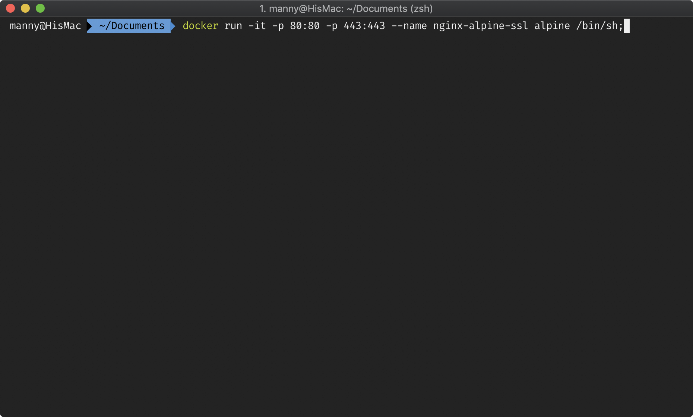

Docker Run

Let’s install `nginx` now:

apk add nginx;

Make the directory that’s needed for nginx:

mkdir /run/nginx/;

Run nginx:

nginx;

Testing the server is running with `curl`

apk add curl;  
curl localhost;\# Expected output  
\# &lt;html&gt;  
\# &lt;head&gt;&lt;title&gt;404 Not Found&lt;/title&gt;&lt;/head&gt;  
\# &lt;body&gt;  
\# &lt;center&gt;&lt;h1&gt;404 Not Found&lt;/h1&gt;&lt;/center&gt;  
\# &lt;hr&gt;&lt;center&gt;nginx&lt;/center&gt;  
\# &lt;/body&gt;  
\# &lt;/html&gt;

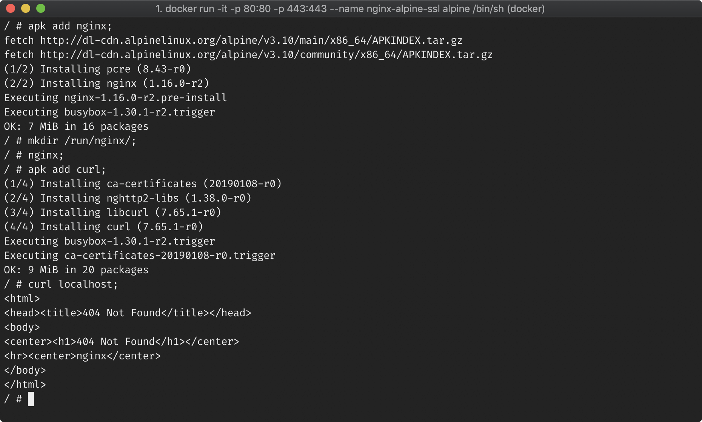

Docker Install Nginx & Curl

It will show `404` because there is no html file and no configuration setup for `nginx` to point to a root directory to load files from.

Looking at the `default.conf` nginx file:

apk add nano;  
nano /etc/nginx/conf.d/default.conf

Change it to the following, save and exit:

**File:** `/etc/nginx/conf.d/default.conf`

server {  
        listen 80 default_server;  
        listen \[::\]:80 default_server; **\# New root location**  
        location / {  
 **root /var/www/localhost/htdocs;**   
 **# return 404;**  
        } # You may need this to prevent return 404 recursion.  
        location = /404.html {  
                internal;  
        }  
}

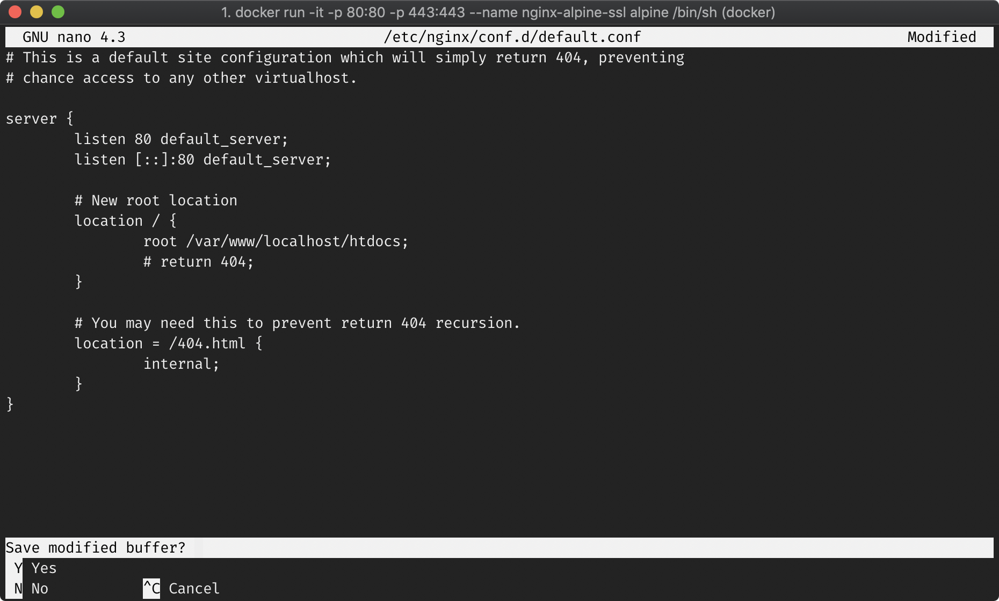

Modifying nginx default.conf

Restart `nginx`:

nginx -s reload;

Create an html in the `htdocs` folder:

echo "&lt;h1&gt;Hello world!&lt;/h1&gt;" > /var/www/localhost/htdocs/index.html;

Test that it’s working with `curl`:

curl localhost;\# Expected output  
\# &lt;h1&gt;Hello world!&lt;/h1&gt;

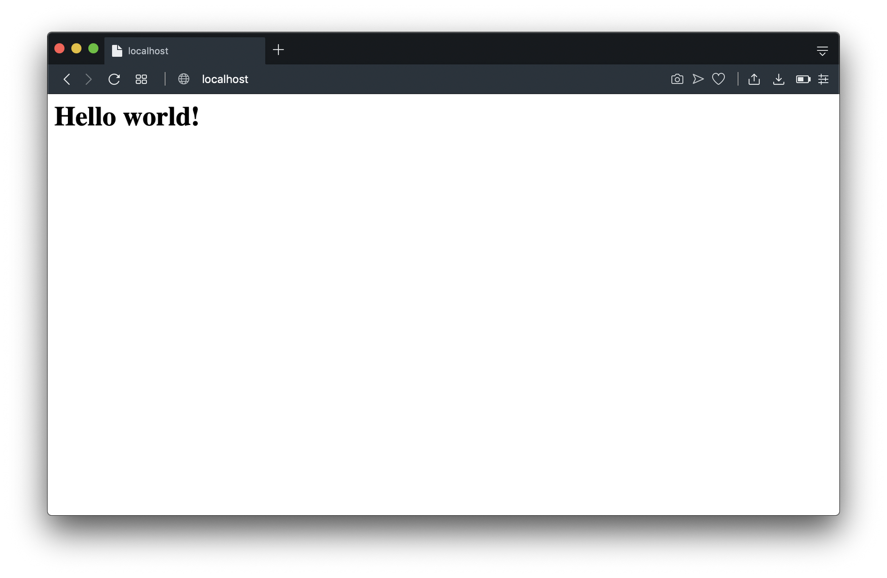

http://localhost

Next we need to use OpenSSL to generate our key and certificate files.

apk add openssl;

Create our new `key` and `crt` files:

openssl req -x509 -nodes -days 365 -subj "/C=CA/ST=QC/O=Company, Inc./CN=mydomain.com" -addext "subjectAltName=DNS:mydomain.com" -newkey rsa:2048 -keyout /etc/ssl/private/nginx-selfsigned.key -out /etc/ssl/certs/nginx-selfsigned.crt;\# Expected Output  
\# Generating a RSA private key  
\# .......................................+++++  
\# ....+++++  
\# writing new private key to '/etc/ssl/private/nginx-selfsigned.key'  
\# -----

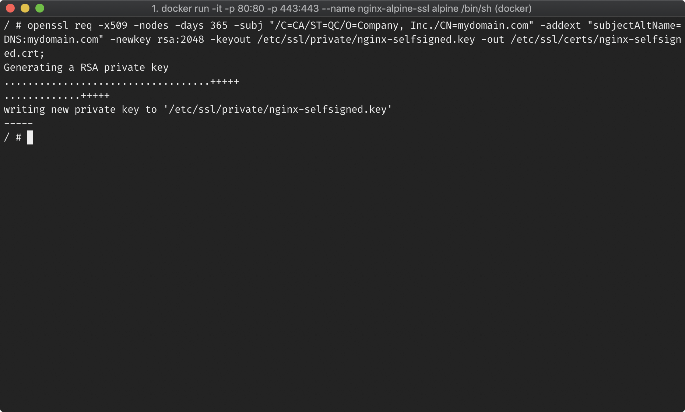

OpenSSL generating new key and crt files

## What Each Options Means

To give some context as to what we’re doing in out `openssl` options:

- `**req**` — to specify we want to use `-x509`
- `**-x509**` — to specify we want to create a self-signed certificate instead of generating a certificate signing request.
- `**-nodes**` — makes it so that we skip the option to secure our certificate with a passphrase, so that nginx can read it.
- `**-days 365**` — specifies how long the certificate would be valid for, which is 365 days.
- `**-subj “/C=CA/ST=QC/O=Company, Inc./CN=mydomain.com"**` — this allows us to specify subject without filling in prompts. `/C` for country, `/ST` for state, `/O` for organization, and `/CN` for common name.
- `**-addext “subjectAltName=DNS:mydomain.com"**` — which adds additional attributes to our certificate which is needed to make it a valid certificate seen by both our browser and local machine.
- `**-newrsa rsa:2048**` — specifies that we want to generate both a new certificate and a new key with an RSA key of 2048 bits.
- `**-keyout /etc/.../yourfile.key**` — specifies the location of the output `.key` file.
- `**-out /etc/.../yourfile.crt**` — specifies the location of the output `.crt` file.

We now need to associate our SSL certificate to our `default.conf` nginx file.

**File:** `/etc/nginx/conf.d/default.conf`

server {  
        listen 80 default_server;  
        listen \[::\]:80 default_server;  
  **listen 443 ssl http2 default_server;**  
 **listen \[::\]:443 ssl http2 default_server;  
        ssl_certificate /etc/ssl/certs/nginx-selfsigned.crt;**  
 **ssl\_certificate\_key /etc/ssl/private/nginx-selfsigned.key;** \# New root location  
        location / {  
                root /var/www/localhost/htdocs;   
                # return 404;  
        } # You may need this to prevent return 404 recursion.  
        location = /404.html {  
                internal;  
        }  
}

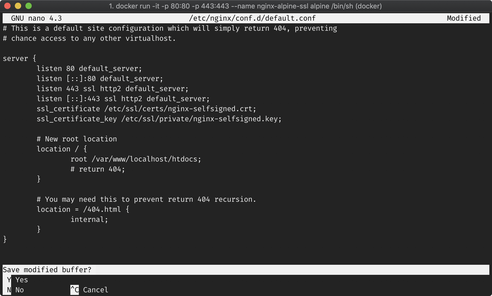

New nginx configuration with SSL enabled & certificates

Save the file, check the file is correct with:

nginx -t;\# Expected Output  
\# nginx: the configuration file /etc/nginx/nginx.conf syntax is ok  
\# nginx: configuration file /etc/nginx/nginx.conf test is successful

**Don’t forget** to now reload `nginx`:

nginx -s reload;

Let’s test https with `curl`:

curl [https://localhost](https://localhost/);\# Expected Output  
\# curl: (60) SSL certificate problem: self signed certificate  
\# More details here: [https://curl.haxx.se/docs/sslcerts.html](https://curl.haxx.se/docs/sslcerts.html)\# curl failed to verify the legitimacy of the server and therefore could not establish a secure connection to it. To learn more about this situation and how to fix it, please visit the web page mentioned above.

This happens because our SSL certificate is self-signed and not really a legitimate certificate. To get around this, just to see if https is working, run:

curl [https://localhost](https://localhost/) --insecure;\# Expected Output  
\# &lt;h1&gt;Hello world!&lt;/h1&gt;

Browser Not Trusting Certificate

To get around this temporarily in our browser, just click **“Help me understand”** in `**Opera**` or click “**Advanced”** in `**Chrome**`.

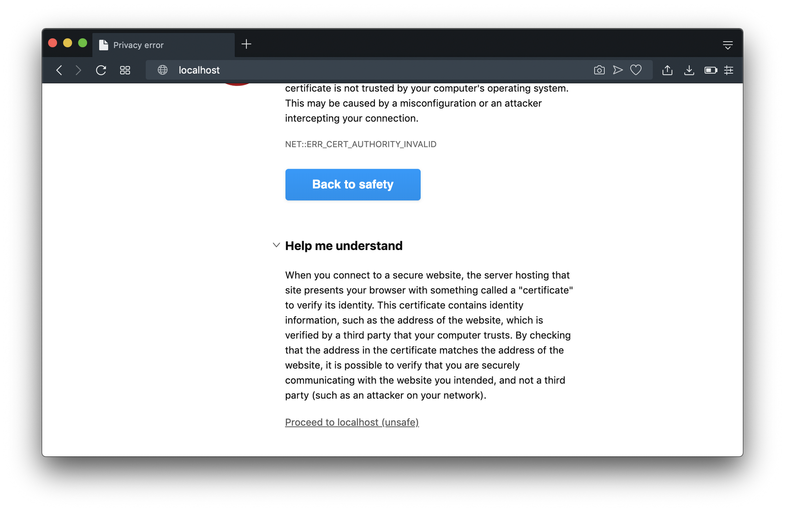

Temporarily getting around unsafe (self-signed) SSL certificate in Opera

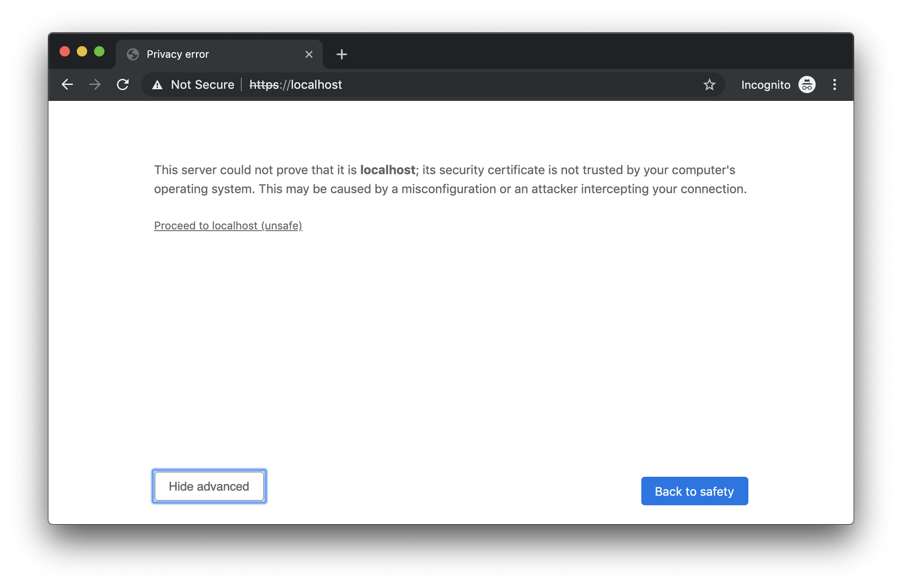

Temporarily getting around unsafe (self-signed) SSL certificate in Chrome

Next we’ll configure out domain `mydomain.com` to point to `localhost` or more specifically `127.0.0.1`. You’ll need root access for this, with you password, by modifying the `hosts` file. Make sure to open a new `**Terminal**` tab or window, and run:

sudo nano /etc/hosts;

**File:** `/etc/hosts`

##  
\# Host Database  
#  
\# localhost is used to configure the loopback interface  
\# when the system is booting.  Do not change this entry.  
##  
127.0.0.1       localhost  
255.255.255.255 broadcasthost  
::1             localhost  
127.0.0.1       mydomain.com

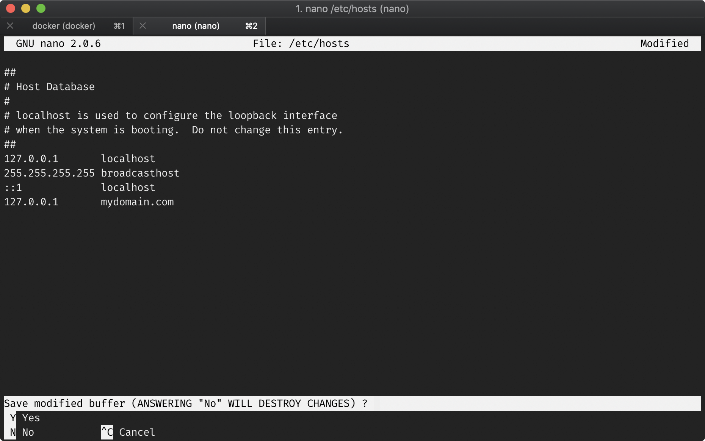

Modified hosts file

If we open up our browser, we’ll see the following when we visit [**https://mydomain.com**.](https://mydomain.com./)

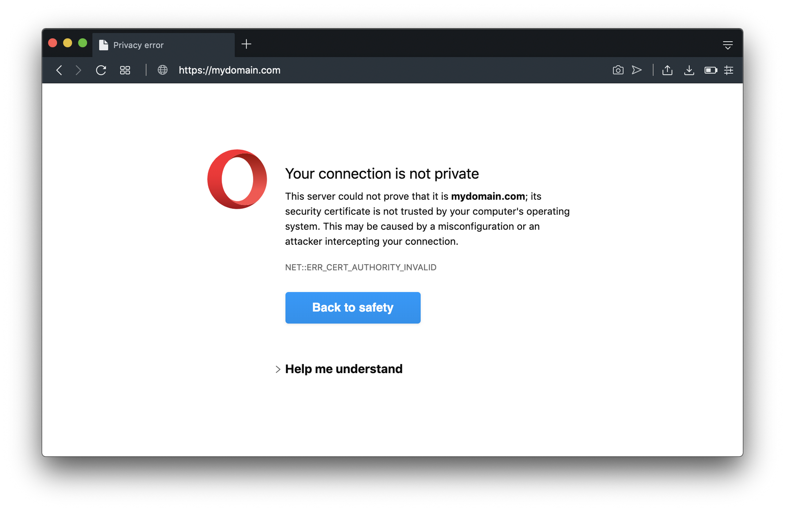

[https://mydomain.com](https://mydomain.com/)

We could just get around this temporarily by proceeding to it being unsafe, but we’ll take the next steps to make ***mydomain.com*** trusted by our local computer.

In order for us to trust the domain, we need to copy and place the `crt` (certificate) in our `**Keychain Access**`.

First we need to get a copy of that certificate in the Docker container. In a new `**Terminal**` window or tab, run:

docker cp nginx-alpine-ssl:/etc/ssl/certs/nginx-selfsigned.crt ~/Desktop;

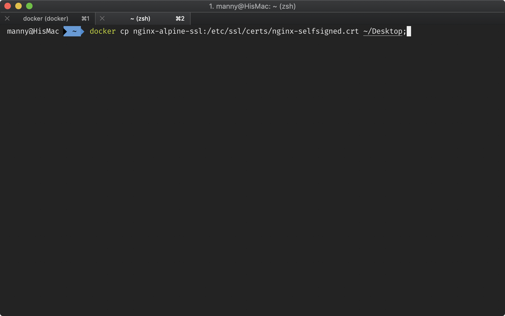

Copying Docker certificate to local computer

Open up you `**Keychain Access**` app.

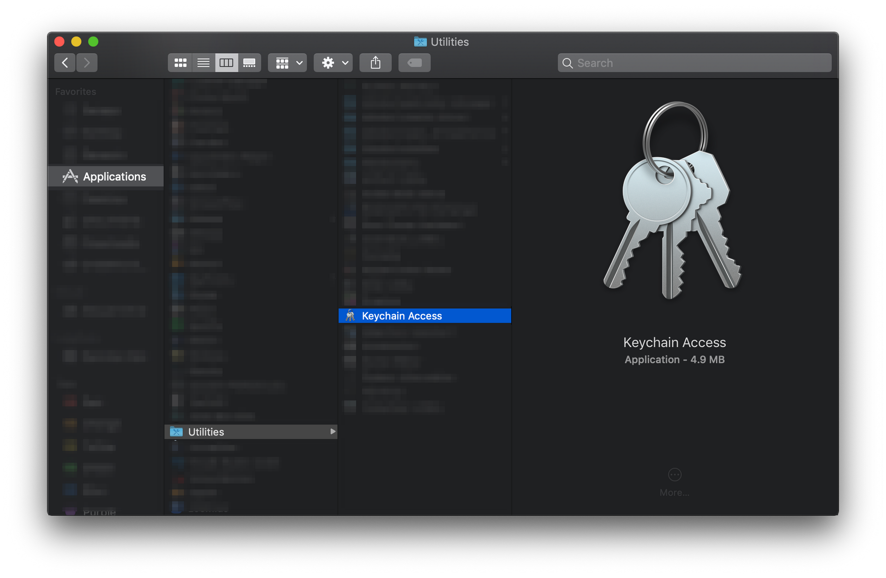

Where to find Mac OS Keychain Access App

When the `**Keychain Access**` app loads up, on the left side bar, select **Certificates**. Drag the newly copied `nginx-selfsigned.crt` file from the Desktop to `**Keychain Access**`.

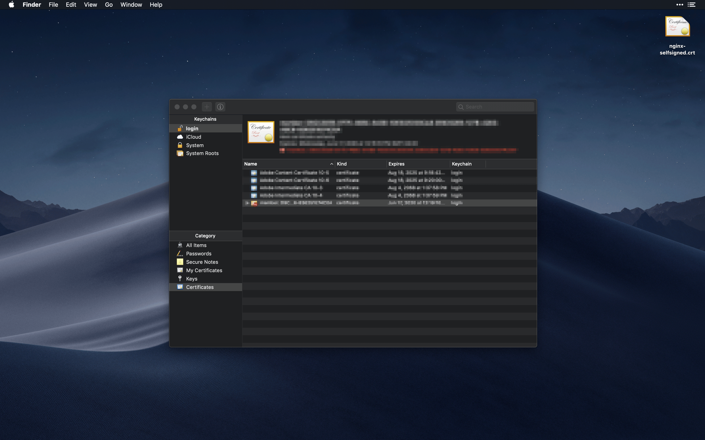

Drag new certificate to Keychain Access app

Next we need to make sure the certificate is trust by our computer. ***Double click*** on the newly added certificate, click the ***Trust*** dropdown and set ***“When using this certificate”*** to ***Always Trust***.

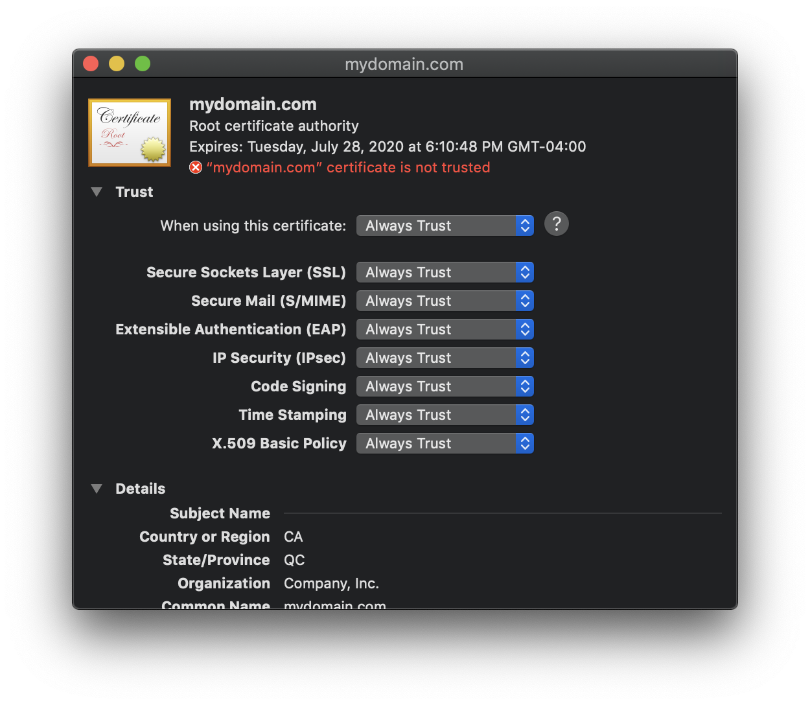

Always trust mydomain.com

Close the window the ***mydomain.com*** certificate window. You will be prompted to enter your computer password to validate and confirm the change.

Now open up [***https://mydomain.com****.*](https://mydomain.com./)

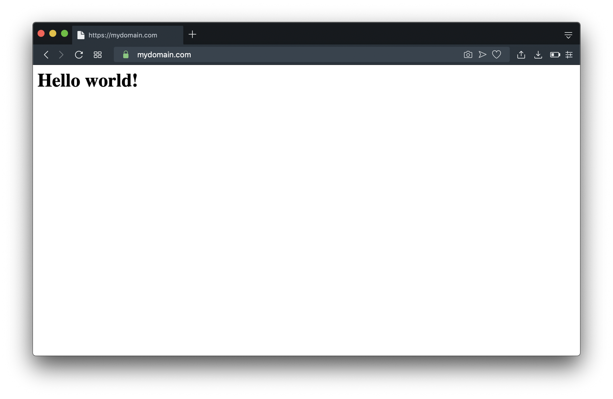

[https://mydomain](https://mydomain/).com working

You’ll see the domain is now working with https and it displays a green 🔒icon.

Next we’ll create a Docker file with some configuration files and an `entrypoint.sh` script.

For this we’ll create a new folder and copy our `key` and `crt` files to a newly created `config` folder, as long with our modified `**nginx**` configuration `default.conf` file.

## Creating our new folders:

mkdir ~/Documents/nginx-alpine-ssl;  
mkdir ~/Documents/nginx-alpine-ssl/config;

## Copying our files:

\# certificate  
docker cp nginx-alpine-ssl:/etc/ssl/certs/nginx-selfsigned.crt ~/Documents/nginx-alpine-ssl/config;\# private key  
docker cp nginx-alpine-ssl:/etc/ssl/private/nginx-selfsigned.key ~/Documents/nginx-alpine-ssl/config;\# nginx configuration file  
docker cp nginx-alpine-ssl:/etc/nginx/conf.d/default.conf ~/Documents/nginx-alpine-ssl/config;

## Creating our Dockerfile:

touch ~/Documents/nginx-alpine-ssl/Dockerfile;

**File:** `/Dockerfile`

\# BASE  
FROM alpine\# RUN  
RUN apk add nginx; \  
    mkdir /run/nginx/; \  
    echo "&lt;h1&gt;Hello world!&lt;/h1&gt;" > /var/www/localhost/htdocs/index.html;\# CONFIGUTATIONS  
\# nginx configuration  
ADD $PWD/config/default.conf /etc/nginx/conf.d/default.conf\# keys and certs  
ADD $PWD/config/*.key /etc/ssl/private/  
ADD $PWD/config/*.crt /etc/ssl/certs/WORKDIR /var/www/localhost/htdocs\# ENTRYPOINT  
COPY $PWD/config/entrypoint.sh /usr/local/binRUN chmod +x /usr/local/bin/entrypoint.shENTRYPOINT \["/bin/sh", "/usr/local/bin/entrypoint.sh"\]\# EXPOSE PORTS  
EXPOSE 80EXPOSE 443\# RUN COMMAND  
CMD \["/bin/sh", "-c", "nginx -g 'daemon off;'; nginx -s reload;"\]

## Creating Our Entrypoint Script:

This will be our script that will run at run time and we want to add some environment variables to add the ability to change the certificate and key out.

touch ~/Documents/nginx-alpine-ssl/config/entrypoint.sh

**File:** `/config/entrypoint.sh`

\# Main shell script that is run at the time that the Docker image is run\# Go to default.conf directory  
cd /etc/nginx/conf.d;\# ENV VARS  
\# A list of environment variables that are passed to the container and their defaults\# CRT - double check that the file exists  
export CRT="${CRT:=nginx-selfsigned.crt}";  
if \[ -f "/etc/ssl/certs/$CRT" \]  
then  
    # set crt file in the default.conf file  
    sed -i "/ssl\_certificate \\//c\\\\\tssl\_certificate \\/etc\\/ssl\\/certs\\/$CRT;" default.conf;  
fi\# KEY - double check that the file exists  
export KEY="${KEY:=nginx-selfsigned.key}";  
if \[ -f "/etc/ssl/private/$KEY" \]  
then  
    # set key file in the default.conf file  
    sed -i "/ssl\_certificate\_key \\//c\\\\\tssl\_certificate\_key \\/etc\\/ssl\\/private\\/$KEY;" default.conf;  
fi\# Needed to make sure nginx is running after the commands are run  
nginx -g 'daemon off;'; nginx -s reload;

## Making A Build

To test the Dockerfile, let’s make a build by running the following in the root directory of the project:

docker build . -t nginxssltest;

## Running Our Container

Let’s run our container and then do a `curl` test:

docker run -it -d -p 80:80 -p 443:443 --name test nginxssltest;curl localhost;\# Expected output  
\# &lt;h1&gt;Hello world!&lt;/h1&gt;curl [https://localhost](https://localhost/) --insecure;\# Expected output  
\# &lt;h1&gt;Hello world!&lt;/h1&gt;

If we open up our browser, with our certificate trusted by our computer, we can see it works:

[https://mydomain.com](https://mydomain.com/) Working

Now that we see that it’s working, let’s test another domain with different generated keys.

First, let us modify out `hosts` file to add a new domain to it.

sudo nano /etc/hosts;

**File:** `/etc/hosts`

##  
\# Host Database  
#  
\# localhost is used to configure the loopback interface  
\# when the system is booting.  Do not change this entry.  
##  
127.0.0.1 localhost  
255.255.255.255 broadcasthost  
::1             localhost  
127.0.0.1 mydomain.com  
127.0.0.1 newdomain.com

/etc/hosts

## Generate New Certificate & Key

Next, we’ll generate new `crt` and `key` files in a new folder called `certkey`. To do this though, Mac OS doesn’t support `-addext` and instead of going the route of trying to reconfiguring our local `openssl.conf` file, we’ll just use an alpine docker image as a one time use to generate the keys we need.

mkdir ~/Documents/nginx-alpine-ssl/certkey;cd ~/Documents/nginx-alpine-ssl;\# --rm will remove the container after it's run  
docker run --rm **-v $PWD/certkey:/usr/share** alpine /bin/sh -c "apk add openssl; openssl req -x509 -nodes -days 365 -subj \\"/C=CA/ST=QC/O=Company, Inc./CN=**newdomain.com**\\" -addext \\"subjectAltName=DNS:**newdomain.com**\\" -newkey rsa:2048 -keyout **/usr/share/new-selfsigned.key** -out **/usr/share/new-selfsigned.crt;**"

## Add Our Certificate To Keychain Access

Drag our newly created `new-selfsigned.crt` to the`**Keychain Access**` app.

Running Container With New Keys

Now we have our new `crt` and `key` files located in our new `certkey` folder. With them, we can use them with our new environment variables defined by our `entrypoint.sh` file:

**\# -v is mounting both to the certs and private folder in docker  
\# -e CRT=name of certificate  
\# -e KEY=name of key**docker run -it -d -v $PWD/certkey:/etc/ssl/private/ -v $PWD/certkey:/etc/ssl/certs/ -e CRT=new-selfsigned.crt -e KEY=new-selfsigned.key -p 80:80 -p 443:443 --name newssl nginxssltest;

If we open our browser now to [**https://newdomain.com**,](https://newdomain.com,/) we’ll see:

[https://newdomain.com](https://newdomain.com/) working with the new certificates

This next part is to bring it all together with a GitHub repository and a connected Docker Hub repository that creates automatic builds for us to use.

## Connecting With GitHub

In the root of our project, let’s get our repo setup:

\# create your new repocurl -u ***{github-username}*** \  
--url https://api.github.com/user/repos \  
-d "{\\"name\\":\\"nginx-alpine-ssl\\"}";\# if you have two-factor authentication use  
\# curl -u ***{github-username}*** \  
\# --url https://api.github.com/user/repos \  
\# --header 'x-github-otp: ***{your-code}***' \  
\# -d "{\\"name\\":\\"nginx-alpine-ssl\\"}";\# initiate git  
git init;\# link new repo  
git remote add origin "https://github.com/***{your-github-username}***/nginx-alpine-ssl.git"

## Creating Documentation Files

\# create a .gitignore file  
echo ".DS_Store\\ncertkey" > .gitignore;\# create a README.md file  
echo "# Nginx Alpine SSL\\n\\nThis will create a basic nginx ssl enabled http server that runs on alpine.\\n\\n## Requirements\\n\\n- Docker CE\\n\\n## Options\\n\\n\\`-e CRT={your-cert-name.crt}\\` - allows you to specify your own \\\`crt\\\` file  (note there is a default for mydomain.com).\\n\\n\\`-e KEY={your-private-key.key}\\` - allows you to specify your own \\\`key\\\` file (note there is a default for mydomain.com).\\n\\n## Generate Your Own Self-Signed SSL\\n\\n\\`\\`\\`bash\\ndocker run --rm -v **\**$PWD/local/path:/usr/share alpine /bin/sh -c \\"apk add openssl; openssl req -x509 -nodes -days 365 -subj \\\\\"/C=CA/ST=QC/O=Company, Inc./CN=yourdomain.com\\\\\" -addext \\\\\"subjectAltName=DNS:yourdomain.com\\\\\" -newkey rsa:2048 -keyout /usr/share/your-key-name.key -out /usr/share/your-cert-name.crt;\\"\\n\\`\\`\\`\\n\\n## Example Run\\n\\n\\`\\`\\\`bash\\ndocker run -it -d -v \\$PWD/local/path:/etc/ssl/private/ -v \\$PWD/local/path:/etc/ssl/certs/ -e CRT=your-cert-name.crt -e KEY=your-private-key.key -p 80:80 -p 443:443 --name container-name {docker-hub-user}/{docker-hub-repo};\\n\\\`\\`\\`" > README.md;

## Committing + Pushing Our Code

git add .;  
git commit -m "INIT: Initial commit."  
git push origin master;

## Creating A New Docker Hub Repository

We’ll need to create a new Docker Hub repository and make sure it’s connected to our GitHub repository.

New Docker Hub Repository

Link to GitHub

Find our GitHub repository and keep to these basic settings.

Docker Hub Automatic Build Configurations

Click **Save** and the automatic building will begin.

Docker Image Building

**NOTE:** You might need to refresh the page to see the latest build status.

## Running Your New Docker Image

Once the Docker image is built, you can pull and run your new image. All you need to do is run:

docker run -it -d -p 80:80 -p 443:443 --name nginxssl {docker-hub-username}:{docker-hub-repo};

This image works well even for valid certificates, so you could validate a new certificate with Let’s Encrypt and pass that along as an environment variable with a mounted folder. Additionally you could take advantage of [**turning your nginx Docker container into a reverse proxy**](https://medium.com/@codingwithmanny/create-an-nginx-reverse-proxy-with-docker-a1c0aa9078f1) and have multiple containers under one SSL certificate.

If you got value from this, and/or if you think this can be improved, please let me know in the comments.

Please share it on twitter 🐦 or other social media platforms. Thanks again for reading. 🙏

Please also follow me on **twitter**: [@codingwithmanny](https://twitter.com/codingwithmanny) and **instagram** at [@codingwithmanny](https://www.instagram.com/codingwithmanny/).
