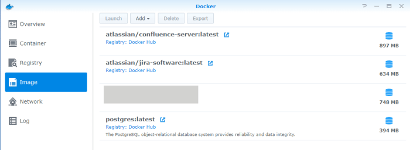

If you have a Synology NAS running a recent version (6.2 and newer) and enough RAM you can run and use Atlassian’s Confluence via Docker using HTTPs. It takes a little patience, but it can be done.

This guide will allow you to:

- **Access your installation of Confluence through a URL such as https://conflunce.yourSynologyName.synology.me:port**
- **Access Confluence with SSL using Let’s Encrypt (via Reverse Proxy)**
- **Create backups of both your database and Confluence**

This guide is the result of endless browsing through various websites, and eventually sticking all the small pieces together in order to form a solid deployment. 

## Security Notes

**Following this guide, your server will be reachable from the internet. This is a security risk.**

Make sure that either your server is not home to sensitive data, and that you have taken steps to prevent unauthorized access.

You can also run Confluence locally, but you will have to adapt some steps in this guide by yourself!

**This guide is not meant for professional use, but for a home / private environments.**

## Overview

We are going to:

1.  Create a sub-domain for Confluence with the Reverse Proxy possibilities on your Synology NAS
2.  Assign it a Let’s Encrypt certificate
3.  Open the Confluence port on our router
4.  Install Docker
5.  Download Confluence and PostgreSQL images
6.  Set up Postgres
7.  Create a database for Confluence
8.  Set up Confluence (Docker)
9.  Open the Confluence port we are going to use in DSM
10. Connect Confluence (Docker) to Postgres (Docker)
11. Make an important change in one of Confluence’s files.

## Requirements

Before we start up, it is important to check if this guide is actually for you.

Confluence (Docker) was installed on a Synology 216+, running DSM 6.2.2, with 8GB of RAM. If you have anything more recent than this, you should be fine.

Some more detailed requirements:

- Synology server running DSM 6.2.2+
- 4GB RAM minimum (8GB or more recommended, especially if you will install Jira along Confluence)
- DDNS setup using Synology as Service Provider (but the guide will apply also to other URLs)
- Docker installed on DSM via the Package Center
- [A Confluence Server License from Atlassian](https://www.atlassian.com/purchase/product/confluence)
- Access to your router to open required ports
- An understanding of Vim and SSH
- A solid idea of what you are getting into

## Step-by-step guide

### Step 1: Create a sub-domain for Confluence using “Reverse Proxy”

Let’s start by choosing where we’ll want our Confluence to be accessible from.

In this example, we’ll want to be able to go to [https://confluence.somecoolname.synology.me:8998](https://confluence.somecoolname.synology.me:8998/) and be able to use Atlassian Confluence.

Note that this is only an example!

**You may choose any other port that best fits your needs**, making sure it will not conflict with other applications on your Synology NAS. If you want to access Confluence through [https://banana.somecoolname.synology.me:9999](https://banana.somecoolname.synology.me:9999/) – you could. It’s up to you!

From the DSM homepage, go to:

- Control Panel → Application Portal

Select “Reverse Proxy” in the top menu.

Click on “Create” and a new window will appear.

Fill as follows (this is based on the example scenario we mentioned above)

**Source**

- Description: Confluence
- Protocol: https
- Hostname: confluence.somecoolname.synology.me
- Port: 8998
- Enable HSTS: check
- Enable HTTP/2: check

**Destination**

- Protocol: HTTP
- Hostname: localhost
- Port: 7777

Press “OK”

This means that we want to access our installation of Confluence from  [https://confluence.somecoolname.synology.me:8998](https://confluence.somecoolname.synology.me:8998/) – with the additional security of HSTS and the sweet advantages of HTTP/2.

### Step 2: Assign Confluence on a Synology NAS a Let’s Encrypt certificate

You will not be able to access your selected address still. This is normal. You have not open the ports yet, and you have activated HSTS without having installed a SSL certificate, and, well… Confluence is not running at all yet.

Let’s start by taking care of the certificate. With Let’s Encrypt and DSM this is super-fast and easy to create:

DSM → Control Pannel → Security

Select the “Certificate” tab

Click on “Add”

Select “Add a new certificate” and click “Next”

Select “Get a certificate from Let’s Encrypt” and click Next (**do NOT select “Set as default certificate”**)

- Domain name: confluence.somecoolname.synology.me
- Email: your email address
- Subject Alternative Name: you may leave this empty

Click “Apply”

While still in DSM → Control Pannel → Security, select your newly created certificatem and click on “Configure” (next to “Add”)

The “Configure” tab appears.

In the column “Services” you will find [https://confluence.somecoolname.synology.me:8998](https://confluence.somecoolname.synology.me:8998/) – if you haven’t created the “Reverse Proxy” in Step 1, you will not see the address here. – Click on the drop-down under “Certificate” and select the confluence.somecoolname.synology.me (the certificate you have just created.)

Done! Now confluence.somecoolname.synology.me:8998 is assigned an SSL certificate with Let’s Encrypt, and once everything is set up, when you will enter your password and username, it will be secured! Awesome.

But you cannot access the URL yet. We still need to open the ports and get Confluence and Postgres running!

### Step 3: Open the Confluence port on our router

**Your NAS will be accessible from the Internet!** Keep this in mind.

**Opening ports on a router is a very router-specific task**, and is out of the scope of this guide; it could be that you have a router that does not not allow you to edit ports, or maybe your internet provider has decided that for you by disabling the options. Nevertheless, here are some useful indications:

Opening ports usually consists in logging to your router, possibly to an IP address on the lines of 192.168.1.1 or similar.

The username and passwords vary depending on your router. Hopefully you will have already changed the password that came with your internet provider’s box when you signed up. If not this is an excellent time to change the out-of-the-box password!

Once logged in, you will have to find the page that allows you to open the ports, usually called **“Port Forwarding”.**

Once there you will have to type: the IP address of your Synology NAS, 8998 as the port you want to open, and TCP as the protocol.

If you have any difficulties, Google “open port router”; Google knows how to help you.

### Step 4: Install Docker

Install Docker through the Package Manager in DSM and accept the additional software it might require.

Open Docker by clicking the Docker icon.

### Step 5: Download Confluence and Postgres Docker images

Click on “Registry” and download the Postgres and the Confluence images. **Take great care in downloading the official releases!**

You are looking for “**atlassian/confluence-server**” and “**postgres**” images.

Once you have downloaded the images, it is time to get them up and running.

### Step 6: Set up Postgres (Docker)

We will start by setting up the Docker version of Postrgres. What we want to do is:

1.  **Make sure that Postgres is up and running every time the Synology NAS starts up**
2.  **Have a copy of the database contents on the server to make it persistent, and so we can back it up remotely**

In DSM, launch Docker.

In the “Image” tab, select Postgres:latest and then click on “Launch” in the top menu.

The “Create Container” tab appears:

You may leave the first page untouched.

Click on “Adavanced Settings”

- Enable auto-restart: Check

In the top menu, select “Volume”. **Here we will choose where we want to store the data outside of the Docker (“File/Folder” column) and which part of the Docker we want to store (“Mount path”.)**

Click on “Add Folder”

If you haven’t already, create a folder called “Docker”.

Open this new folder, and create another folder called “Postgres”. Select this folder and click “Select”.

In “Mount path” type:

`/var/lib/PostgreSQL/data`

**The data in /var/lib/PostgreSQL/data will be copied in the folder Docker/Postgres. You can then back- up this folder with your favorite backup strategy.**

Set “Local Port” to a number of your preference. In this example we will use 7777

Note: **There is no need to make the Postgres directly reachable through the internet in this scenario.** The database will talk to Confluence within the LAN, so we will not add a reverse proxy to the PostgreSQL Docker, and we will not open one on the router.

Click on “Apply” to execute your Dockerized Postgres on your Synology NAS:

### Step 7: Create a database for Confluence

When you start your Postgres, it will be mostly empty. What we want to do is create a database for Confluence.

This is where things can get tricky as we have to use the command line, SSH, PuTTY, Docker commands, etc. Don’t worry, let’s go!

Make sure Postgres (Docker) is running.

SSH into your NAS. To do this, you first have to open the SSH port for your Synology by going to Control Panel → Terminal & SNMP → Enabled SSH service, and click “Apply”.

It’s a bit out of scope to explain how to SSH into your server. You can Google “SSH Synology” and many great guides will help you, just like they helped me.

Log in with your usual account; this must have administrator rights.

Type the command:

`sudo -i`

You will be prompt for a password. Use the same as your Synology’s admin account.

**You will now be “root”. You can really mess up things, so use your brain.**

Here is a preview of what you are going to do:

We now need find our Postgres Docker to access it.

Type the command:

`docker ps`

The list of running containers appears.

Find your Postgres container and take note of the first three characters of the “CONTAINER ID”

To access your your Postgres image, type the command:

`docker exec -it FirstThreeLettersOfTheContainerID bash`

so, for example: 

`docker exec -it abc bash`

You will now be root@whateverImageName!

Type command:

`psql -U postgres`

You are now “Postgres”, a super-user that can create databases!

Let’s add a difficult password for this super-user to be extra-safe while we are at it. Note that this is a debatable action. Check around if this is the best thing for you or not.

Type:

`ALTER USER postgres PASSWORD 'veryDifficultPasswordGoesHere';`

Now, to create the Confluence database, type command:

`CREATE DATABASE confluence;`

Your (empty) Confluence database will be created!

To make sure, type command:

 \\l

And check that the database “confluence” is in the list.

Done! Ah yes, you could have used pgAdmin to create the database, but that would not have been as fun!

### Step 8: Set up Confluence (Docker)

You have a Postgres database ready to go, so it’s time to start the Confluence side of things.

You have downloaded the official Confluence Docker image from Atlassian already in the previous step. Now, we want to do something similar to what we did with Postgres:

In DSM, launch Docker.

In the “Image” tab, select confluence-server:latest and then click on “Launch” in the top menu.

The “Create Container” tab appears

Now you have a choice:

“Enable resource limitation” – you might want to limit how many resources Confluence is going to use. **If you choose to do so, do not assign less than 4096MB as “Memory Limit”.** Conflunce likes its RAM.

Click on “Advanced Settings”

“Enable auto-restart”: enable if you want Confluence to be always available whenever you restart your NAS.

In the top menu, select “Volume”. Here we will choose where we want to store Confluence data, such as attachments, outside of the Docker (“File/Folder” column) and which part of the Docker we want to store (“Mount path”.)

Click on “Add Folder”

If you haven’t already, create a folder called “Docker”

Open this new folder, and create another folder called “Confluence”. Select this folder and click “Select”.

In “Mount path” type:

`/var/atlassian/application-data/confluence`

**The data in /var/atlassian/application-data/confluence will be copied in the folder Docker/confluence. You can then back-up this folder with your favorite backup strategy.**

In the top menu, select “Port Settings”.

Replace “Auto” with “8998”, and for “Container Port” leave “8090” as it is. **Remember: “8998” is the port we decided to access our Confluence from in the previous steps.**

You can leave the other port setting on “Auto”.

Click on “Next” and run this Docker image.

Congratulations! Confluence will now start-up in it’s own Docker container.

**Starting up Confluence via Docker can take more than 20 minutes,** especially on low-performing NAS. Go have a coffee, make some tea. Relax. Come back in a bit. 

### Step 9: Open the Confluence ports we are going to use in DSM

The following applies only if you have “Enable firewall” turned on in Control Panel → Firewall (like… any sane person.)

The settings here vary per user, so this is a rough example. Again, if in trouble, Google knows!

Click on “Edit Rules” and select one of the profiles you want to edit, or create a new one.

“Select from a list of build-in applications” → “Select”

Here you should see: “Reverse Proxy” / 8998 / HTTPS

Enable it.

You should also see the Conflunece Docker and the Postgres Docker. Enable both.

### Step 10: Connect Confluence (Docker) to Postgres (Docker)

If you have carefully followed the previous steps, you should now be able to access [https://confluence.somecoolname.synology.me:8998](https://confluence.somecoolname.synology.me:8998/) – and Confluence should be welcoming you with its Setup Wizard.

If something isn’t working, or you cannot connect to your chosen address, these were the steps we took so far:

1.  Create a sub-domain for Confluence with the Reverse Proxy possibilities on your Synology NAS
2.  Assign it a Let’s Encrypt certificate
3.  Open the Confluence port we are going to use in DSM
4.  Open the Confluence port on our router
5.  Install Docker
6.  Download Confluence and PostgreSQL images
7.  Set up Postgres
8.  Create a database for Confluence
9.  Set up Confluence (Docker)

Review them. Hopefully the issue will be there somewhere.

Follow the instructions on screen, choosing to set up Confluence with your own database.

Once you are on the “Set up your database” page:

- Database type:  PostgreSQL
- Setup type: Simple
- Hostname: The IP address of your Synology – ex. 192.168.1.2
- Port: 9355 (the port we selected in Postgres’ Docker earlier on. )
- Database name: confluence
- Username: Postgres
- Password: your Postgres user password we created earlier on.

Test the connection. If it turns green: well done! Wait for the installaiton to finish and enjoy using Confluence!

But there’s one last thing…

### Step 11: Make an important change in one of Confluence’s files

When you start Confluence for the first time, you will be shown an error:

#### **Tomcat config is incorrect**

> The Tomcat server.xml has an incorrect configuration:
> scheme should be ‘https’
> proxyName should be ‘confluence.somecoolname.synology.me’
> proxyPort should be ‘8998’

This is due to the inner workings of Confluence and the Reverse Proxy we setup earlier on. How do we tackle it?

This is not necessarily the right way to do it, but it’s a possibility. The choice to do so is yours:

SSH into your Synology NAS again, while the Confluence image is running, then become root:

`sudo -i`

Access your Confluence image:

`docker ps`

`docker exec -it <container> bash`

You want to go to the folder **/opt/atlassian/etc/**

If you are having difficultied, find the “etc” folder:

`find / -type d -name 'etc'`

We want to edit the file server.xml.j2 **(Make a copy of server.xml.j2 if you are not sure** **about what your are doing)**

`vi server.xml.j2 `

Note: You might get an error that Vim is missing, but you can install it with these commands: 

`apt-get update`

`apt-get ``install` `vim`

Once you have executed vi server.xml.j2, press “i” to edit what you see.

change the defaults:

http → https

proxyName → ‘confluence.somecoolname.synology.me’
proxyPort → ‘8998’

type :wq to save your changes

Restart the Docker container by switching it off and on in the DSM Docker.

Have fun with your personal Confluence. **Don’t forget to look into backing up your data for both Confluence and Postgres**!