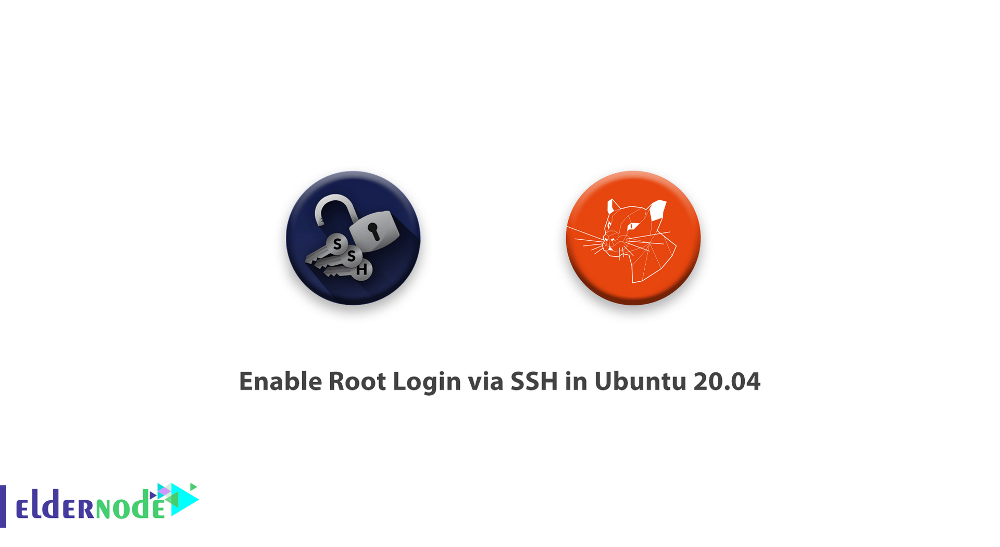
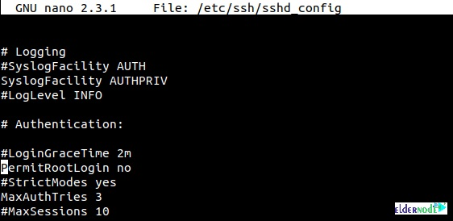

In this [tutorial](https://eldernode.com/category/tutorial/), You will learn enabling root login via SSH in Ubuntu 20.04. And we will show you how to set a password for the Root user and how to enable it. Since the Secure shell helps you to handle your network service when you may face an unsecure network, it is a logical reason to learn about it. Stay with us to verify this secure connection of client and a server. But if you have not get your own [VPS](https://eldernode.com/vps/), contact us to be a virtual  private server owner.

To let this tutorial work better, please consider the below **Prerequisites**:

a non-root user with sudo privileges  
To set up, follow our [Initial server set up on Ubuntu 20.04 LTS](https://eldernode.com/initial-server-set-up-on-ubuntu-20-04-lts/).

## Enable Root Login via SSH in Ubuntu 20.04

By default, SSH on Ubuntu comes configured in a way that disables the root users log in. This was originally enabled as a security precaution which means that you cannot directly log in as the root user over SSH. However, you can usually get around the need for root ssh login by using the sudo command.

### Set Root password

After login to Ubuntu 20.04, Now type following command for reset/set root password.

```
sudo passwd root
```

After type the command, maybe [Ubuntu](https://en.wikipedia.org/wiki/Ubuntu_version_history) 20.04 check your password username. first, you put your username’s password and when you see a prompt for a new password, type a new password for root and confirm that.

you succeed to change the root password, now you need to change some configuration on /etc/ssh/ssh_config for the permit root login.

### Configure SSH config to permit root login

Edit /etc/ssh/sshd_config file with following command.

```
nano /etc/ssh/sshd_config
```



As you see, the PermitRootLogin is set to No. It means that the root login via SSH has been disabled. So, to enable root login change the No to Yes. Find **PermitRootLogin** and delete **No** or **without-password** and type **yes**.

For example:

Before change

```
PermitRootLogin without-password
```

After edit

```
PermitRootLogin yes
```

After edit the SSH config file, press **Ctrl \+ x** and **press Enter** button twice for save and exit.

Restart SSH service for loading new configuration on SSH_config file.

```
sudo systemctl restart sshd
```

OR

```
sudo service sshd restart
```

Now you can check SSH via Root user.

## conclusion

At this point, you learned how to Enable Root Login via SSH in Ubuntu. From now on you will be able to connect to your system remotely and perform administrative tasks. So, log in to Ubuntu 20.04 via ssh with root user and enjoy it. In case you feel interested in reading more about SSH articles, have a look at [Install SSH Server on Linux and allow root user login](https://blog.eldernode.com/install-ssh-server-on-linux-and-allow-root-user-login/).