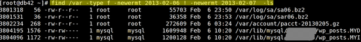

How do I find out all files that have been modified on 2013-02-07 (07/Feb/2013) using find command under Linux / Apple OS X / *BSD and Unix like operating systems?  
  
There are two ways to list files in given directory modified after given date of the current year. The latest version of GNU/find command use the following syntax:

## Syntax

GNU/find latest version:  
find /path/to/dir -newermt "date"  
find /path/to/dir -newermt "Feb 07"  
find /path/to/dir -newermt "yyyy-mm-dd"  

## List all files modified on given date  

`find /path/to/dir -newermt yyyy-mm-dd ! -newermt yyyy-mm-dd -ls ` 

### print all *.pl ###  
find /path/to/dir -newermt "yyyy-mm-dd" -print -type f -iname "*.pl"  
  
Sample outputs:  

Fig.01: Find -newermt yyyy-mm-dd in action

The other way of doing this works on the versions of find before v4.3.3:

touch -t 02010000 /tmp/stamp$$
find /usr -newer /tmp/stamp$$
rm -f /tmp/stamp$$

## Examples

To find out all files that have been modified on 2013-02-07 (07/Feb/2013), enter:

find /path/to/dir -type f -name "*" -newermt 2013-02-07 ! -newermt 2013-02-08

Sample outputs:

./output/tmp/rss.js-gzip-10881623-407-1360173602
./images/advanced-cache.php
./images/faq/2013/02/ir-150x150.jpg
./images/faq/2013/02/warning-40px76.png

To **find out all Python files** (*.py) in /home/vivek/projects that have been modified on 2013-02-07 (07/Feb/2013), enter:

find $HOME/projects -type f -name "*.py" -newermt 2013-02-07 ! -newermt 2013-02-08 -print

Pass the -ls option to get **detailed file listing**:

find $HOME/projects -type f -name "*.py" -newermt 2013-02-07 ! -newermt 2013-02-08 -ls

To **find and delete all tmp** files (*.tmp) in /home/vivek/projects that have been modified on 2013-02-07 (07/Feb/2013), enter:

find $HOME/projects -type f -name "*.py" -newermt 2013-02-07 ! -newermt 2013-02-08 -delete

The author is the creator of nixCraft and a seasoned sysadmin, DevOps engineer, and a trainer for the Linux operating system/Unix shell scripting. Get the **latest tutorials on SysAdmin, Linux/Unix and open source topics via [RSS/XML feed](https://www.cyberciti.biz/atom/atom.xml)** or [weekly email newsletter](https://www.cyberciti.biz/subscribe-to-weekly-linux-unix-newsletter-for-sysadmin/).