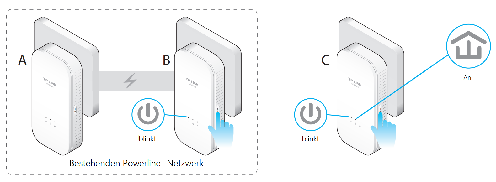

Configuration Guide

Updated 09-07-2016 15:48:56 PM_27612_

**Dieser Artikel gilt für:**

TL-WPA8630P KIT , TL-PA4010P TKIT , TL-PA411KIT , TL-PA4010 KIT , TL-WPA4226T KIT , TL-PA4010P KIT , TL-WPA4530 KIT , TL-PA4020P KIT , TL-PA9020P KIT , TL-WPA4230PKIT , TL-PA4020 KIT , TL-WPA4220KIT , TL-WPA4220 KIT , TL-WPA4230P , TL-WPA4220T KIT , TL-PA7020 KIT , TL-PA7020P KIT , TL-WPA8630 KIT , TL-PA8010P KIT , TL-PA4016P KIT , TL-PA4020PT KIT , TL-WPA8730 KIT , TL-PA411 , TL-PA8030P KIT , TL-WPA4220 , TL-WPA4226KIT , TL-PA8010 KIT

**Hinweis**:" Diese Anleitung soll Ihnen zeigen, wie Sie die Powerline Adapter mit Hilfe der Pair-Taste paaren/hinzufügen."

**Voraussetzungen:**

\- Zu pairende Adapter

**Betroffene Produkte**: Alle aktuellen Powerline Adapter.

**Schritt 1:**Schließen Sie den neuen Powerline Adapter an.

**Schritt 2: **Hinzufügen eines Powerline Adpater.

1.  Drücken Sie die Pair-Taste einer der Powerline Adapter (**A**oder**B**) in Ihrem bestehenden Powerline Netzwerk für 1 Sekunde. Die Power Anzeige fängt zu**blinken**an.

2.  Innerhalb von Zwei Minuten drücken Sie bitte die Pair-Taste des neues Powerline Adapters (**Adapter C**) für eine Sekunde. Die Power Anzeige fängt zu**blinken**an.
3.  Der Pairing Vorgang ist abgeschlossen. Die Power und Powerline Anzeige aller Powerline Adapter sind an.

**Hinweis:**"Für das Pairen der Adapter diese im gleichen Raum anschließen. Nach erfolgreichen Pairen können Sie die Adapter umstecken. Ein erneutes drücken der Pair-Taste ist nicht notwendig"

**Finden Sie diese FAQ hilfreich?**  
Mit Ihrer Rückmeldung tragen Sie dazu bei, dass wir unsere Webpräsenz verbessern.