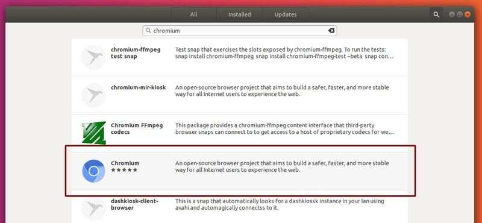
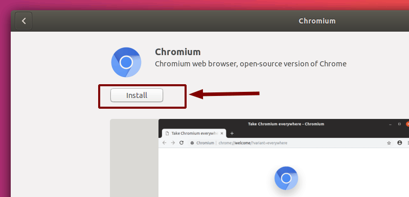
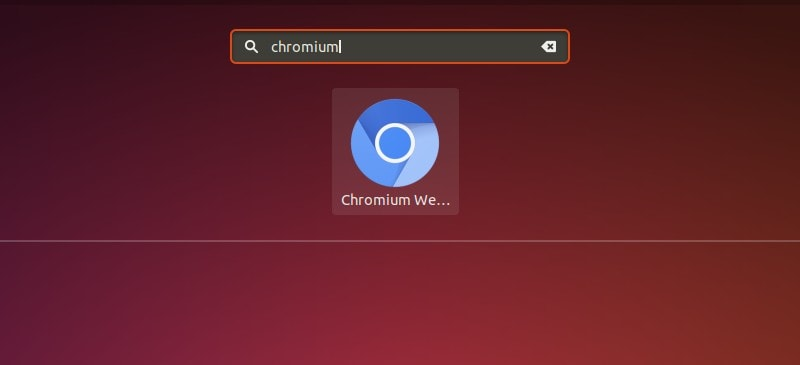

## Installing Chromium in Ubuntu

If you are okay with using commands, you can simply type this in the terminal:

```
sudo apt install -y chromium-browser
```

If you are not comfortable with terminal, don’t worry. In Ubuntu (as well as in other distributions), you can find Chromium in the Software Center. Open up Software Center and search for Chromium:



Ubuntu Software Center Chromium

Click on the entry and then on Install:



Ubuntu Software Center Install Chromium

You can now open Chromium by searching for it in the Applications menu:



Ubuntu Applications Chromium

or by opening up a terminal and typing in:

```
chromium
```

You can uninstall the app the same way you installed it (from the Software Center).