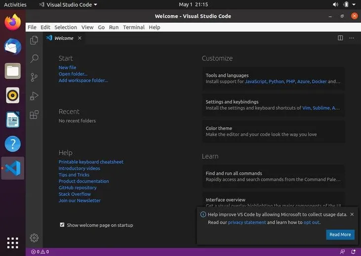

## Installing Visual Studio Code with `apt`

Visual Studio Code is available from the official Microsoft Apt repositories. To install it, follow the steps below:

1.  Update the packages index and install the dependencies by running the following command as a [user with sudo privileges](https://linuxize.com/post/how-to-create-a-sudo-user-on-ubuntu/) :
    
    ```
    `sudo apt update``sudo apt install software-properties-common apt-transport-https wget`
    ```
    

Import the Microsoft GPG key using the following [`wget` command](https://linuxize.com/post/wget-command-examples/) :

```
wget -q https://packages.microsoft.com/keys/microsoft.asc -O- | sudo apt-key add -
```

And enable the Visual Studio Code repository by typing:

```
sudo add-apt-repository "deb [arch=amd64] https://packages.microsoft.com/repos/vscode stable main"
```

Once the [apt repository is enabled](https://linuxize.com/post/how-to-add-apt-repository-in-ubuntu/) , install the Visual Studio Code package:

```
sudo apt install code
```

When a new version is released you can update the Visual Studio Code package through your desktop standard Software Update tool or by running the following commands in your terminal:

```
`sudo apt update``sudo apt upgrade`
```

## Starting Visual Studio Code

In the Activities search bar type “Visual Studio Code” and click on the icon to launch the application.

When you start VS Code for the first time, a window like the following should appear:



You can now start installing extensions and configuring VS Code according to your preferences.

VS Code can also be launched from the command line by typing `code`.