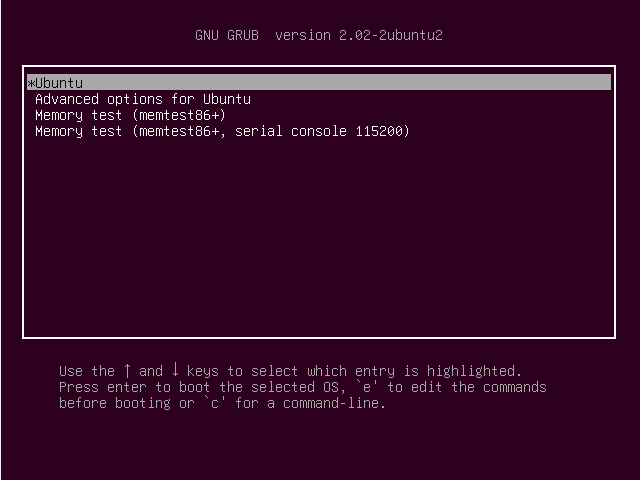
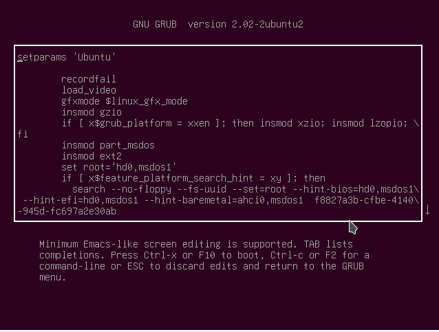
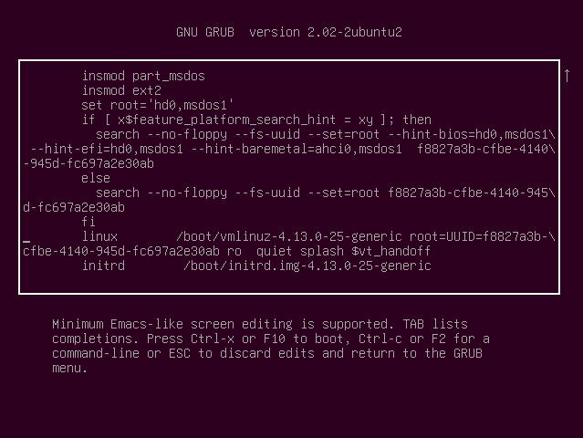
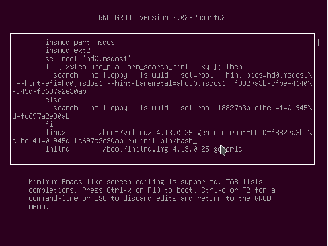
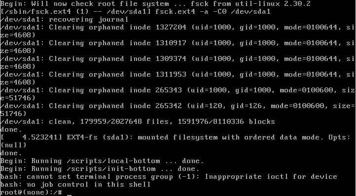

## Objective

The objective is to reset lost root or user password on Ubuntu 18.04 Bionic Beaver Linux.

## Operating System and Software Versions

*   **Operating System:** \- Ubuntu 18.04 Bionic Beaver

## Requirements

Physical access to your computer or virtual machine with the Ubuntu 18.04 Bionic Beaver installation is required.

## Difficulty

EASY

## Conventions

*   **#** \- requires given [linux commands](https://linuxconfig.org/linux-commands) to be executed with root privileges either directly as a root user or by use of `sudo` command
*   **$** \- requires given [linux commands](https://linuxconfig.org/linux-commands) to be executed as a regular non-privileged user

## Instructions

The first step is to reboot into the GRUB menu. If Ubuntu 18.04 Bionic Beaver is the only operating system installed you need to keep pressing `SHIFT` for the GRUB menu to show up.

Using arrows select the `Ubuntu` menu or the menu you use to boot your system and hit the `e` key. This will allow you to edit the menu:

Navigate down with the arrow-down key until you can see a line ending with:

ro   quiet splash $vt_handoff

* * *

_**SUBSCRIBE TO NEWSLETTER**  
Subscribe to Linux Career [NEWSLETTER](https://bit.ly/2X5D30q) and receive latest Linux news, jobs, career advice and tutorials._

* * *

* * *

Using your keyboard replace the following keywords.  
FROM:

ro   quiet splash $vt_handoff

TO:

rw init=/bin/bash

Once you have made the change press `F10` or `CTRL + x` to perform boot into a single mode.

### Reset password

Confirm that your system partition is mounted as read/write (rw):

\# mount | grep -w /

If all good, reset your root password with the `passwd` command:

\# passwd

Alternatively, you can reset your user password. The following [linux command](https://linuxconfig.org/linux-commands) will reset the password for the `linuxconfig` user:

\# passwd linuxconfig

### Reboot

Your root password is now reset. Reboot your system:

\# exec /sbin/init

## Troubleshooting

Enter new UNIX password:
Retype new UNIX password:
passwd: Authentication token manipulation error
passwd: password unchanged

Your root partition is mounted read-only. Try:

\# mount -o remount,rw /

to resolve this issue.

* * *

\[ end Kernel panic - not syncing: Attempted to kill init! exit code=0x0007f00

Make sure that you removed the `splash` boot option when editing the grub's menu item.

* * *

When trying to reboot with the `reboot` command I get:

Failed to connect to bus: No such file or directory
Failed to talk to init daemon.

Ignore, and reboot with:

\# exec /sbin/init