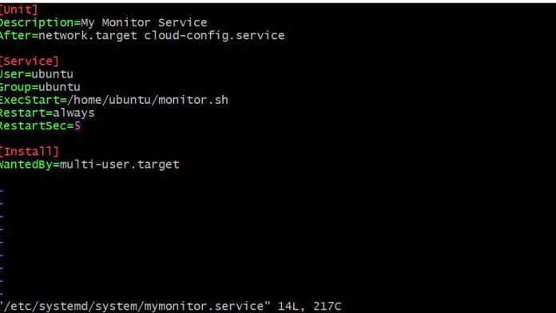

In this post I am going to show how easy it is to setup a service or script to start when a Linux server boots up. The method I am going to demonstrate is using systemd. I have a script monitor.sh that simply runs a curl command in an endless while loop. This particular example does not do anything other than run the curl, but you could easily add a check and send alert if the curl statement fails.

The same monitor command could be run via cron as well, where you execute the script every minute. Configuring it via systemd give you a bit more control over when the scripts starts \[on boot\] and also makes sure it keep running as long as the server is up.

This systemd setup ensure that the script will always be active and there will be only one copy of it running at any given time. If you did this via cron, you could end up with more than one active script in some cases.

As per Wikipedia, since 2015, the majority of Linux distributions have adopted systemd and it is now considered a de facto standard. [Wiki Page of Systemd.](https://en.wikipedia.org/wiki/Systemd)

## Procedure

Let us write our monitor.sh script first which runs the curl in an endless loop. Using an editor you are comfortable with, save the following code in a file */home/ubuntu/monitor.sh*

```

#!/bin/bash

while true;
do
    echo "Running monitor..."
    curl -o /dev/null -k https://blog.skbali.com &> /dev/null
    sleep 75
done

```

Make sure you have execute permission set.

```

chmod u+x /home/ubuntu/monitor.sh
```

Next, we will setup the systemd configuration file. Create a new file *sudo vi /etc/systemd/system/mymonitor.service.*

```

[Unit]
Description=My Monitor Service
After=network.target

[Service]
User=ubuntu
Group=ubuntu
ExecStart=/home/ubuntu/monitor.sh
Restart=always
RestartSec=5

[Install]
WantedBy=multi-user.target

```

Let us examine this configuration.

- The \[Unit\] section is where we describe our service and the relationship of the unit to other units.
- In this example, I want to ensure that my service runs after network is enabled
- In the \[Service\] section, I define that the process starts up a the ubuntu user. If your script was creating some output files then the user and group will be ubuntu:ubuntu for the output file.
- The ExecStart is where I set the path to my script.
- The next two lines ensure that my script is always running. If the job dies, then it will restart the script after a 5 second interval.
- WantedBy= ensures that the current service will be started when the listed services are started \[multi-user.target\]

Once the configuration file is saved, we reload the systemd daemon to ensure it picks up the new configuration file. Also the enable option makes the service start up on reboot. To start the service now you pass the start option.

```

systemctl daemon-reload
systemctl enable mymonitor.service
systemctl start mymonitor

```

Now if you run the ps command you can see your script is running as the ubuntu user.

```

ps -ef | grep monitor
ubuntu    1516     1  0 19:54 ?        00:00:00 /bin/bash /home/ubuntu/monitor.sh

```

If you run the journalctl command you can verify that the monitor.sh script is running.

```

journalctl -e

Mar 02 20:12:17 ip-10-234-115-92 monitor.sh[1516]: Running monitor...
Mar 02 20:13:32 ip-10-234-115-92 monitor.sh[1516]: Running monitor...

```

if you kill this process and run a ps again you will see that the process has been restarted and it has a new pid.

```

ps -ef | grep monitor
ubuntu    1660     1  0 20:20 ?        00:00:00 /bin/bash /home/ubuntu/monitor.sh
```

Check the logs again by running journalctl again.

```

Mar 02 20:19:56 ip-10-234-115-92 systemd[1]: mymonitor.service: Main process exited, code=killed, status=9/KILL
Mar 02 20:19:56 ip-10-234-115-92 systemd[1]: mymonitor.service: Failed with result 'signal'.
Mar 02 20:20:01 ip-10-234-115-92 systemd[1]: mymonitor.service: Service hold-off time over, scheduling restart.
Mar 02 20:20:01 ip-10-234-115-92 systemd[1]: mymonitor.service: Scheduled restart job, restart counter is at 1.
Mar 02 20:20:01 ip-10-234-115-92 systemd[1]: Stopped My Monitor Service.
Mar 02 20:20:01 ip-10-234-115-92 systemd[1]: Started My Monitor Service.


```

## Conclusion

Once you understand the procedure, you can adapt the configuration to run any script, application or custom server. Maybe it is a node application or a python script listening on a port. The systemd service will make sure your process is started on boot and always running.

**Note: If you make any changes to your script monitor.sh, make sure to stop and start your service so that a new process is launched.**

If you need to change ulimits for your process, you can add it to your configuration as shown in my post [here](https://blog.skbali.com/2019/09/set-ulimits-for-a-script-started-using-systemd/).

## Further reading

- [More info on systemd](https://wiki.archlinux.org/index.php/Systemd)
- [https://www.freedesktop.org/software/systemd/man/systemd.service.html](https://www.freedesktop.org/software/systemd/man/systemd.service.html)