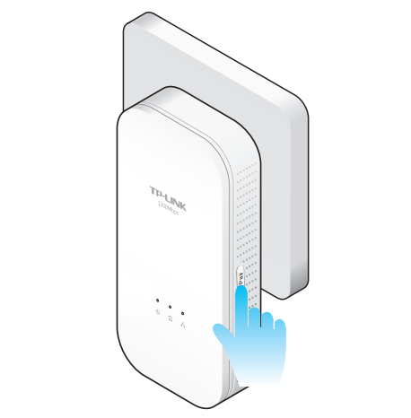

User Application Requirement

Updated 09-07-2016 14:35:33 PM_18973_

**Dieser Artikel gilt für:**

TL-PA8030P KIT , TL-PA9020P KIT , TL-PA8010 KIT , TL-PA7020 KIT , TL-PA7020P KIT , TL-PA8010P KIT

**Hinweis**: Diese Anleitung soll Ihnen zeigen, wie Sie einen Powerline Adapter über die Pair-Taste auf die Werkseinstellungen zurücksetzen.

**Voraussetzungen:**

\- Zurückzusetzender Powerline Adapter

**Betroffene Produkte**: TL-PA7020, TL-PA7020 KIT, TL-PA7020P KIT, TL-PA8010P KIT, TL-PA8030P KIT, TL-PA9020P KIT.

**Schritt 1**: Drücken Sie die**Pair**-Taste für ca. 15 Sekunden, während der Powerline Adapter eingeschaltet ist. Alle Anzeige sollten aufleuchten. Dann können Sie die Taste loslassen und warten, bis der Powerline Adapter neu gestartet wurde.

**Finden Sie diese FAQ hilfreich?**  
Mit Ihrer Rückmeldung tragen Sie dazu bei, dass wir unsere Webpräsenz verbessern.