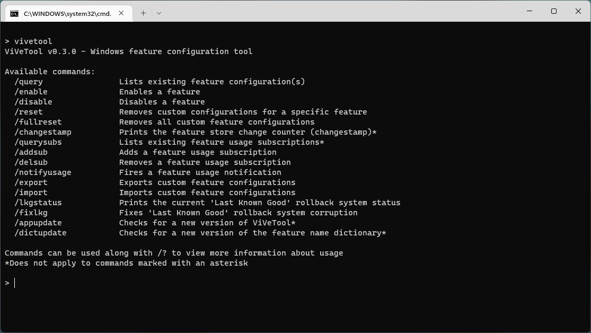

## ViVe

ViVe is a C# library you can use to make your own programs that interact with the A/B feature experiment mechanism found in Windows 10 & newer.

The *FeatureManager* class should cover most feature management needs with the added benefit of some struct heavy lifting being done for you. Boot persistence and LKG management is offered exclusively by this class as it had to be reimplemented.

In case you'd like to talk to NTDLL exports directly, you can use *NativeMethods*.

## ViVeTool

ViVeTool is both an example of how to use ViVe, as well as a straightforward tool for power users which want to use the new APIs instantly.

## Compatibility

In order to use ViVe, you must be running Windows 10 build 18963 or newer.

