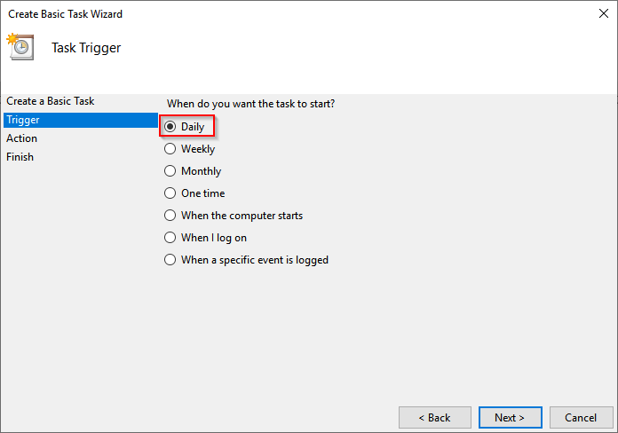
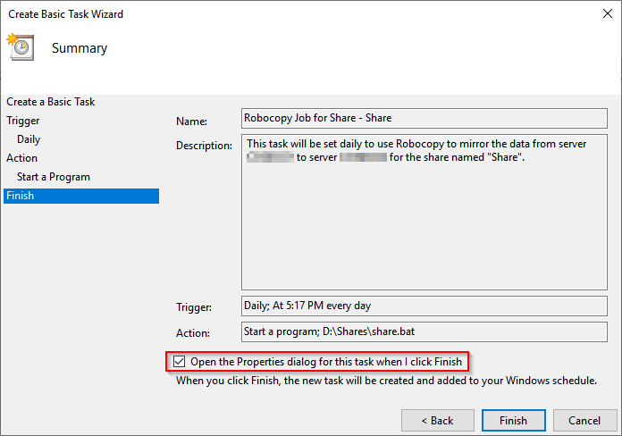
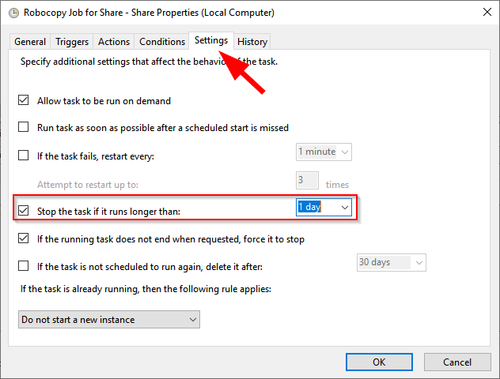

This blog covers how to automate daily Robocopy jobs using Task Scheduler.

Again, the syntax I choose is:

***robocopy*** ***\\\sourceserver\\ShareName*** ***D:\\Shares\\ShareName /e /b /copyall /PURGE /r:5 /w:5 /MT:64 /log+:D:\\Shares\\log\_ShareName \_%date:~-10,2%”-“%date:~7,2%”-“%date:~-4,4%.txt /v***

Recall I recommend removing the /tee parameter when not caring to see the output displayed to the screen, as you would not see it in this scheduled task.

Additionally, I recommend testing out your exact line of code before creating the batch file. Once you have finalized it, create a new text file, rename it to have a .bat file extension, and then edit it, putting in one Robocopy line with parameters you will use.

I typically try to create one batch file per share I’m copying instead of putting multiple Robocopy jobs in one batch file. This generally is for troubleshooting purposes, but if you wanted, you could create just one batch file for various Robocopy jobs.

Launch Task Scheduler your favorite way by searching for it in the Control Panel:

Or by simply launching it from the Tools menu in Server Manager.

Or by searching for it from the Start menu:

Once launched, select the Task Scheduler Library to view current scheduled tasks. Right click it and select “Create Basic Task…”

A wizard will launch. Enter a useful name and a description (optional) of the task.

Choose the frequency of the task. I prefer to run these daily.

Pick the start date and daily time the task will run and leave it to recur every day.

Leave the action to “Start a program.”

Browse for or manually type in path to the batch file. No additional arguments are required.

Review the settings configured. Check the box to “Open the Properties dialog for this task when I click Finish.”

Select the option button to “Run whether user is logged on or not” and the check box for “Run with highest privileges.” It also may be necessary to change the user of the job running if you don’t want the task to run with the previous user account.

I also usually have the task stop if it has been running longer than one day. To do this, click on the Settings tab, then change the default three days to 1 day. This is where you would have done your homework ahead of time to see how many files and folder and their size and estimate how long it will take to copy to the new server. If unsure, just leave it the default three days and check the logs generated afterward to see if it completed or if it needs a longer run window.

Clicking OK will prompt for the user account information that will be running the task. This saves the credentials in Task Manager. Be sure to enter the domain in the username field along with the username.

Create additional tasks by using the same method as above or slightly more quickly by exporting the task already created to an XML file, then modifying a few things in the XML file (Description, URI, StartBoundary, and Command). When importing, verify the settings are the same as previously configured as you may lose some settings during the import.

The benefit to creating Scheduled Tasks to run these jobs are:

- It will run by itself.
- You don’t need to log into the server to do it.
- For the most part, running it daily will equate to a smaller delta on the actual cutover day.
- You can run it manually very quickly instead of finding the correct syntax all over again.

**Be sure on the actual cutover day to disable and/or delete the task! Failure to do so will mean that new active data on the active share will be deleted because it doesn’t exist on the old share!**

For the actual cutover, change the source server’s shares to Read Only to prohibit users from changing file and run the task one last time (right-click the task and click Run).

Be sure to review the logs outputted to see if there are any errors due to syntax or locks on the files. Putting the share in Read Only or a server reboot should do the trick if necessary if there is a lock.