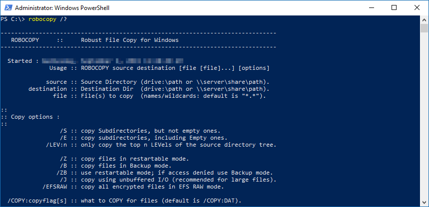

With various flavors of Windows Server operating systems going out of support this year, I have found myself with a decent number of file server migrations from one system to another. Sometimes if the server doesn’t have any other roles or functions installed other than just a file server, then I could simply unshare the shares on the original server, detach the virtual hard disk from it, attach the virtual hard disk to the new server, and reshare the shares. This maintains NTFS permissions if both servers are members of the same Active Directory domain. It is also generally very quick as there is no need to copy terabytes of data from one server to another. However, this process only works elegantly when the file share data exists on a volume that isn’t where Windows or any applications are installed.

When the need arises to duplicate the data for the migration to the new server, I always go back to old faithful—[**Robocopy**](https://docs.microsoft.com/en-us/windows-server/administration/windows-commands/robocopy) (Robust File Copy for Windows). Robocopy has existed since NT4 days in 1996, so this is likely not the first time you are hearing of it. Back then and until 2008, it was available with the Windows Resource Kit download. Beginning in 2008 (and thereafter), it was bundled with both desktop and server operating systems starting with Vista and Server 2008. So, chances are if you start a command prompt on your computer and type “robocopy /?” you’ll see the help dump of information to your screen on how to use the utility.

There are quite a few options when it comes to file server migrations using Robocopy, and you might not know where to start. Be careful with some of the options if you are just trying it out, as some of them move the data (deleting the files and folders in the source location or the target location).

Over the years of usage, I have found this syntax the one I keep going back to over and over again:

***robocopy*** ***\\\sourceserver\\ShareName*** ***D:\\Shares\\ShareName /e /b /copyall /PURGE /r:5 /w:5 /MT:64 /tee /log+:D:\\Shares\\log\_ShareName \_%date:~-10,2%”-“%date:~7,2%”-“%date:~-4,4%.txt /v***

### Let’s break that down.

**Robocopy  
**Initiates the command.

**\\\sourceserver\\ShareName  
**The first parameter is always the source location. I typically always run Robocopy from the new file server as:

- It will likely have a newer version of Robocopy installed; and
- I will not likely have the shares built yet on the new server.

**D:\\Shares\\ShareName  
**The second parameter is always the destination location. I highly encourage you to not put these on the C:\ operating system volume whenever possible. I also like to create a root folder called “Shares” and put all the shared folders into this folder instead of leaving them at the root. There are multiple advantages to that I have found over the years.

The next parameters don’t need to be in any particular order.

**/e **

This copies subdirectories, including Empty ones. This is where the true value of Robocopy comes into play. If it only copied the files in the top-level shared folder, it would not be of much value.

**/b  
**This copies files in Backup mode. This doesn’t create a VSS snapshot, but instead, this is useful if the Windows account you are running Robocopy with may not have complete access to the source location due to ACLs in NTFS.

**/copy all  
**So you may have been asking yourself, why all the hassle? Why not navigate to both location and copy-paste the files from location to location? This parameter copies all file info. That way, there isn’t a new timestamp, or owner, or inherited NTFS permissions when there shouldn’t be, etc. All file info includes:

- Data
- Attributes
- Timestamps
- Security (NTFS ACLs)
- Owner info
- Auditing info

**/PURGE**  
This parameter **deletes** destination files and folders that no longer exist in the source. Note that technically, using parameters /e and /PURGE together gives the same effect as using one parameter by itself (/mir – for “mirror”), but I prefer having a big capital “PURGE” in the syntax so when I look at it, I know I am likely deleting something. The question arises here of if the file or folder no longer exists in the source location, why would I be trying to copy it to the target. Furthermore, why would I want to delete a file that never existed in the first place.

This is the second place where Robocopy really shines. I don’t usually just run Robocopy once and be done unless I’m copying inactive stale data. I usually create a scheduled task to run a batch file that includes the Robocopy lines to run. With this in mind and with the above parameters, the first execution of the job will take a while as it has to do the initial copy of all the data. However, when it runs the next time (I usually set it to run daily after business hours), it will look at the source and compare it to the target, and if the file has not changed, it will not do anything with it. If the file in the source is newer, it will overwrite the file in the target. If the file in the source has been deleted since the last run of the job, the same file in the target will be deleted automatically as well. For an actual file share migration, I set this up about a week in advance, look at the logs it generates, troubleshoot any issues, and let it run daily until the scheduled cutover date. On the cutover date, I would put the source share into Read-Only and run the Robocopy job once more to copy over any deltas that have changed since the last run. Afterward, to wrap up, I would unshare the source share and then share out the new share.

**/r:5  
**This flag specifies the number of times Robocopy will retry a failed copy on a file or a folder. Sometimes this fails because there is a lock on the file because the user or process has it open. When this occurs, Robocopy will retry the copy to see if the lock is no longer on the file. By default (if you don’t specify this parameter), Robocopy will retry the copy 1 million times. Knowing that we are going to try to copy this file again during the next scheduled run one day away, I am more than content with trying five retries, and if it doesn’t copy successfully, proceed to the next file.

**/w:5  
**This flag goes hand in hand with /r. This flag specifies the amount of time in seconds to wait between retries. Default is 30 seconds. Putting 2 and 2 together, 1,000,000 * 30 = 30,000,000 seconds or 500,000 minutes or 8,333 hours and 20 minutes or 347 days and 5 hours. This means if a single file was locked and remained locked, Robocopy would take almost a year before it would proceed onto the next task! This is a must to set the /r and /w flags appropriately.

**/MT:64  
**This flag will set a new maximum number of threads when doing multi-threaded copies. This does not copy multiple files or folders at the same time, but instead uses more threads with the CPU to do the copy it has been set to do. The default number is 8. I like to increase this number to a total of 64 (keep this in mind if running multiple Robocopy jobs simultaneously). There is CPU overhead of opening the source file, opening the destination file, copying the data, closing the source file, and closing the destination file. If all of that must be done before proceeding to the next file, there is potential that the I/O subsystem will be idle part of the time that it could have been working. **Note: this will likely make your system appear sluggish as it is working the CPU decently. If this is on a new not-yet-in-production file server, it shouldn’t matter if it is “slow.”**

**/tee  
**By default, when this is running manually from the command prompt, Robocopy will output what it is doing to the screen display. With potentially thousands of files to copy, it makes for a less than efficient way to find something that went wrong. Specifying /tee (instead of leaving it out entirely) will force it to output to the console window, as well as the log file. This is specifically useful if it is your first run of the Robocopy job, and you’re troubleshooting something not quite working the way it should. If I create a scheduled task of the Robocopy job, I recommend leaving this command out.

***log+:D:\\Shares\\log\_ShareName \_%date:~-10,2%”-“%date:~7,2%”-“%date:~-4,4%.txt***

By default, the only logging from Robocopy is display to the screen. With the /log parameter, specify the file path to a new file (or existing file). It will overwrite the file if it already exists. However, when doing this process with a scheduled task, you may want to see all iterations of the run instead of just the most recent. By specifying the + after log (/log+), it will append to the specified file instead of overwriting it. Also by putting “_%date:~-10,2%”-“%date:~7,2%”-“%date:~-4,4%” into the file name it will automatically create a new file (if ran for the first time that day) with a suffix of _*MM_DD*_YYYY at the end of the log file for historical referencing. For especially large file shares, even the log files can grow into the multiple gigabytes if left running for days and splitting them out into daily logs makes a lot of sense.

**/v  
**This parameter shows Verbose output, which will show skipped files. Generally, you really want to see this to make sure skip files are logged.