Let us discuss on setting up the Windows Task Scheduler to run the PowerShell scripts. We would discuss on setting up a simple script to run Locally on a system and to have script doing remote execution.
Windows Task Scheduler has wide functionalities and options we would explore the options useful for PowerShell.

###### <a id="Case_1_Run_the_PowerShell_script_with_Windows_Task_Scheduler_Locally"></a>Case 1: Run the PowerShell script with Windows Task Scheduler Locally.

Sample code for execution Locally.
Save the code in a file with .ps1 extension in C:\ to be called by the task scheduler.

`1.``#Sample script to test the script execution from Task Scheduler.`

`2.``"Ran on System $(hostname) as $([Security.Principal.WindowsIdentity]::GetCurrent().Name)"` `` ` ``

`3.``| Out-File c:\scriptLog.log -Force -Append`

Setting up the Windows Task Scheduler.

[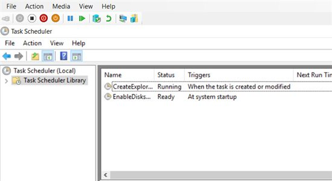](https://social.technet.microsoft.com/wiki/cfs-file.ashx/__key/communityserver-wikis-components-files/00-00-00-00-05/3624458.1.jpg)

Create a Basic Task

[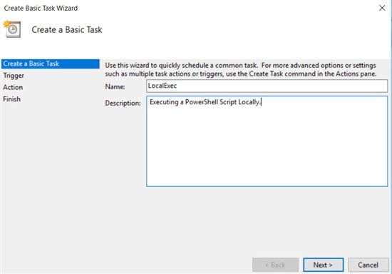](https://social.technet.microsoft.com/wiki/cfs-file.ashx/__key/communityserver-wikis-components-files/00-00-00-00-05/050870.2.jpg)

Select the option as appropriate for script execution.

[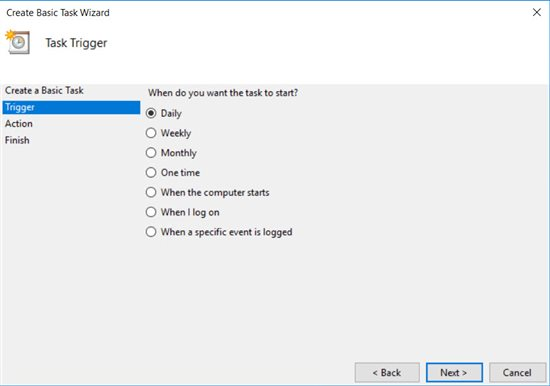](https://social.technet.microsoft.com/wiki/cfs-file.ashx/__key/communityserver-wikis-components-files/00-00-00-00-05/16602.3.jpg)

Select the Start Schedule as appropriate

[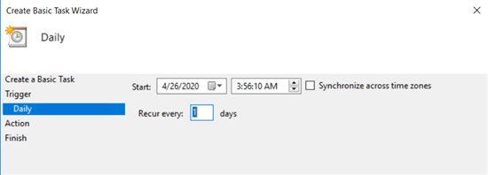](https://social.technet.microsoft.com/wiki/cfs-file.ashx/__key/communityserver-wikis-components-files/00-00-00-00-05/32132.4.jpg)

Select "**Start a Program**"

[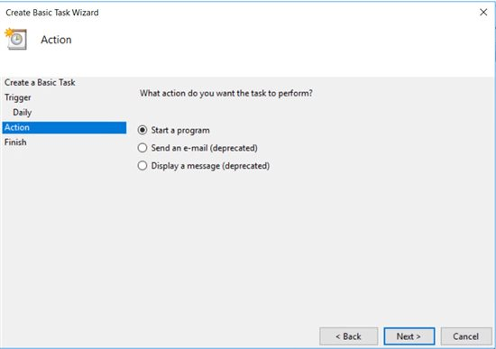](https://social.technet.microsoft.com/wiki/cfs-file.ashx/__key/communityserver-wikis-components-files/00-00-00-00-05/616856.5.jpg)

Set the Program as "Powershell.exe" and the Arguments as "-file &lt;filename&gt;.ps1"

**Troubleshooting Tips:
**Putting the filename in **single quotes** here would give a error while executing. **0xFFFD0000**
The filename should be in double quotes even if the path has spaces in the **folder names.** 
ie It should be "C:\\Program Files\\My Data\\Run Script.ps1"  and **not** 'C:\\Program Files\\My Data\\Run Script.ps1'

[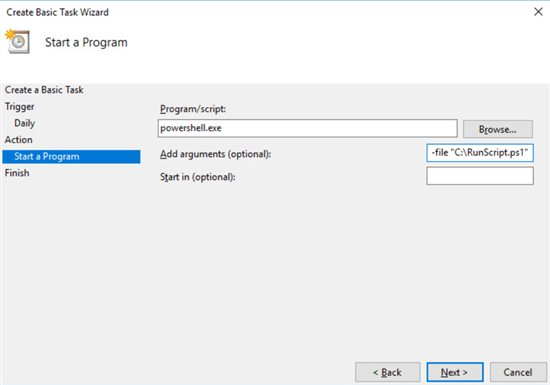](https://social.technet.microsoft.com/wiki/cfs-file.ashx/__key/communityserver-wikis-components-files/00-00-00-00-05/0842.6.jpg)

Select "Open the Properties....." and Click "Finish"

[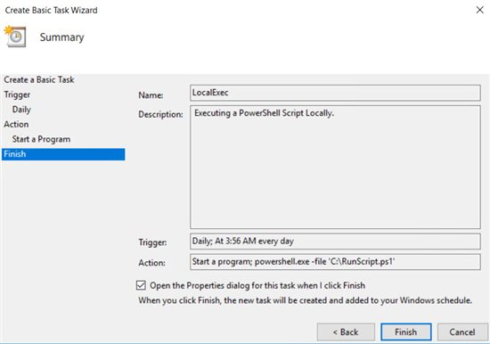](https://social.technet.microsoft.com/wiki/cfs-file.ashx/__key/communityserver-wikis-components-files/00-00-00-00-05/6545.7.jpg)

On the new Properties window.

[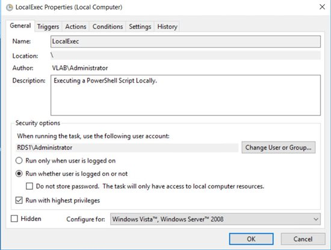](https://social.technet.microsoft.com/wiki/cfs-file.ashx/__key/communityserver-wikis-components-files/00-00-00-00-05/3201.8.jpg)

**Troubleshooting Tips :**
Check the user name - Here its local Administrator or server RDS1. Though the Author of the Script is Domain account.
Ensure "Run whether user is logged on or not" is checked if your script is specific time dependent and not user logon status.
Check "Run with highest privileges" - To ensure the script runs elevated.

Validate the "Trigger" tab.

[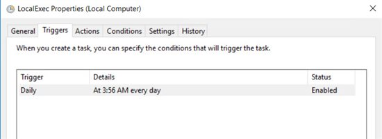](https://social.technet.microsoft.com/wiki/cfs-file.ashx/__key/communityserver-wikis-components-files/00-00-00-00-05/4265.9.jpg)

Validate the "Actions" Tab

[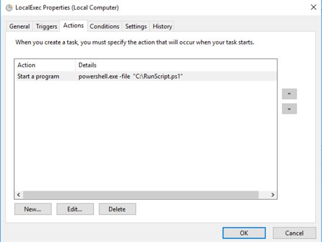](https://social.technet.microsoft.com/wiki/cfs-file.ashx/__key/communityserver-wikis-components-files/00-00-00-00-05/66760.10.jpg)

Click "OK" and "Enter the Local Administrator Credentials."

[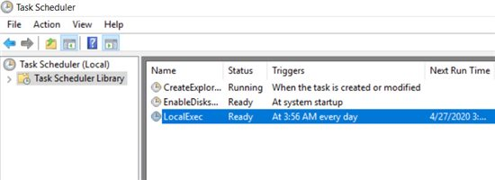](https://social.technet.microsoft.com/wiki/cfs-file.ashx/__key/communityserver-wikis-components-files/00-00-00-00-05/7242.11.jpg)

The Task is Scheduled.

Execute the Script

[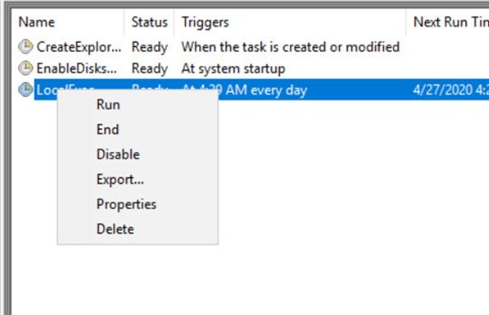](https://social.technet.microsoft.com/wiki/cfs-file.ashx/__key/communityserver-wikis-components-files/00-00-00-00-05/3116770.1.jpg)

Status of the Task and the output in the Log file.

[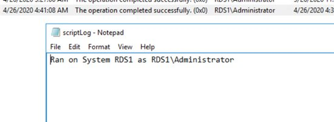](https://social.technet.microsoft.com/wiki/cfs-file.ashx/__key/communityserver-wikis-components-files/00-00-00-00-05/11260.1.jpg)

**Troubleshooting Tips:**
The task is set to run as Local Administrator.
Find the Execution Policy set on the System.
If the Execution Policy is **Restricted, AllSigned **as shown below the task would fail with **0x1 error.**
**If you want to bypass the execution Policy on the system, change the "Action" in the Properties of the Task as below.
**Append the "-executionPolicy bypass" and save the Task.
[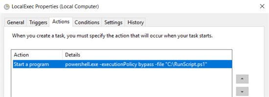](https://social.technet.microsoft.com/wiki/cfs-file.ashx/__key/communityserver-wikis-components-files/00-00-00-00-05/28700.1.jpg)

###### <a id="Case_2_Run_the_PowerShell_script_with_Windows_Task_Scheduler_with_a_Domain_Account"></a>Case 2: Run the PowerShell script with Windows Task Scheduler with a Domain Account.

Things change a bit here, when we plan to run the task scheduler with Domain Account.
Two things to consider.
**Case 2 : Option 1**.The PowerShell script does all it's stuff locally when it's called from the Windows Task Scheduler.
If the Domain Account has the Administrators privileges locally (domain user or the Domain Group if it's part of Local Administrators Group), the scenario wont change much.

Change the "General" Tab setting for the user by going to the Task Properties.

[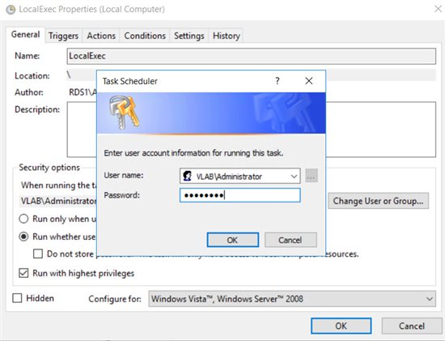](https://social.technet.microsoft.com/wiki/cfs-file.ashx/__key/communityserver-wikis-components-files/00-00-00-00-05/02308.2.jpg)

Output of the Log File and the Task Status. Shows the Domain Account in use.

[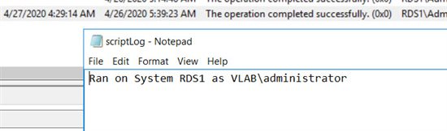](https://social.technet.microsoft.com/wiki/cfs-file.ashx/__key/communityserver-wikis-components-files/00-00-00-00-05/7002.3.jpg)

Once the job is configured to "Run as a Different User" it can be called by users who have Administrator rights.
Output of execution as Local Administrator on the same server.

[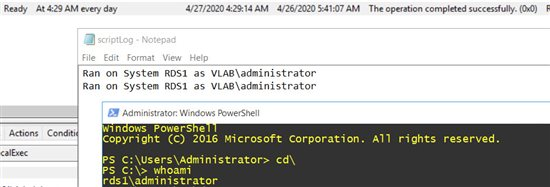](https://social.technet.microsoft.com/wiki/cfs-file.ashx/__key/communityserver-wikis-components-files/00-00-00-00-05/50002.3.jpg)

**Troubleshooting Tips:
**Logging with local users without administrator privileges won't allow you to see the Tasks in the Windows Task Scheduler.
Users without the Administrator rights may not be able to modify the tasks in the Windows Task Scheduler.

****Case 2 : **Option 2**.The PowerShell script tries to do something remotely, like winrm, copying data, etc when it's called from the Windows Task Scheduler.
A domain account with Administrators permissions on the remote servers and if the WinRM is enabled to communicate over. The scenario is simple. Configure the task to run as the account with the permissions on remote systems.

Sample Code: Save as C:\\RunScript1.ps1

`1.``#Sample script to test the script execution from Task Scheduler`

`2.``# Calling remote servers with account that has administrators rights on the resources`

`3.```get-service -ComputerName domain01,rds1 -Name bits| ` ``

`4.``select Status, MachineName| Out-File c:\scriptLog.log -Force -Append`

Account used : Domain Account with Administrators rights on the servers. 

Output: Able to query both the servers and returns the output.

[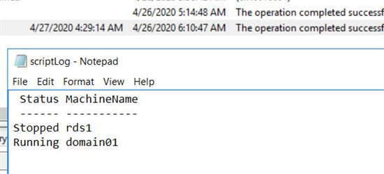](https://social.technet.microsoft.com/wiki/cfs-file.ashx/__key/communityserver-wikis-components-files/00-00-00-00-05/7656523.3.jpg)

**Troubleshooting Tips:
**If we configure local account to fetch the details it would fail, in a very rare case if the domain account name and password match the local account it may execute, probably to do with authentication options.
ie. &lt;Domain&gt;\\User01 and &lt;Hostname&gt;\\User01 
If you are running batch scripts instead of PowerShell, in addition to the permissions described, we need to ensure the "Allow logon as batch" in security policies.

Tried to cover some basics with common issues.
Reference URL : [https://docs.microsoft.com/en-us/dynamics365/business-central/dev-itpro/developer/devenv-task-scheduler ](https://docs.microsoft.com/en-us/dynamics365/business-central/dev-itpro/developer/devenv-task-scheduler) 

* * *