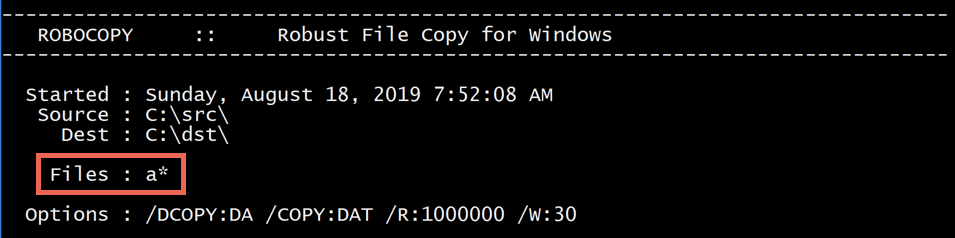

Robocopy is one of the most-used command-line utilities to copy large volumes of data in Windows. It’s such a popular tool because of how powerful it is. But with all that power comes complexity. In this guide, we will break down all that complexity and provide a complete tutorial on using this useful tool.

Robocopy is a Windows command-line utility that’s been available since Windows NT. It’s a replacement for the less versatile xcopy utility. It allows you to specify a drive path or server path to copy/move files at a command prompt.

The version of Robocopy as of this writing is up to 10.0.18. This is the version I performed my testing on.

Robocopy provides a slew of features you can leverage to perform efficient and fast file copies and moves. It can:

- Copy files over a network with resume capabilities
- Can skip NTFS junction points causing failure typically from infinite loops
- Can copy file and directory attributes preserving timestamps
- Can copy NTFS permissions, owners, and auditing info
- Can copy directory timestamps
- Can copy files in ‘backup’ mode to ensure files are copied even those rights have been denied to the administrator
- Automatic retries
- Can sync two folders
- Is smart enough to skip files already copied
- Can copy paths larger than the 256 character path limit
- Perform asynchronous copies using its multithreading ability.
- Returns standardized exit codes for use in scripts

As you can see, there’s *a lot* to to copy. I wanted to cover everything you need to know about this handy tool.

## Common Robocopy Syntax Reference

Why such a long blog post on a single utility? Just feast your eyes on the tables below. You have *a lot* of options to copy or move files with robocopy! You will more options in the individual sections.

These tables were built from the help syntax returned from `robocopy /?`. They’ve been broken up into more meaningful sections, added to over time, and cleaned up to provide more useful info.

### Source Options

|     |     |     |     |     |
| --- | --- | --- | --- | --- |
| Switch | Explanation | Default Behavior | Equivalent Switch | Notes |
| /S  | Copy subfolders |     |     |     |
| /E  | Copy subfolders including empty subfolders |     |     |     |
| /COPY:\[DATSOU\] | Copy options | /COPY:DAT |     | D=Data, A=Attributes, T=Timestamps S=Security=NTFS ACLs, O=Owner info, U=aUditing info. File Data (D) always includes file Timestamps (T) |
| /SEC | Copy files with SECurity |     | /COPY:DATS |     |
| /DCOPY:T | Copy directory timestamps |     |     |     |
| /COPYALL | Copy ALL file info |     | /COPY:DATSOU | This will prevent dehydrating offline files and will instead copy the file’s tag (on emc VNX/Unity systems at least). This is not officially documented! If dehydration is what you need (reason i found this issue), you can’t copy the ACLs along your files. CREDIT: [Monsieurx (Reddit)](https://www.reddit.com/user/MonsieurX) |
| /NOCOPY | Copy NO file info |     |     | useful with /PURGE |
| /A  | Copy only files with the Archive attribute set |     |     |     |
| /M  | like /A, but remove Archive attribute from source files |     |     |     |
| /LEV:n | Only copy the top n LEVels of the source tree |     |     |     |
| /MAXAGE:n | MAXimum file AGE – exclude files older than n days/date |     |     |     |
| /MINAGE:n | MINimum file AGE – exclude files newer than n days/date |     |     | If n < 1900 then n = no of days, else n = YYYYMMDD date |
| /FFT | Assume FAT File Times |     |     | 2-second date/time granularity. This replaces NTFS timestamps. Seems to be more reliable when transferring over a network. |
| /256 | Turn off very long path (> 256 characters) support |     |     |     |

### Destination Options

|     |     |     |     |     |
| --- | --- | --- | --- | --- |
| Switch | Explanation | Default Behavior | Equivalent Switch | Notes |
| /A+:\[RASHCNET\] | Set file attribute(s) on destination files + add |     |     |     |
| /A-:\[RASHCNET\] | Remove file attribute(s) on destination files |     |     |     |
| /FAT | Create destination files using 8.3 FAT file names only |     |     |     |
| /CREATE | Create directory tree structure + zero-length files only |     |     |     |
| /DST | Compensate for one-hour DST time differences |     |     |     |

### Copy Options

|     |     |     |     |     |
| --- | --- | --- | --- | --- |
| Switch | Explanation | Default Behavior | Equivalent Switch | Notes |
| /L  | List files only |     |     | Don’t copy, timestamp or delete any files |
| /MOV | Move files |     |     | Delete from source after copying |
| /MOVE | Move files and directories |     |     | Delete from source after copying |
| /sl | Copy file symbolic links instead of the target |     |     |     |
| /Z  | Copy files in restartable mode |     |     | Survive a network glitch |
| /B  | Copy files in backup mode |     |     |     |
| /J  | Copy using unbuffered I/O |     |     | Recommended for large files |
| /NOOFFLOAD | Copy files without using the Windows copy offload mechanism |     |     | [https://docs.microsoft.com/en-us/previous-versions/windows/it-pro/windows-server-2012-R2-and-2012/hh831628(v=ws.11)](https://docs.microsoft.com/en-us/previous-versions/windows/it-pro/windows-server-2012-R2-and-2012/hh831628(v=ws.11)) |
| /EFSRAW | Copy any encrypted files using EFS RAW mode |     |     |     |
| /TIMFIX | Fix file times on all files, even skipped files |     |     |     |
| /XO | Exclude older |     |     | if destination file exists and is the same date or newer than the source – don’t bother to overwrite it. |
| /XC | Exclude changed files |     |     |     |
| /XN | Exclude newer files |     |     |     |
| /XX | Exclude files present in destination but not source | /XX |     |     |
| /XF file \[file\]… | Exclude files matching given names/paths/wildcards |     |     |     |
| /XD dirs \[dirs\]… | Exclude directories matching given names/paths. |     |     | /XF and /XD can be used in combination e.g. ROBOCOPY c:\\source d:\\dest /XF *.doc *.xls /XD c:\\unwanted /S |
| /IA:\[RASHCNETO\] | Include files with any of the given attributes |     |     |     |
| /XA:\[RASHCNETO\] | Exclude files with any of the given attributes |     |     |     |
| /IM | Overwrite modified files. This includes the same files with different times. |     |     |     |
| /IS | Overwrite files even if they are already the same |     |     |     |
| /IT | Include tweaked files |     |     |     |
| /XJ | Exclude junction points from source | /XJ |     |     |
| /XJD | Exclude junction points from source directories |     |     |     |
| /XJF | Exclude junction points from source files |     |     |     |
| /MAX:n | Exclude files bigger than n bytes |     |     |     |
| /MIN:n | Exclude files smaller than n bytes |     |     |     |
| /MAXLAD:n | Exclude files unused since n |     |     |     |
| /MINLAD:n | Exclude files used since n |     |     | If n < 1900 then n = n days, else n = YYYYMMDD date |
| /MIR | Mirror a directory tree |     | /PURGE /E |     |
| /PURGE | Delete dest files/folders that no longer exist in source |     |     |     |
| /XL | Exclude files present in source but not destination |     |     |     |
| /SECFIX | Robocopy /secfix fixes file security on all files, even skipped files. |     |     | Specify the type of security information you want to copy by also using one of these options: /COPYALL /COPY:O /COPY:S /COPY:U /SEC |
| /ZB | Use restartable mode; if access denied use Backup mode |     |     |     |

### Monitoring Options

|     |     |     |     |     |
| --- | --- | --- | --- | --- |
| Switch | Explanation | Default Behavior | Equivalent Switch | Notes |
| /R:n | Number of retries on failed copies | /R:1000000 |     | Always try to set this option. I recommend setting this to 10-20 to not waste time retrying. |
| /W:n | Wait time between retries | /W:30 |     | Always try to set this option to a lower number to retry more quickly. I suggest 5-10. |
| /REG | Save /R:n and /W:n in the Windows registry as default settings |     |     |     |
| /RH:hhmm-hhmm | times when new copies can be started |     |     |     |
| /TBD | Wait for sharenames to be defined |     |     | retry error 67 |
| /PF | Check run hours on a per file (not per pass) basis |     |     |     |
| /MON:n | Run again when more than n changes seen |     |     |     |
| /MOT:m | Run again in m minutes, if changed |     |     |     |

## Understanding Robocopy Behavior

I’ve now completely blew your mind with all of the potential syntax options available to you. Let’s now see all of the different combinations of how we can use this syntax.

I could provide you an enormously long list of robocopy commands with an ever-growing number of switches. But I think it’s better to teach you how to fish. Let’s go over how to put sense out of all of these options.

### Robocopy Only Copies Entire Directories

Every robocopy execution will have a source and a destination directory. Robocopy copies and moves files by entire directory. It’s not possible to *explicitly* copy a single file with robocopy. Use `copy` or PowerShell’s `Copy-Item` for that.

However, you *can* robocopy single file with the right filtering which you’ll learn about below. To robocopy a single file file, specify the source and destination directories immediately followed by the file name in the source.

```
> robocopy c:\src d:\dst copythisfile.txt
```

### Syntax Depends on the Environment

Also, the options you provide to robocopy will depend on the environment. You’ll need to answer a few questions when trying to figure out which options to use.

- Will you always be copying to an empty directory?
- Is it possible files may already exist in the destination directory?
- Will you be copying terabytes of data or just a few megabytes?
- Will you be copying files over a network or locally?
- …and more.

If there are no files in the destination file directory, you shouldn’t care about options that overwrite files. If you won’t be copying files over the network, don’t worry about those options. Explicitly define your current and potential future circumstances your environment will be in.

### Recognize Default Options

Robocopy uses a lot of options by default. You can pick them out by looking at the tables above. It also provides a handy output to every time you run the utility.

You can see below that when I ran robocopy with its most basic options (the source and destination folder), it automatically used some options. Understanding the default behavior is important.

Reference the options you see in the output with the option explanations above and you’ll understand exactly what robocopy is doing under the covers.


Default robocopy options

## Understanding What Robocopy Commands can Do

If you’ve used `copy` or PowerShell’s `Copy-Item` cmdlets, you’ve probably specified a source and destination and went on about your day. There’s not a whole lot of options you can configure there. These robocopy commands have a default behavior.

But robocopy, on the other hand, understands *a lot* more and gives you the flexibility to tweak the behavior as much as you want.

It’s important to know robocopy isn’t just aware of the concept of a file or directory. There’s a lot more to a filesystem than that and robocopy supports just about everything.

A file sitting on a filesystem isn’t just a dumb object with a single purpose. There are many different attributes and things that go with the concept of a file. For example, a file has attributes such as:

- a timestamp (written, modified and accessed)
- NTFS ACL
- an owner
- NTFS auditing information
- hidden flag
- archived flag

When you copy or move a file, you have the option to bring all of that stuff along with it, if you want.

Understand that when you run robocopy, you’re not just copying a file, you’re also potentially copying all of the other information with it. It’s important to realize that and to account for it in the options you provide robocopy.

## The Basics: Performing WhatIf Scenarios

If you’ve got a huge file server somewhere you’d like to migrate and don’t want to take any action yet, you can use robocopy to return what it *would* have done.

Using the `/L` option, you can tell robocopy to enumerate all of the files and/or folders you specify and return a list of files it would have copied/moved.

You can use the `/L` option with any other option. This is a great way to return all of the options robocopy would have used (default or not). It will give you an overall view of what robocopy will do given the options you provided it.


Using `/L`

## The Basics: Copying Files

The most basic use of robocopy is using a source and destination directory with no options.

```
> robocopy C:\src C:\dst
```

This option will copy all files (excluding subfolders) from *C:\\src* to *C:\\dst*.

You can also copy *everything* including subfolders (empty or not) and NTFS permissions. This is, from what I can tell, the method to literally copy everything there is about a directory of files to another directory.

Below I’m copying all NTFS ACLs, file owners, subfolders (including empty ones) and all file attributes. All of this is made possible with just the `/E` option to include all empty subfolders and  `/COPYALL` to catch the rest.

```
> robocopy C:\src C:\dst /E /COPYALL
```

## The Basics: Moving Files

Moving files transfers files from one directory to another just like copying does. The only difference with a move operation is that the source files are removed after the copy.

To delete files/directories from the source after copying, use the `/MOV` option. This will remove all files in the specified directory (no subfolders).

```
> robocopy C:\src C:\dst /MOV
```

You can also use `/MOVE` to move all files and subfolders.

```
> robocopy C:\src C:\dst /MOVE
```

## The Basics: Syncing Files

Robocopy allows you to sync two directories. This means either ensuring all files in the destination directory are in the source directory and no more. `/MIR` will replicate data copying all files in the source not in the destination *and* delete files in the destination not in the source. Beware!

```
> robocopy C:\src C:\dst /MIR
```

## Copying Files over a Network

If you’re copying files over a network, there are a few options that you should consider.

Robocopy allows you to copy files in ‘restartable mode’ using the `/Z` option. This means that if a file begins copying and fails midway, the copy can start again instead of failing completely. The `/Z` option is useful when the stream gets cut over a network.

> *Warning: Some have reported using `/Z` cuts performance by 1/4. Let me know your findings.*

You can also use the `/FFT` option. This switch has been known to more accurately preserve file timestamps when transferring over a network. This option uses FAT file system timestamps instead of NTFS.

```
robocopy C:\src \\SRV1\share /Z /FFT
```

### Using `/IPG` to Control Inter-Packet Gap

When copying files over a network, you can use the `/IPG` switch. This is also known as the inter-packet gap option. This option defines (in milliseconds) the frequency in which robocopy will wait between sending new packets.

### Always use UNC Paths not Drive Letters

A reader on Reddit discovered the hard way to not use mapped drives as a destination directory. Instead, always use always use a UNC path. You might run into issues with the 256-character limit if you do. Check out this [Microsoft doc](https://docs.microsoft.com/en-us/windows/win32/fileio/naming-a-file#maximum-path-length-limitation) for more information.

## Robocopy Backup Mode (Robocopy `/Z`)

Robocopy has a option (`/B`) or as a backup to restartable mode (`/ZB`) which copies files in backup mode. What is “backup mode” anyway?

When you usually copy a file in Windows and hit a file that requires administrative privileges to access, you’ll receive an error indicating you don’t have permission. Even though you may be running as the local administrator, Windows won’t let you access it.

> ***WARNING: There have been reports of corrupted server volumes when copying data to a Windows Server 2016 server with de-duplication turned on. When you use the `/ZB` switch, the result will be a dedup chunk store being trashed in the System Volume Information. The copied files will not be readable and will generate errors when trying to manipulate them. [Serverfault link with more info](https://serverfault.com/questions/920018/apparently-robocopy-does-not-understand-windows-server-2016-deduplication-is-th).***

Backup mode is a way to access files without worry about permissions.

Robocopy uses backup mode to use the *SeBackupPrivilege* for reading files and the *SeRestorePrivilege* user right to access any files it needs. This ignores any ACEs that would normally prevent you from accessing those files.

The *SeBackupPrivilege* and *SeRestorePrivilege* user rights are normally assigned to users in the *Backup Operators* and *Administrators* groups but sometimes they can get removed. Backup module eliminates that risk and temporarily grants the user executing robocopy those rights.

If you’d like to check to see if your user account has that right, you can run `whoami /priv` and both rights should be displayed.

## Filtering Files and Folders

The large majority of the options available to you are to exclude files and directories many different ways. I’ve broken down all of the ways you can filter or exclude files and directories based on various criteria.

### **By File Name or File Extension**

Filtering what files get copied/moved in a robocopy call is done using wildcards. You can use a wildcard to filter on files matching a specific file name string or extension.

For example, to only copy TXT files, you can specify **.txt*.

```
> robocopy C:\src C:\dst *.txt
```

If you’d like to limit to only files starting with a, you could use *a**.

```
> robocopy C:\src C:\dst a*
```

Y0u can also provide multiple sets of file name matches by separating them with a space as shown below.

```
> robocopy C:\src C:\dst a* b*
```

When you filter by file name, robocopy will show you the filter in the output.



FIltering files output

### **By Directory Name**

Robocopy allows you to filter items not just by file but by directory name too. Using `robocopy /xd`, you can exclude certain directories matching a specific name.

When copying multiple folders, use the `/XD` switch to exclude folders from the run.

```
> robocopy C:\src C:\dst /XD "c:\src\exclude"
```

### **By File/Directory Timestamp**

Below you will find all of the robocopy options that will exclude files and folders based on various timestamp attributes.

|     |     |
| --- | --- |
| Switch | Explanation |
| /DCOPY:T | Copy directory timestamps |
| /MAXAGE:n | Exclude files older than n days/date |
| /MINAGE:n | Exclude files newer than n days/date |
| /XO | If destination file exists and is the same date or newer than the source, don’t overwrite |
| /XN | If destination file exists and is the same date or older than the source, don’t overwrite |

There are two popular options to choose when filtering on things like timestamp; `/XO` and `/MAXAGE`.

`/XO` allows you to exclude files from copy only if they are newer than the source. Using the `/XO` option, you can robocopy only new files by access date.

```
> robocopy C:\src C:\dsc /XO
```

If you know the maximum age files will be, you can also use the `/MAXAGE` option. This allows you to specify in *YYYMMDD* format the older date a file can have before it’s copied.

```
> robocopy c:\src c:\dst /S /MAXAGE:20191001
```

## Robocopy Jobs

You have seen that dozens of options are available to you. It’s easy for these options to soon become unwieldy. Thankfully, you have a better option than memorizing and ensuring all of these options are spot on every time.

Robocopy job files are text files containing one option per line. You’ll typically use robocopy to create these job files. Once created, you can then either use robocopy to modify them or a simple text editor.

You have various robocopy commands that work with jobs.

|     |     |     |     |     |
| --- | --- | --- | --- | --- |
| Switch | Explanation | Default Behavior | Equivalent Switch | Notes |
| /JOB:jobname | Take parameters from the named job file |     |     |     |
| /SAVE:jobname | Save parameters to the named job file |     |     |     |
| /QUIT | Quit after processing command line |     |     | Useful for viewing parameters |
| /NOSD | No source directory is specified |     |     |     |
| /NODD | No destination directory is specified |     |     |     |
| /IF | Include the following files |     |     |     |

A typical job file created with robocopy has an RCJ extension and looks like the below snippet. This job file was created by running `robocopy C:\src D:\dst /save:myjob`. You can see that you can provide comments in the job file using `::` which is most of what this file has.

Without comments, the file would only contain one option per line.

```
::
:: Robocopy Job C:\MYJOB.RCJ
::
:: Created by Administrator on Sunday, August 18, XXXX at 8:53:24 AM
::

::
:: Source Directory :
::
        /SD:C:\SRC\     :: Source Directory.

::
:: Destination Directory :
::
        /DD:C:\SRC\     :: Destination Directory.

::
:: Include These Files :
::
        /IF             :: Include Files matching these names
::              *.*     :: Include all names (currently - Command Line may override)

::
:: Exclude These Directories :
::
        /XD             :: eXclude Directories matching these names
::                      :: eXclude no names (currently - Command Line may override)

::
:: Exclude These Files :
::
        /XF             :: eXclude Files matching these names
::                      :: eXclude no names (currently - Command Line may override)
::
:: Copy options :
::
        /DCOPY:DA       :: what to COPY for directories (default is /DCOPY:DA).
        /COPY:DAT       :: what to COPY for files (default is /COPY:DAT).
::
:: Retry Options :
::
        /R:1000000      :: number of Retries on failed copies: default 1 million.
        /W:30           :: Wait time between retries: default is 30 seconds.
::
:: Logging Options :
::
```

### Saving Job Files

Saving a job file is as simply as appending the `/SAVE:<jobname>` option to the end of your syntax. Replace `<jobname>` with the name of the job. The `/SAVE` option will create a file called *&lt;jobname&gt;.rcj* in the directory where you ran robocopy.

```
> robocopy C:\src C:\dst /SAVE:myjob
```

You *must* specify `/SAVE` as the last option. Any options specified after `/SAVE` will not be added to the job file. Also, note that even if an existing job file already exists, robocopy will always overwrite the existing one. Backup or version control your job files!

> *Note: If you attempt to use the `/MT` option when saving to a job file, it will not be in the job file. Let me know if you were able to get this to be included.*

### Using Job Files

Once a job is saved into a job file, you can then use the `/JOB:<jobname>` option to specify the job file to read from. Robocopy reads all of the parameters inside of the job file. It then executes just as if you provided the options directly on the command-line.

```
> robocopy /JOB:myjob
```

### Creating a Job File Without Running a Job Using `/QUIT`

The purpose of the `/QUIT` option isn’t obvious. On the surface, you may think `/QUIT` forces a running to exit. Instead, `/QUIT` acts more like an option to prevent a job from running in the first place.

Officially, the `/QUIT` option “forces robocopy to terminate processing the command line”. However, it would be better explained as creating a job file without running a job.

If you use the `/SAVE` option, it will also run the job automatically. There’s no way to create a job file without first running the job. You could create the RCJ job file with a text editor or you could use robocopy do it by appending `/QUIT` to the end.

```
> robocopy C:\src C:\dst /SAVE:myjob /QUIT
```

### Editing a Job File

Since job files are just text files, you could edit them with your favorite text editor or you could have robocopy do it for you.

You can edit job files using a combination of `/JOB`, `/SAVE` and `/QUIT`.

For example, perhaps you’d like to exclude all EXE files from your robocopy job saved in a job file called *backupfiles.rcj*. You’ve already created the job file and don’t want to overwrite the entire thing. You can add the new option like below:

```
> robocopy /JOB:backupfiles /XF *.EXE /SAVE:backupfiles /QUIT
```

### Using Multiple Job Files

You can even combine the use of job files too. When specifying multiple job files in the same run, all of the options used in that run will be combined together.

For example, perhaps you have a large list of files to exclude from your *backupfiles* copy job. Open up a text editor, and add the following to create an *exclude.rcj* file.

```
/XF
    a.exe
    b.txt
    c.cer
```

You can then exclude these files from the *backupfiles* job like so:

```
> robocopy /JOB:backupfiles /JOB:exclude
```

Since the original *backupfiles* job file was already excluding all EXE files, the above run’s syntax would look be `/XF *.exe a.exe b.txt c.cer`. Robocopy combines all options into one.

### Robocopy Templates and Using the `/NOSD` and `/NODD` Options

If you’re working with a lot of job files, you can build job files to accept parameters. Robocopy allows you to pass values from the command-line to jobs when they are run. A *parameter* isn’t a robocopy term but it fits well in this scenario.

You can build robocopy jobs to accept parameters by not specifying a source or destination directory either explicitly using the `/NOSD` and `/NODD` options or just not including a source and destination directory at all.

For a simple example, create a job file with no source or destination using the syntax below. This job’s intention is to copy all TXT and EXE files from a source to a destination directory.

```
> robocopy *.txt *.exe /SAVE:backupfiles /QUIT
```

On its own, this job will never work because there’s no source or destination directory specified.

When you create a job with no source and destination directory, the job file is automatically created using the `/NOSD` and `/NODD` options.

```
/NOSD           
/NODD
/IF
    *.txt
    *.exe
/DCOPY:DA
/COPY:DAT
/R:1000000
/W:30
```

The `/NOSD` options tells robocopy you did not include a source directory while `/NODD` indicates you didn’t include a destination directory. This job file is a “template” for other jobs.

But you can pass “parameters” to this job file to provide the source and destination directories.

To use the job file just created to copy files from *C:\\src* to *C:\\dst*, you can pass these directories directly on the command-line which will then be passed to the job.

```
> robocopy /JOB:backupfiles C:\src C:\dst
```

## Asynchronous Copying (Robocopy `/MT`)

By default, robocopy only processes one file at a time. However, you can force robocopy to copy more files than at once by using the `/MT` option.

The `/MT` option allows you to specify the number of threads robocopy will use to copy files. The maximum is 128.

You can use `/MT` like so:

```
> robocopy C:\src C:\dst /MT:32
```

I’ve chosen 32 in this case as a baseline. I suggest starting at 32 to see how your computer and network handle things and adjust the threads accordingly.

> *Note that if you do use `/MT`, you won’t be able to use `/IPG` or `/EFSRAW`. For better performance, don’t output the log to the console. Instead, use `/LOG`.*

## Scheduling Robocopy

Robocopy has a few ways you can schedule when it runs.

### Using /RH

Using the `/RH` option, you can tell robocopy to only run during a specific time. This is great if you have a maintenance window or a time when everyone has gone home for the day.

You can specify a start time and an end time in the format *HHMM-HHMM*. For example, to invoke robocopy but only allow it to run between the hours of 5PM and 9AM as defined by the system clock, run:

```
> robocopy C:\src C:\dst /RH:1700-0900
```

You’ll see that if you invoke robocopy outside of those hours, it will tell you the current time and wait for the start time to run.


Robocopy tells you what time it will start if scheduled

You must ensure that both times are in a 24-hour format and are exactly four digits long. The window must be greater than two minutes.

By default, using `/RH` will check for the start time before the entire run. However, if you have a lots of files and believe the process may go longer than that, you can use the `/PF` option. `/PF` will force robocopy to check the window before every file.

### Using the Task Scheduler

## The Output Log

Robocopy will always return an output log. Whether that log is displayed via stdout on the console and/or redirected to a log file is up to you.

You’ve got lots of options when displaying robocopy output.

|     |     |     |     |     |
| --- | --- | --- | --- | --- |
| Switch | Explanation | Default Behavior | Equivalent Switch | Notes |
| /NP | No progress. Suppresses the display of progress information. This can be useful when output is redirected to a file. |     |     |     |
| /unicode | Display the status output as unicode text |     |     |     |
| /LOG:file | Output status to log file and overwrite |     |     |     |
| /UNILOG:file | Output status to unicode log file and overwrite |     |     |     |
| /LOG+:file | Output status to log file and append to existing log file |     |     |     |
| /UNILOG+:file | Output status to unicode log file and append to existing log file |     |     |     |
| /TS | Displays the file timestamps for every file processed. |     |     |     |
| /FP | Replaces simple file names with full file pathnames in the output. |     |     |     |
| /NS | Does not show file sizes. |     |     |     |
| /NC | Hides output the file class “Text Tags” (Go here for more information: [https://www.uvm.edu/~gcd/2015/04/robocopy-file-classes/](https://www.uvm.edu/~gcd/2015/04/robocopy-file-classes/)) |     |     |     |
| /NFL | Hides file names. Failures are still logged though. Any files files deleted or would be deleted if /L was omitted are always logged |     |     |     |
| /NDL | Hides output of the directory listing. Full file pathnames are output to more easily track down problematic files. |     |     |     |
| /TEE | Output to console window, as well as the log file |     |     |     |
| /NJH | No job header |     |     |     |
| /NJS | No job summary |     |     |     |
| /BYTES | Print sizes as bytes |     |     |     |
| /X  | Report all files, not just those selected & copied |     |     |     |
| /V  | Produce verbose output log, showing skipped files |     |     |     |
| /ETA | Show estimated time of arrival of copied files. See the start time of each file copy and the estimated time of completion based on the observed throughput of previous copies. Times are displayed after the file name in the format HH:MM – > HH:MM (start – > finish). |     |     |     |
| /DEBUG | Show debug volume information |     |     |     |

### Limiting Log Elements with `/NJS` and `/NJH`

By default, robocopy returns two elements in it’s output, a job header and a job summary.

The job header is the simple *ROBOCOPY* header at the top.


Robocopy job header

The job summary shows a summary status of all files/folders, how much data was transferred and the time the run ended.


Robocopy job summary

You can hide each of these elements using the `/NJH` option to hide the job header and the `/NJS` option to hide the job summary. You can include either of these options or both of them together.


Hiding the job header and job summary

### Redirecting Output Log to a File

If you need to save the output log, you can redirect it to a text file and/or display it on the console. You can do so using traditional output redirectors like `>`, `>>`, PowerShell or the `/LOG` option.

To redirect the output log to a file using the `/LOG` option overwriting any existing log file use the syntax `/LOG:<filepath>` like below. The only output you will receive on the console is the path to the log file.

```
> robocopy C:\src C:\dst /LOG:c:\file.log

 Log File : c:\file.log
```

If you’d like to keep the contents of any existing log file and append results to a file, you can use the `+` operator as shown below.

```
> robocopy C:\src C:\dst /LOG+:c:\file.log

 Log File : c:\file.log
```

### Redirecting Output Log to a File and Displaying on the Console

If you’d like to save the output log to a file yet also see it on the console, you can use the `/TEE` option. This option causes robocopy to write the output to the log file while still maintaining the default behavior of returning output to the console.

```
robocopy C:\src C:\dst /LOG+:c:\file.log /TEE
```

## Exit Codes

Like all other command-line utilities, robocopy returns exit codes depending on the results of the execution. We all wish for robocopy to always exit successfully with a `0` but that doesn’t always happen.

Below you will find all of the exit code that robocopy returns and their explanation. Any exit code greater than seven indicates at least one failure during execution.

|     |     |
| --- | --- |
| Exit Code | Explanation |
| 0   | No action performed. Source and destination are synchronized. |
| 1   | At least one file was copied successfully. |
| 2   | Extra files or directories were detected. Examine log. |
| 3   | Exit codes 2 and 1 combined. |
| 4   | Mismatched files or directories found. Examine log. |
| 5   | Exit codes 4 and 1 combined. |
| 6   | Exit codes 4 and 2 combined. |
| 7   | Exit codes 4, 1 and 2 combined. |
| 8   | At least one file or directory could not be copied. Retry limit exceeeded. Examine log. |
| 16  | Copy failed catastrophically. |

Note that if you’re executing robocopy in a third-party utility, that utility may think any non-zero exit code is a failure. To prevent this, you can change the exit code to 0 if it returns 1.

> The Robocopy “extra” file exit code is a common return code meaning an “extra” file is in the destination folder but not the source folder. This code excludes extras that will prevent any deletions from the destination.

### **Changing the Exit Code in a Batch File**

If you’re executing robocopy with a batch file, you can find the value of the `%ERRORLEVEL%` variable. If it returns 1 then use the `exit` keyword to exit the script with 0.

```
> (robocopy <options>) ^& IF %ERRORLEVEL% LEQ 1 exit 0
```

### **Changing the Exit Code in a PowerShell script**

If you’re executing robocopy in a PowerShell script, you can invoke robocopy with `Start-Process` using `PassThru` to return the process created and `Wait` to wait for robocopy to finish. You can then check the `ExitCode` property for a value of 1. If the exit code is 1 then exit the PowerShell script with a 0 using `$host.SetShouldExit()`.

```
$exitCode = (Start-Process -FilePath 'robocopy' -ArgumentList '<option>' -PassThru -Wait).ExitCode
if ($exitCode -eq 1) {
    $host.SetShouldExit(0)
}
```

## Common Errors

If you’re dealing with thousands of files, you’re bound to run across some problems. Here’s a breakdown of common errors I’ve come across

### Error Invalid Parameter

When you see an error stating *error invalid parameter*, this normally means that you’ve tried to pass options to robocopy out of sequence somehow. The *robocopy invalid parameter 3* error is the most common, it seems.

A common reason you’d receive this error is when you specify a source or destination directory with spaces and forget to surround it with quotes.

## Robocopy Examples

You can build your own strings of robocopy or you can take what others have learned and use them! In this section, I’ll cover use cases on how to use robocopy to accomplish various things.

### Find the directory size of a network folder

Contributor: [*northendtroooper* (Reddit)](https://www.reddit.com/user/northendtrooper/)

```
> robocopy "\\MACHINE\fileshare" c:\dummy /l /xj /e /nfl /ndl /njh /r:0 /mt:64
```

### Quickly delete folder contents (ignoring permissions on subfolders)

Contributor: [pizzasteveo](https://www.reddit.com/user/pizzastevo) (Reddit)

```
> robocopy c:\dummy c:\foldertodelete /MIR
```

### Performing large file migrations

Contributor: [@MySnozzberries](https://twitter.com/MySnozzberries) (Twitter)

The goal of this snippet is to force ownership on all files back to Administrators. We then add an explicit ACE for the Administrators group for full control on every object recursively even though we are also setting inheritance.

Finally, we do a full robocopy copy with DACLs to the destination with log. Log can then be reviewed for additional permission issues or just file locks and another delta sync can be performed later.

```
> takeown /F .\test /R /A /D Y
> icacls .\test /grant "Administrators":(OI)(CI)F /T
> robocopy .\test .\test2 /E /SEC /FP /V /LOG:.\temp.log
```

Recursively force Administrators group as the owner of all files and directories. There can be ways around this, but this is the most heavy handed approach and usually the fastest.

```
> takeown /F .\test /R /A /D Y
```

Once we are the owner we can now force a new ACE into the DACL for every object. This grants Administrators full control with inheritance enabled and recursively through the path.

Setting this at the root with inheritance would cover the environment, but when a share has *CREATOR OWNER* with *Full Control* (which sadly is even Microsoft’s recommendation for things like file user profile stores), the user can disable inheritance or remove ACEs at their discretion. So a heavy hand is usually the fastest fix.

```
> icacls .\test /grant "Administrators":(OI)(CI)F /T
```

Once we have changed the DACLs on the majority of files we try copying the files to a new location, common for things like file share migrations. For this, we are copying the items recursively and using the `/SEC` switch to also copy the Data/Attributes/Timestamps/DACLs.

Then we log the operation with full paths and for all objects (`/V` verbose switch) to a log, so we can remediate the <5% of errors that are commonly path length or file lock related and get more granular.

```
> robocopy .\test .\test2 /E /SEC /FP /V /LOG:.\temp.log
```

This is a simple framework for managing a file share migration with minimal impact to user experience. It also improves the control IT holds over the data. If a customer has a strong data governance practice where ownership is properly managed at a child folder level, this becomes a more complicated discussion, but most customers we find are lucky to be using inheritance and group-based ACEs only, so this is the most common situation and fix we start at.

## Robocopy Alternatives

Robocopy is an awesome tool but there are so many other tools similar to it that may be of interest.

- [xxcopy](http://www.xxcopy.com/xcpydnld.htm) – A similar command-line utility with *tons* of options.
- [Copy-Item PowerShell cmdlet](https://adamtheautomator.com/copy-item-copying-files-powershell/) – Not nearly as featured but much simpler.
- [TreeSize](https://www.jam-software.com/treesize_free/) – GUI and scriptable utility to find folder information.

## Summary

Robocopy is an excellent tool to copy large sets of files. Whether you’re doing a data migration, keeping folders in sync or simply need a quick way to accurately copy files, robocopy is a great choice.