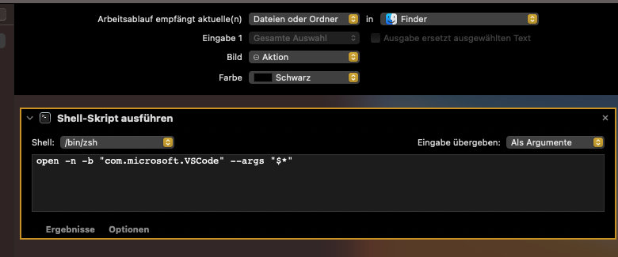

- Open Automator
- File -> New -> Service
- Change "Service Receives" to "files or folders" in "Finder"
- Add a "Run Shell Script" action
- Change "Pass input" to "as arguments"
- Paste the following in the shell script box: open -n -b "com.microsoft.VSCode" --args "$*"
- Save it as something like "Open in Visual Studio Code"

