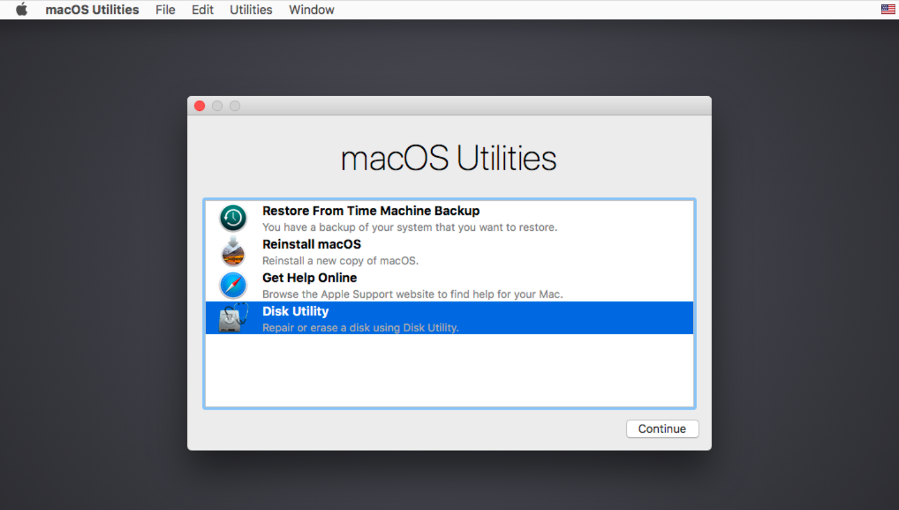

Before selling my late 2015 27″ iMac Retina 5K I wanted to secure erase its 1TB Fusion Drive consisting of a 24GB SSD and 1TB HDD. Secure erasing an HDD is simple enough using the Security Options in `Disk Utility`, but for Fusion Drives and SSDs this option is not available. To secure erase the iMac’s HDD I first needed to break the Fusion Drive into its constituent parts using `Terminal`.

A Fusion Drive is a logical volume group utilising Apple’s CoreStorage technology. Fusion Drives can be managed from the `Terminal` using the `diskutil` command followed by `cs` and the appropriate action. For more information on `diskutil` see [man diskutil (8)](https://www.manpagez.com/man/8/diskutil/)

### 1.1 Breaking Apart a Fusion Drive

**WARNING** Despite the obvious intent of this article, breaking apart a fusion drive will delete all the data on both its constituent SSD and HDD whether you choose to subsequently secure erase the HDD or not.

The first step is to start your Mac in [Recovery Mode](https://support.apple.com/en-gb/HT204904) or from a bootable [macOS installer](https://support.apple.com/en-gb/HT201372).

#### Information for Fusion Drive Macs Running macOS Mojave (10.14)

Since the release of Mojave, installing or updating macOS from an earlier version has forced startup Fusion Drives formatted as HFS\+ to be automatically converted to APFS as part of the install process.

The instructions detailed in this article are only applicable to HFS+ Fusion Drives. However, they are still relevant when running macOS Mojave with an APFS-formatted Fusion Drive providing you first perform these extra steps:

**IMPORTANT:** Performing these steps will erase all the data on your Fusion Drive.

1.  Having started your Mac in Recovery Mode, open `Disk Utility`.
2.  In the top-left corner of `Disk Utility`, click the **View** dropdown and select **Show All Devices**. The Mac’s startup Fusion Drive should be listed in the `Disk Utility` sidebar:
    
    Internal
    Fusion Drive
    **Container disk 2** 1
    Macintosh HD
    

1 The disk identifier may be another number.

4.  Select **Container disk 2** in the sidebar and click the **Erase** icon in the toolbar.
5.  At the prompt, enter *Macintosh HD* for the **Name** – it will likely be pre-populated with *Preboot* – and select *Mac OS Extended (Journaled)* for the **Format**.
6.  Click the **Erase** button. Container disk 2 is deleted and the sidebar will show something similar to:
    
    Internal
    APPLE HDD ST1000DM003 Media
    APPLE SSD AP0032H Media
    Fusion Drive
    Macintosh HD
    
7.  Quit and then re-open `Disk Utility` to see the correct disk configuration:
    
    Internal
    Fusion Drive
    Macintosh HD
    
8.  Quit `Disk Utility`.

At this point you have a Fusion Drive formatted as HFS+ and can continue with the steps in the remainder of this article.

Once started, open `Terminal` from the Utilities menu:

Opening Terminal from the Utilities menu in macOS Recovery Mode

**WARNING** A Fusion Drive is classed as a logical volume group in CoreStorage. However, other connected non-Fusion Drives – both internal and external – may also be displayed as logical volume groups. To ensure you’re targeting the correct one I would suggest ejecting or disconnecting any additional drives first.

To display details of a Fusion Drive, in `Terminal` type:

diskutil cs list

Information similar to the following is displayed:

CoreStorage logical volume groups (1 found)
|
\+\-\- Logical Volume Group CE7D4BA0-BF9E-446F-83AC-8080A77D1AE4
    =========================================================
    Name:         Macintosh HD
    Status:       Online
    Size:         1022898851840 B (1.0 TB)
    Free Space:   45056 B (45.1 KB)
    |
    +-< Physical Volume 4542AE27-6EB3-41F9-AA09-9C0958CB669E
    |   ----------------------------------------------------
    |   Index:    0
    |   Disk:     disk0s2
    |   Status:   Online
    |   Size:     23553724416 B (23.6 GB)
    |
    +-< Physical Volume 9672F4CC-7B87-4460-ABE6-75F6954E7645
    |   ----------------------------------------------------
    |   Index:    1
    |   Disk:     disk1s2
    |   Status:   Online
    |   Size:     999345127424 B (999.3 GB)
    |
    +-\> Logical Volume Family B8223BAC-CEFD-4851-8706-493F2B96AC8C
        ----------------------------------------------------------
        Encryption Type:         None
        |
        +-\> Logical Volume 3BAEF8EE-B7F1-4094-88D4-58CECD811A72
            ---------------------------------------------------
            Disk:                  disk2
            Status:                Online
            Size (Total):          1021994074112 B (1.0 TB)
            Revertible:            No
            LV Name:               Macintosh HD
            Volume Name:           Macintosh HD
            Content Hint:          Apple_HFS
            LVG Type:              Fusion, Sparse

When breaking apart a Fusion Drive the two pieces of information needed are the logical volume universally unique identifier (UUID): 3BAEF8EE-B7F1-4094-88D4-58CECD811A72 and the logical volume group UUID: CE7D4BA0-BF9E-446F-83AC-8080A77D1AE4.

The logical volume needs to be deleted first followed by the logical volume group. Note the difference between the `Terminal` command for deleting the logical volume: `diskutil cs deleteVolume` and the command for deleting the logical volume group: `diskutil cs delete`.

### 1.2 Deleting the Logical Volume

As mentioned, the first task is to delete the logical volume. The `Terminal` command is `diskutil cs deleteVolume logical_volume_uuid`.

To delete a logical volume with a UUID of `3BAEF8EE-B7F1-4094-88D4-58CECD811A72`, in `Terminal` type:

diskutil cs deleteVolume 3BAEF8EE-B7F1-4094-88D4-58CECD811A72

The following is displayed:

The Core Storage Logical Volume UUID is 3BAEF8EE-B7F1-4094-88D4-58CECD811A72
Started CoreStorage operation on disk2 Macintosh HD
Unmounting disk2
Removing Logical Volume from Logical Volume Group
Finished CoreStorage operation on disk2 Macintosh HD

### 1.3 Deleting the Logical Volume Group

Having deleted the logical volume, the next step is to delete the logical volume group. The `Terminal` command is `diskutil cs delete logical_volume_group_uuid`

To delete a logical volume group with a UUID of `CE7D4BA0-BF9E-446F-83AC-8080A77D1AE4`, in `Terminal` type:

diskutil cs delete CE7D4BA0-BF9E-446F-83AC-8080A77D1AE4

The following is displayed:

Started CoreStorage operation
Destroying Logical Volume Group
Erasing disk0s2
Initialized /dev/rdisk0s2 as a 22 GB case-insensitive HFS Plus volume with a 8192k journal
Mounting disk
Erasing disk1s2
Initialized /dev/rdisk1s2 as a 931 GB case-insensitive HFS Plus volume with a 81920k journal
Mounting disk
Finished CoreStorage operation

To confirm the Fusion Drive no longer exists, in `Terminal` type:

diskutil cs list

The following is displayed:

No CoreStorage logical volume groups found

At this point we can quit `Terminal` and secure erase the 1TB HDD using the Security Options in `Disk Utility`.

Opening Disk Utility in macOS Recovery Mode

Secure erasing an HDD involves erasing the drive and writing first random and then known data to the drive a specified number of times. There are 4 options ranging from the fastest to the most secure. The fastest option doesn’t securely erase a drive whereas the most secure and slowest writes to the disk 7 times and meets USDoD standards. Using the most secure option on my iMac’s 1TB HDD took around 12 hours to complete.

Selecting Security Options… in Disk Utility

NOTE: The Security Options button in `Disk Utility` is not available when erasing an SSD or Fusion Drive as it is not possible to secure erase either type of drive.

### 2.1 Creating a new Fusion Drive

Having deleted the existing Fusion Drive and secure erased the 1TB HDD, the final step is to create a new Fusion Drive. First we create a new logical volume group followed by a new logical volume. Note the difference between the `Terminal` command for creating the logical volume group: `diskutil cs create` and the command for creating the logical volume: `diskutil cs createVolume`.

### 2.2 Creating a new Logical Volume Group

The `Terminal` command for creating a new logical volume group is `diskutil cs create logical_volume_group_name disk_1 disk_2`. `disk_1` and `disk_2` are the device identifiers of the 24GB SSD and 1TB HDD respectively that can be obtained by typing `diskutil list` in `Terminal`. Be aware that your drives may have different identifiers to those shown below.

/dev/disk0 (internal):
   #:                     TYPE NAME               SIZE       IDENTIFIER
   0:    GUID\_partition\_scheme                     24.0 GB   disk0
   1:                      EFI EFI                314.6 MB   disk0s1
   2:                Apple_HFS Untitled            23.6 GB   disk0s2
   
/dev/disk1 (internal, physical):
   #:                     TYPE NAME               SIZE       IDENTIFIER
   0:    GUID\_partition\_scheme                     *1.0 TB   disk1
   1:                      EFI EFI                209.7 MB   disk1s1
   2:                Apple_HFS Untitled           999.3 GB   disk1s2

When creating a new logical volume group the SSD device identifier – disk0s2 – should be placed before the HDD device identifier – disk1s2. To create a new logical volume group with the name `My Fusion Drive`, in `Terminal` type:

diskutil cs create My\ Fusion\ Drive disk0s2 disk1s2

Note that spaces in the logical volume group name are escaped with a `\`. Alternatively, you can enclose the logical volume group name in double-quotes: `"My Fusion Drive"`.

The following is displayed:

Started CoreStorage operation
Unmounting disk0s2
Touching partition type on disk0s2
Adding disk0s2 to Logical Volume Group
Unmounting disk1s2
Touching partition type on disk1s2
Adding disk1s2 to Logical Volume Group
Creating Core Storage Logical Volume Group
Switching disk0s2 to Core Storage
Switching disk1s2 to Core Storage
Waiting for Logical Volume Group to appear
Discovered new Logical Volume Group "385A33C7-D843-46A7-A022-E5B2D0A3BC1F"
Core Storage LVG UUID 385A33C7-D843-46A7-A022-E5B2D0A3BC1F
Finished CoreStorage operation

### 2.3 Creating a new Logical Volume

Having created a new logical volume group, the next step is to create a new logical volume. To do so we need the UUID of the logical volume group created in the previous operation: 385A33C7-D843-46A7-A022-E5B2D0A3BC1F.

The `Terminal` command to create a new logical volume is `diskutil cs createVolume logical_volume_group_uuid type name size`. To create a new logical volume as `Journaled HFS+` with the name `Macintosh HD` for the logical volume group with a UUID of `385A33C7-D843-46A7-A022-E5B2D0A3BC1F`, in `Terminal` type:

diskutil cs createVolume 385A33C7-D843-46A7-A022-E5B2D0A3BC1F jhfs+ Macintosh\ HD 100%

Note that spaces in the logical volume name are escaped with a `\`. Alternatively, you can enclose the logical volume name in double-quotes: `"Macintosh HD"`

The following is displayed:

Started CoreStorage operation
Waiting for Logical Volume Group to appear
Formatting file system for Logical Volume
Initialized /dev/rdisk2 as a 952 GB case-insensitive HFS Plus volume with a 81920k journal
Mounting disk
Core Storage LV UUID: 94B2CB6F-0BC4-49AA-9EFA-71011D0FCF24
Core Storage disk: disk2
Finished CoreStorage operation  

To confirm the creation of a new Fusion Drive, in `Terminal` type:

diskutil cs list

The following is displayed:

CoreStorage logical volume groups (1 found)
|
\+\-\- Logical Volume Group 385A33C7-D843-46A7-A022-E5B2D0A3BC1F
    =========================================================
    Name:         My Fusion Drive
    Status:       Online
    Size:         1022898851840 B (1.0 TB)
    Free Space:   45056 B (45.1 KB)
    |
    +-< Physical Volume 40470E54-2965-4EE4-BB1B-2DF77785AEF3
    |   ----------------------------------------------------
    |   Index:    0
    |   Disk:     disk0s2
    |   Status:   Online
    |   Size:     23553724416 B (23.6 GB)
    |
    +-< Physical Volume 31460DB0-7848-4A41-96CD-28EFCAF8DE71
    |   ----------------------------------------------------
    |   Index:    1
    |   Disk:     disk1s2
    |   Status:   Online
    |   Size:     999345127424 B (999.3 GB)
    |
    +-\> Logical Volume Family 677C034A-3D8A-4552-ABB2-C90D09557436
        ----------------------------------------------------------
        Encryption Type:         None
        |
        +-\> Logical Volume 94B2CB6F-0BC4-49AA-9EFA-71011D0FCF24
            ---------------------------------------------------
            Disk:                  disk2
            Status:                Online
            Size (Total):          1021994074112 B (1.0 TB)
            Revertible:            No
            LV Name:               Macintosh HD
            Volume Name:           Macintosh HD
            Content Hint:          Apple_HFS
            LVG Type:              Fusion, Sparse

While still in Recovery Mode we can now re-install macOS on the newly created Fusion Drive.

A native Brit exiled in Japan, Steve spends too much of his time struggling with the Japanese language, dreaming of fish & chips and writing the occasional blog post he hopes others will find helpful.