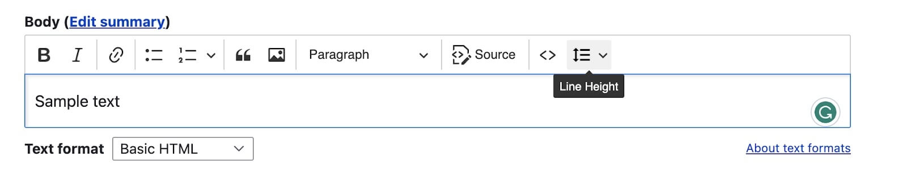
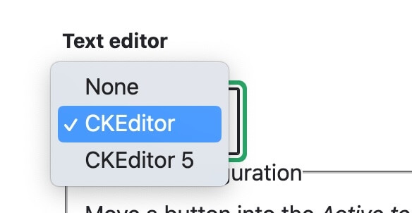
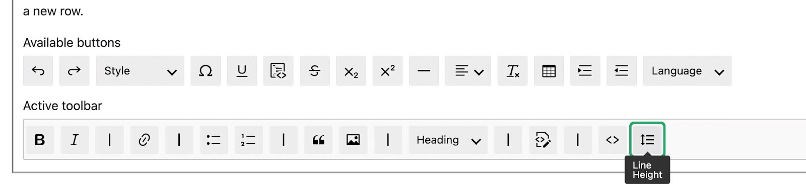
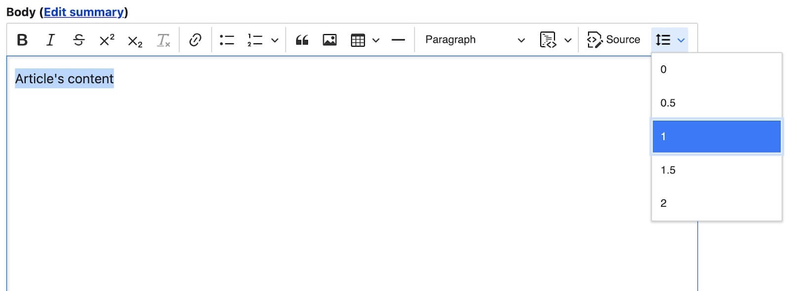
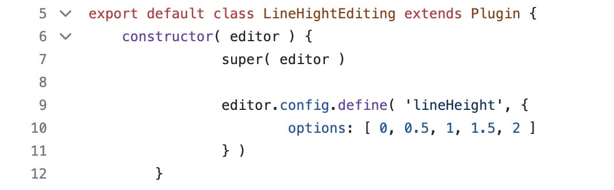
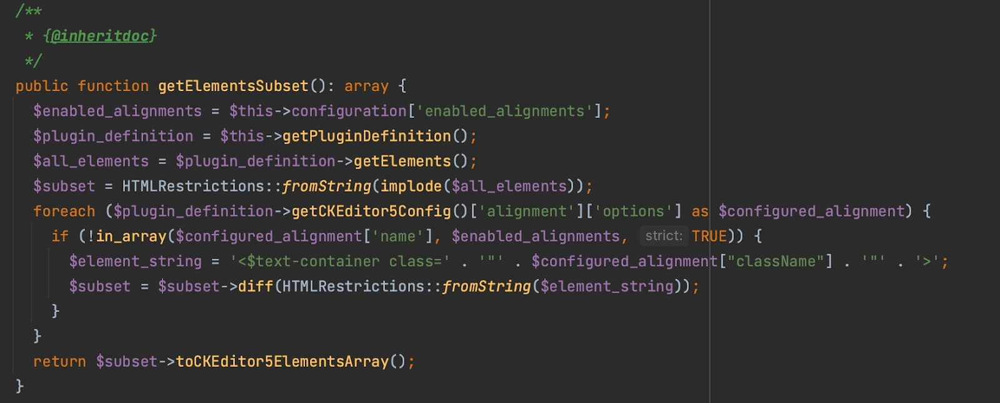

One of the main features in Drupal 10 is CKEditor 5 framework from the core. The process of integrating CKEditor 5 might be tricky if you have never created the plugins for CKEditor 5 before. Thus, check the [CKEditor documentation](https://ckeditor.com/docs/ckeditor5/latest/framework/index.html) and learn [how to create a simple CKEditor plugin](https://ckeditor.com/docs/ckeditor5/latest/framework/plugins/creating-simple-plugin-timestamp.html) before you start the development process.

In this article, you will find out how to integrate your existing plugin into the Drupal 9/10 module and how to create a Drupal configuration form for the plugin. I will demonstrate the integration process step-by-step using [CKEditor5 Line Height](https://www.drupal.org/project/ckeditor5_line_height), a handy module that allows changing line height in CKEditor 5. I used the open-source package [p0thi/ckeditor5-line-height-plugin](https://github.com/p0thi/ckeditor5-line-height-plugin) from GitHub for this module.

## Get prepared for integration:

- Install [NPM](https://docs.npmjs.com/downloading-and-installing-node-js-and-npm). This tool will download Webpack and libraries related to the plugin.
- Make sure you use Drupal 9.3.0-beta1 version — CKEditor 5 is included in the core of this version.
- Check whether CKEditor 5 is enabled (_/admin/modules_) and configured for one of the text formats.

Now, let’s start the development process.

## Step 1. Create a custom module

First, download the [starter template](https://git.drupalcode.org/project/ckeditor5_dev/-/tree/1.0.x/ckeditor5_plugin_starter_template), which is a part of [CKEditor 5 Dev Tools](https://www.drupal.org/project/ckeditor5_dev). Move the downloaded folder to modules/custom and name it ckeditor5_line_height. Rename all “MODULE_NAME” to “ckeditor5_line_height.” Open ckeditor5_line_height.info.yml file. This is general information about the module. There is no need to pay much attention to it; simply change the content with the following:

```
name: CKEditor5 Line Height
type: module
description: Provides CKEditor5 Line Height plugin.
package: CKEditor
core_version_requirement: ">=9.3"
dependencies:
  - drupal:ckeditor5
```

Next, open ckeditor5_line_height.libraries.yml. You will see two libraries inside. Change the content with: 

```
# First library containing the build file of your plugin.
line_height:
  js:
    js/build/ckeditor5_line_height.js: { preprocess: false, minified: true }
  dependencies:
    - core/ckeditor5

# Second library contains CSS with plugin`s icon for admin panel
admin.line_height:
  css:
    theme:
      css/line_height.admin.css: { }
```

Why do we need the second library if the icon is already inside the plugin code? This is for icons that will be shown in the text format setting (_/admin/config/content/formats/manage/basic_html_, for example). The icon from the plugin’s code will be shown directly in CKEditor.  



Open ckeditor5_line_height.ckeditor5.yml — this required file contains general information about the CKEditor 5 plugin. First, Drupal receives information from this file and then adds the plugin.

As you can see, the configurations for the plugin have two sections:

1. _**ckeditor5**_ — contains a “path” to a plugin plugin_folder_name.PluginName. You can see the PluginName in _js/ckeditor5_plugins/ckeditor5_line_height/src/index.js_

```
import LineHeight from './lineheight';

export default {
LineHeight, // This is a plugin name which need to add in ckeditor5_line_height.ckeditor5.yml
};
```

2. **drupal**— contains general information about a plugin that Drupal will send to the editor. 

Change the default file content with the following:

```
ckeditor5_line_height_line_height:
  ckeditor5:
    plugins:
      - ckeditor5_line_height.LineHeight
  drupal:
    label: Line Height
    library: ckeditor5_line_height/line_height
    admin_library: ckeditor5_line_height/admin.line_height
    toolbar_items:
      lineHeight:
        label: Line Height
    elements: false
```

Let's take a closer look at some attributes inside the Drupal section:

- _**library**_ — a library that contains the plugin’s .js build
- _**toolbar_items**_ — items that will be shown in the CKEditor toolbar. Use camelCase to create your item machine name
- _**elements**_ — which HTML elements your plugin generates. For example, if it’s `<span style=”color:black”><span>`, add in this section `<span> and <span style>`. Our plugin doesn’t generate any HTML elements.

At this point, let’s move on to the packages.json file.


```
{
	"name": "drupal-ckeditor5",
	"version": "1.0.0",
	"description": "Drupal CKEditor 5 integration",
	"author": "",
	"license": "GPL-2.0-or-later",
	"scripts": {
		"watch": "webpack --mode development --watch",
		"build": "webpack"
	},
	"devDependencies": {
		"@ckeditor/ckeditor5-dev-utils": "^30.0.0",
		"ckeditor5": "~34.1.0",
		"raw-loader": "^4.0.2",
		"terser-webpack-plugin": "^5.2.0",
		"webpack": "^5.51.1",
		"webpack-cli": "^4.4.0"
	}
}
```

Look at packages used in your plugin packages.json and move them to the module’s packages.json. In the reviewed case, it’s @ckeditor/ckeditor5-core and @ckeditor/ckeditor5-ui, but there's no need to copy it to the file — Drupal core already uses these packages by default.  

The default packages.json looks good, so there’s no need to change anything. 

The next step is webpack.config.js. This file describes which folders and files need to be included in a build and where the build files will be located. Also, you can add plugins for minifying, reading different types of files, converting .scss to .css, etc.  
Default webpack.config.js is appropriate.

```
const path = require('path');
const fs = require('fs');
const webpack = require('webpack');
const { styles, builds } = require('@ckeditor/ckeditor5-dev-utils');
const TerserPlugin = require('terser-webpack-plugin');

function getDirectories(srcpath) {
  return fs
    .readdirSync(srcpath)
    .filter((item) => fs.statSync(path.join(srcpath, item)).isDirectory());
}

module.exports = [];
// Loop through every subdirectory in src, each a different plugin, and build
// each one in ./build.
getDirectories('./js/ckeditor5_plugins').forEach((dir) => {
  const bc = {
    mode: 'production',
    optimization: {
      minimize: true,
      minimizer: [
        new TerserPlugin({
          terserOptions: {
            format: {
              comments: false,
            },
          },
          test: /\.js(\?.*)?$/i,
          extractComments: false,
        }),
      ],
      moduleIds: 'named',
    },
    entry: {
      path: path.resolve(
        __dirname,
        'js/ckeditor5_plugins',
        dir,
        'src/index.js',
      ),
    },
    output: {
      path: path.resolve(__dirname, './js/build'),
      filename: `${dir}.js`,
      library: ['CKEditor5', dir],
      libraryTarget: 'umd',
      libraryExport: 'default',
    },
    plugins: [
      // It is possible to require the ckeditor5-dll.manifest.json used in
      // core/node_modules rather than having to install CKEditor 5 here.
      // However, that requires knowing the location of that file relative to
      // where your module code is located.
      new webpack.DllReferencePlugin({
        manifest: require('./node_modules/ckeditor5/build/ckeditor5-dll.manifest.json'), // eslint-disable-line global-require, import/no-unresolved
        scope: 'ckeditor5/src',
        name: 'CKEditor5.dll',
      }),
    ],
    module: {
      rules: [{ test: /\.svg$/, use: 'raw-loader' }],
    },
  };

  module.exports.push(bc);
});
```
## Step 2: Get the source plugin code
Download the [ckeditor5-line-height-plugin](https://github.com/p0thi/ckeditor5-line-height-plugin/tree/master) and unarchive it. Rename the unarchived folder to ckeditor5_line_height and move it to ckeditor5_line_height/js/ckeditor5_plugins/ folder. Remove demoPlugin, you won’t need it.

You can also use the command gh repo clone p0thi/ckeditor5-line-height-plugin inside ckeditor5_line_height/js/ckeditor5_plugins/ folder for downloading. 
## Step 3: Install the dependencies
Run an npm install command in the module folder. You will likely encounter missing dependencies’ warnings at this stage — install them. 
## Step 4: Modify the source code
You are already halfway there! The next step is modifying the source code. As you remember, you created css/line_height.admin.css, which will contain a path to the icon. The plugin’s SVG icon is now included directly in  
ckeditor5_line_height/src/inlineheightui.js at line 27: 

```
icon: editor.config.get( 'lineHeight.icon' ) || '
<?xml version="1.0" encoding="UTF-8"?><!DOCTYPE svg PUBLIC "-//W3C//DTD SVG 1.1//EN" 
"http://www.w3.org/Graphics/SVG/1.1/DTD/svg11.dtd"><svg xmlns="http://www.w3.org/2000/svg" 
xmlns:xlink="http://www.w3.org/1999/xlink" version="1.1"  width="24" height="24" viewBox="0 0 24 24">
<path fill="#000000" d="M10,13H22V11H10M10,19H22V17H10M10,7H22V5H10M6,7H8.5L5,3.5L1.5,7H4V17H1.5L5,20.5L8.5,17H6V7Z" /></svg>',  
```

It looks a bit improper, right? Let’s move `<svg>` to a separate .svg file and create a theme/icons folder inside a source ckeditor5_line_height folder. Go into theme/icons and create a lineHeight.svg file.

Copy `<svg>` from ckeditor5_line_height/src/inlineheightui.js (row 27) and paste it in lineHeight.svg. Next, go into inlineheightui.js and import the .svg in line 5:

```
import Icon from '../theme/icons/lineHeight.svg';
```

Then replace the whole line 28 with:

```
icon: Icon,
```

Run the npm run build console command in the module’s root to build a new dist. 

## Step 5. Let’s test!

Enable your module with the drush en ckeditor5_line_height command. Add your plugin in full_html text format. Go to _/admin/config/content/formats/manage/full_html_ and change CKEditor to CKEditor 5. 



Move “Line Height” from “Available buttons” to “Active toolbar.”



Сlick “Save configuration.”

Add new Article — _/node/add/article_. Add any text in the Body field. Select the text, click the “Line Height” button, and select the “5” option. Make sure that you choose “Full HTML” for the Body field. 



Choose option “2” and check how it works. 

Congratulations! You’ve integrated the CKEditor 5 plugin in the Drupal 9/10 module.

What do you think about adding one extra helpful feature to the module? Keep reading to find some bonus insights. 

## Add a setting form for adding/changing default line-height options

This feature isn’t compulsory, and you may add it if it fits your business needs.

I will add the ability to change default line height options via the admin setting form. 

==Disclaimer: the whole process will be managed manually because Drush and Drupal Console can’t create such a form. Drush 12 can generate a template structure only for the CKEditor5 plugin without a config form. As of publishing this article, Drupal Console does not support Drupal 10 yet== ([https://www.drupal.org/project/console/issues/3337542](https://www.drupal.org/project/console/issues/3337542)).

First of all, you’ll need to create a schema config. Otherwise, Drupal will throw an error that the config schema is not defined for your config form. 

Create a config/schema folder in the module’s root and then create ckeditor5_line_height.schema.yml.

Add the code:

```
# Plugin \drupal\ckeditor5_line_height\Plugin\ckeditor5Plugin\LineHeight
ckeditor5.plugin.ckeditor5_line_height_line_height:
 type: mapping
 label: 'Line Height Options'
 mapping:
   line_height_options:
     type: sequence
     orderby: value
     label: 'Line Height Options'
     sequence:
       type: string
       label: 'Line Height Options'
```

Read the [Config Schema Cheat Sheet 2.0](https://www.hojtsy.hu/files/ConfigSchemaCheatSheet2.0.pdf) to get a better understanding of the process. Also, you can check config schemas for default CKEditor 5 plugins in the core (core/modules/ckeditor5/config/schema/ckeditor5.schema.yml).

Now, you need to update ckeditor5_line_height.ckeditor5.yml — after label: Line Height  
add line:

```
class: \Drupal\ckeditor5_line_height\Plugin\CKEditor5Plugin\LineHeight
```

This is a path to the class that contains the future settings form.

So, let’s create this class! Inside the module’s root, create src/Plugin/CKEditor5Plugin/LineHeight.php

Next, define the class: 

```
<?php

declare(strict_types=1);

namespace Drupal\ckeditor5_line_height\Plugin\CKEditor5Plugin;

use Drupal\ckeditor5\Plugin\CKEditor5PluginConfigurableInterface;
use Drupal\ckeditor5\Plugin\CKEditor5PluginConfigurableTrait;
use Drupal\ckeditor5\Plugin\CKEditor5PluginDefault;
use Drupal\Core\Form\FormStateInterface;
use Drupal\editor\EditorInterface;

/**
* CKEditor 5 Line Height plugin configuration.
*
*/
class LineHeight extends CKEditor5PluginDefault implements CKEditor5PluginConfigurableInterface {

 use CKEditor5PluginConfigurableTrait;

}
```

As you can see, we extend from **CKEditor5PluginDefault**, which has the function getDynamicPluginConfig() responsible for sending the line height options from config to JS code (plugin’s constructor). 

Besides, we implement **CKEditor5PluginConfigurableInterface**, which extends some other interfaces that allow defining a CKEditor 5 settings form.

**CKEditor5PluginConfigurableTrait** also is required. It contains two functions for “get” and “set” configuration.

At this point, you’ll need to define some constants in the class body.

```
/**
* The default config name for line-height options.
*
* @var string
*/
const CONFIG_NAME = 'line_height_options';

/**
* The default array of line height options.
*
* @var string[][]
*/
const DEFAULT_CONFIGURATION = [
 'line_height_options' => [
   '0',
   '0.5',
   '1',
   '1.5',
   '2',
   '2.5',
   '3',
   '3.5',
   '4',
   '4.5',
   '5',
   '5.5',
   '6',
   '6.5',
 ],
];
```

**CONFIG_NAME** — will be used in many places in the code  
**DEFAULT_CONFIGURATION** — array with default values. There will be a field _**line_height_options**_ in a form; the **DEFAULT_CONFIGURATION** array also has one parameter.  

The next step is defining the function for getting the default configuration.

```
/**
* {@inheritdoc}
*/
public function defaultConfiguration(): array {
 return static::DEFAULT_CONFIGURATION;
}
```

Now, let’s build the form: 

```
/**
* {@inheritdoc}
*/
public function buildConfigurationForm(array $form, FormStateInterface $form_state): array {
 $form[static::CONFIG_NAME] = [
   '#type' => 'textarea',
   '#title' => $this->t('Line Height Options'),
   '#default_value' => implode(' ', $this->configuration[static::CONFIG_NAME]),
   '#description' => $this->t(
     'A list of line height options separated with " ".
     Default options are ' . implode(' ', static::DEFAULT_CONFIGURATION[static::CONFIG_NAME]) . '<br>
     The maximal value should be less than 10<br>
     If you want to reset your options, just clean the text field and click "Save configuration"'
   ),
 ];

 return $form;
}
```

As you can see, we defined only one text area with the description. 

Now, we need to validate the form.

```
/**
* {@inheritdoc}
*/
public function validateConfigurationForm(array &$form, FormStateInterface $form_state): void {
 // Match the config schema structure at
 // ckeditor5.plugin.ckeditor5_line_height_line_height.
 $options_string = $form_state->getValue(static::CONFIG_NAME);

 if ($options_string !== "") {
   $string_without_extra_spaces = preg_replace('/\s+/', ' ', $options_string);
   $options_array = explode(' ', trim($string_without_extra_spaces));

   // Remove item if value >= 10
   foreach ($options_array as $key => $value) {
     if ($value >= 10) {
       unset($options_array[$key]);
     }
   }

   $form_state->setValue(static::CONFIG_NAME, array_unique($options_array));
 }
 else {
   $form_state->setValue(static::CONFIG_NAME, static::DEFAULT_CONFIGURATION[static::CONFIG_NAME]);
 }
}
```

Functionality is pretty simple — if the string from **_line_height_options_** is not empty, convert it to an array and set the value for the same key. Otherwise, save **DEFAULT_CONFIGURATION** in this key.

Let’s define the submit function: 

```
/**
* {@inheritdoc}
*/
public function submitConfigurationForm(array &$form, FormStateInterface $form_state): void {
 $this->configuration[static::CONFIG_NAME] = $form_state->getValue(static::CONFIG_NAME);
}
```

This is also pretty simple — send value from validated **_line_height_options_** to configuration.

And finally, we need to send submitted options to our plugin’s dropdown. As I mentioned above, we need to implement **getDynamicPluginConfig()**. 

```
/**
* {@inheritdoc}
*/
public function getDynamicPluginConfig(array $static_plugin_config, EditorInterface $editor): array {
 return [
   'lineHeight' => [
     'options' => $this->configuration[static::CONFIG_NAME],
   ],
 ];
}
```

The structure of the result array should match the structure in the plugin constructor (/js/ckeditor5_plugins/ckeditor5_line_height/src/lineheightediting.js).



**Let's take a look at the final code of the configuration form:**

```
<?php

declare(strict_types=1);

namespace Drupal\ckeditor5_line_height\Plugin\CKEditor5Plugin;

use Drupal\ckeditor5\Plugin\CKEditor5PluginConfigurableInterface;
use Drupal\ckeditor5\Plugin\CKEditor5PluginConfigurableTrait;
use Drupal\ckeditor5\Plugin\CKEditor5PluginDefault;
use Drupal\Core\Form\FormStateInterface;
use Drupal\editor\EditorInterface;

/**
* CKEditor 5 Line Height plugin configuration.
*
*/
class LineHeight extends CKEditor5PluginDefault implements CKEditor5PluginConfigurableInterface {

 use CKEditor5PluginConfigurableTrait;

 /**
  * The default config name for line height options.
  *
  * @var string
  */
 const CONFIG_NAME = 'line_height_options';

 /**
  * The default array of line height options.
  *
  * @var string[][]
  */
 const DEFAULT_CONFIGURATION = [
   'line_height_options' => [
     '0',
     '0.5',
     '1',
     '1.5',
     '2',
     '2.5',
     '3',
     '3.5',
     '4',
     '4.5',
     '5',
     '5.5',
     '6',
     '6.5',
   ],
 ];

 /**
  * {@inheritdoc}
  */
 public function defaultConfiguration(): array {
   return static::DEFAULT_CONFIGURATION;
 }

 /**
  * {@inheritdoc}
  */
 public function buildConfigurationForm(array $form, FormStateInterface $form_state): array {
   $form[static::CONFIG_NAME] = [
     '#type' => 'textarea',
     '#title' => $this->t('Line Height Options'),
     '#default_value' => implode(' ', $this->configuration[static::CONFIG_NAME]),
     '#description' => $this->t(
       'A list of line height options separated with " ".
       Default options are ' . implode(' ', static::DEFAULT_CONFIGURATION[static::CONFIG_NAME]) . '<br>
       The maximal value should be less than 10<br>
       If you want to reset your options, just clean the text field and click "Save configuration"'
     ),
   ];

   return $form;
 }

 /**
  * {@inheritdoc}
  */
 public function validateConfigurationForm(array &$form, FormStateInterface $form_state): void {
   // Match the config schema structure at
   // ckeditor5.plugin.ckeditor5_line_height_line_height.
   $options_string = $form_state->getValue(static::CONFIG_NAME);

   if ($options_string !== "") {
     $string_without_extra_spaces = preg_replace('/\s+/', ' ', $options_string);
     $options_array = explode(' ', trim($string_without_extra_spaces));

     // Remove item if value >= 10
     foreach ($options_array as $key => $value) {
       if ($value >= 10) {
         unset($options_array[$key]);
       }
     }

     $form_state->setValue(static::CONFIG_NAME, array_unique($options_array));
   }
   else {
     $form_state->setValue(static::CONFIG_NAME, static::DEFAULT_CONFIGURATION[static::CONFIG_NAME]);
   }
 }

 /**
  * {@inheritdoc}
  */
 public function submitConfigurationForm(array &$form, FormStateInterface $form_state): void {
   $this->configuration[static::CONFIG_NAME] = $form_state->getValue(static::CONFIG_NAME);
 }

 /**
  * {@inheritdoc}
  */
 public function getDynamicPluginConfig(array $static_plugin_config, EditorInterface $editor): array {
   return [
     'lineHeight' => [
       'options' => $this->configuration[static::CONFIG_NAME],
     ],
   ];
 }

}
```

Now, it’s time to test! I recommend reviewing core forms in /admin/config/content/formats/manage/full_html and scrolling to “Line Height Options.”

## Additional notes

I recommend overviewing with core forms in core/modules/ckeditor5/src/Plugin/CKEditor5Plugin. Some forms also implement the **_CKEditor5PluginElementsSubsetInterface_** and implement the **_getElementsSubset()_** function. Check it in **Alignment.php**, for example:



This function can be implemented if you define a subset of elements in your_module.ckeditor5.yml and want to get the elements and dynamically change something (HTML structure, for example).

## Ideas for your module integration

You can try my way and find some CKeditor 5 plugins on GitHub by searching the keyword “ckeditor5”. For integrating into the Drupal module, use the [starter template](https://git.drupalcode.org/project/ckeditor5_dev/-/tree/1.0.x/ckeditor5_plugin_starter_template).

Also, you can create your own plugin, integrate it into the Drupal 10 module, and publish it on [drupal.org](https://www.drupal.org/).

Besides, you can take part in upgrading contrib modules to CKEditor 5 support. The complete list of contrib modules is [here](https://www.drupal.org/docs/core-modules-and-themes/core-modules/ckeditor-5-module/upgrade-coordination-for-modules-providing-ckeditor-4-plugins).

## Final word 

If you still have any questions concerning the CKEditor 5 integration into Drupal 9/10, don’t hesitate to contact us. Our [Drupal development](https://lembergsolutions.com/drupal-development) experts are always eager to help and answer all of your questions. [Drop us a line](https://lembergsolutions.com/contact), and we’ll get back to you shortly.