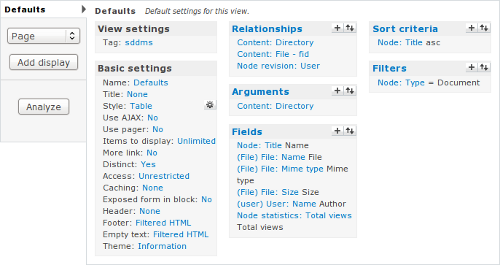
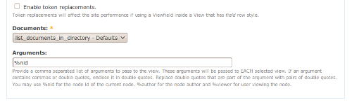

Many moons ago I needed a way of storing documents online, so they could be shared between users and easily accessed from many locations.  Thus, [Simple Document Management System](http://sdms.cafuego.net) was born. SDMS is a PHP based front-end to a MySQL database that allows users to upload and download files into and from virtual directories using only a web browser.

It was my second ever PHP project and I wrote it in (bad) php3, with only some informal C coding as experience. Needless to say the code was not great, it used globals and had SQL injection problems. Though I did fix these two particular issues, the code is still old and tired and I've not really maintained it for years.  Bringing it up to date would probably involve more effort than just scrapping it and rewriting it from scratch.

I've been doing a lot of work with Drupal over the past year and I had been vaguely considering reimplementing SDMS as a Drupal module, thus removing the need for me to also maintain code to handle users, passwords, commenting and permissions.

As I got more familiar with some 3rd party Drupal modules, it struck me that it should be completely possible to implement a document management system similar to SDMS in Drupal. Without doing any coding whatsoever. Thus, SDDMS was born.

## The basics: Install Modules

You'll need to enable a few additional core modules and obtain a bunch of third party modules to make this all work. First, go to _Administer → Site Building → Modules_ and enable the **Book** and **Statistics** modules.  These are not enabled by default, but SDDMS needs them.

When that is done, you will need to grab a dozen of 3rd party modules. I've listed them here. For each one, download the latest stable 6.x tarball. When done, unpack them into the site-wide (_sites/all/modules_) or per-site (_sites/mysite.com/modules_) module directory.

- [CCK](http://drupal.org/project/cck) - Allows you to create custom node types.
    - Nodereference  - Allows you to reference a node from another node (Included with CCK).
- [Viewfield](http://drupal.org/project/viewfield) - Allows you to reference a view from nodes. (No stable version yet, grab the -dev one)
- [Filefield](http://drupal.org/project/filefield) - Allows you to attach files to nodes.
    - Filefield meta - Manage attachment file meta information (Included with Filefield).
- [Filefield paths](http://drupal.org/project/filefield_paths) - Adds filefield tokens to Pathauto.
- [Mimedetect](http://drupal.org/project/mimedetect) - Detect file attachment meta information.
- [Getid3()](http://drupal.org/project/getid3) - Detect media attachment file meta information.
- [Pathauto](http://drupal.org/project/pathauto) - Automatically create permanent urls for nodes.
- [Token](http://drupal.org/project/token) - Tokeniser needed to automatically create permanent urls for nodes.
- [Views](http://drupal.org/project/views) - Create custom displays and listings of content.
    - Views UI - Management interface for Views (Included with Views).

When installed, visit _Administer → Site Building → Modules_ again and enable each of these modules. Some need other modules to be enabled and Drupal will first ask and then automatically enable these other modules for you.

## Next: Configure the modules

Now that you have installed all required modules, it's time to configure them for use.

### Book

The Book module provides us with the tree-like structure we need for directories. Go to _Administer → Content Management → Content types_ and edit **Book page**.  Change the name from Book page to Directory and (optionally) change the description. In _Submission Form Settings_ a bit further down the page, change Title to Name and Body to Description.

### CCK: Create a custom content type

You have a directory content type now, but you still lack the ability to upload documents. To rectify this, go to _Administer → Content Management → Content types_ and click Add a new content type. Name this new content type _Document_, set its type to _document_ and add a description. In _Submission Form Settings_, change Title to Name and Body to Description, just like you did for the Directory type.  Make sure that _Promoted to front page_ is not checked under _Workflow settings_ and save the content type.

Now its time to allow users to put a document in a specific directory and actually upload files. On _Administer → Content Management → Content types_, click **Manage fields** for the _Document_ content type.

#### CCK: Add fields

Set the _Label_ to **Directory** and add **document_directory** as the _Field name_. In the _type of data to store_, select **Node refence** and leave the _form element_ on **Select list**. When done, click Save. On the next page, add optional _help text_ for this field (for instance: "Select a directory to store this document.") and leave the default value as None.

In the global settings section, tick the **required** box and leave the _number of values_ at **1** - after all, we require each document to live in one directory only. In the _Content types that can be referenced listing_, check the box for **Directory**. This will limit the nodes you can reference to directories only.

Click **Save field settings** to save your changes and return to the _Manage fields_ page.

Now add a field _labeled_ **File** and _named_ **document_file**. The _type of data to store_ is **File** and the _form element_ should be **File upload** and click Save.

On the next page, add _help text_ (eg: "Choose a file to upload to SDDMS.") and make sure the field for _Permitted upload file extension_ is empty.  This will allow your users to upload any kind of file.  If you want to limit the kinds of files they can upload, enter a list of permitted file extensions.

Under _File Size Restrictions_ you are able to limit the maximum file size your users may upload. This is blank by default and uploads will be limited by the value of _upload_max_filesize_ in your php.ini file.  You can enter a smaller value here to restrict your users more, but you cannot increase the maximum allowed size without editing php.ini.

So that you won't have clashes between uploaded files, you can specify where on the file system they should be stored an with what name.  Under _Filefield Path Settings_, enter **sdms/[bookpath]**.  The latter is a replacement token that is provided by the Token, Pathauto and Filefield Paths modules.  Together, they will store any uploaded file in a directory under _files/sddms_ named after the _Directory_ which is listed in this _Document_. You can get a full listing of available tokens by clicking File path replacement patterns.

To avoid incompatible characters in file and directory names and keep them looking tidy, make sure you check the **Cleanup using Pathauto** and **Convert to lowercase** boxes.

For the File name field, you want to do essentially the same thing. Leave the tokens **[filefield-onlyname-original].[filefield-extension-original]** in place and again check the **Cleanup using Pathauto** and **Convert to lowercase** boxes under the _File name cleanup settings_.

After you check the **Required** box under _global settings_ and leave both the list and description fields on Disabled, you can click Save field settings.

For the arch-lazy, you can also import the content type definitions from the attached [directory](https://cafuego.net/sites/cafuego.net/files/cck-directory.txt) and [document](https://cafuego.net/sites/cafuego.net/files/cck-document.txt) files.

### Views: List documents for a specified directory.

You now have content types that represent documents and directories, but no way of listing the documents that are associated with a given directory.  This is where the Views module comes to the rescue.  You can use it to generate a list of document nodes without the need to write any PHP code.

#### Views: Basic settings

Go to _Administer → Site building → Views_ and click add. Choose a descriptive name for the new view, like **list_documents_in_directory** and add a concise description. The _view type_ should be **Node**.  When that's done, click next.

This is the main view adminsitative interface. Start by changing some of the basic settings for the new view. Set the _style_ to **Table** and change _Items to display_ to **0**, so all documents will be listed on a single page and set check the _Distinct_ box to prevent duplication from occurring. Make sure to click **update** after changing each of these settings.

To make it easy for users to add new directories and documents, change the view footer. Check the _Display even if view has no result_ box and add the following HTML code in the text field:

<a href="/node/add/document">Add a document</a> or <a href="/node/add/book">add a directory</a>.

Next, change the empty text to **This directory contains no documents** and click update again.

To permanently save the changes you just made, click save.

#### Views: Relationships

Now you'll need to do a bit more advanced configuration.  To make sure that only documents for a specific directory are listed by the view and so that some information about the attached file is available, you need to add some relationships. If you know about about SQL, a relationship in Views essentially adds a _JOIN_ clause to the query that Views uses to retrieve data. This makes additional information available for filtering and display.

Start with the link between a document and the directory with which it is associated. Click the **+** next to _Relationships_ and select **Content** in the _groups_ pull-down menu. Check the box next to _Content: Directory (field_document_directory)_ and click add. The default label is fine, but ensure the _Require this relationship_ checkbox is checked before you click uUpdate.

Because it would be good to display some file attachment meta-data in the listing, you will also need a File relationship. Click **+** and again select **Content** in the _groups_ pull-down. This time, check the box next to _Content: File (field_document_file) - fid_ and click add. This relationship is also required and when you agree that the default label is fine, click update.

Finally, you need a relationship that retrieves the ower of a document. Click **+** again and select **Node revision** from the _groups_ list. There is only one field to choose from; _Node revision: User._  Check its box and click add. Change the _label_ to **Author** and make sure the _Require this relationship_ checkbox is checked before you click update.

To make the changes to the relationships permanent, click Save.

#### Views: Arguments

This view is supposed to display the contents of a single directory when a user loads the directory in question. The node ID of a directory can be passed to the view as an argument and we can configure the view to make use of this.

Click the **+** next to _Arguments_ and select **Content** from the groups pull-down. The argument we want is a directory, so check the box next to _Content: Directory (field_document_directory)_ and click Add.  If a directory has no documents associated with it we need the view to display our empy text, so for _Action to take if argument is not present_ select  **Display empty text**.

Finally, to make sure that the argument for this view is always a directory you can perform argument validation. Select the **Node** _Validator_ and select Directory as the type. Check the Validate user has access to the node box and set the _argument type_ to **Node ID**. Change _Action to take if argument does not validate_ to **Display empty text** and click update, then save.

#### Views: Fields

Next, add some fields to this view, so it actually displays documents and associated information. Start with the document name.

Click the **+** after _Fields_ and select **Node** in the _groups_ pull-down list. Scroll down and check the box next to **Node: Title**, then click Add. Change the _label_ to **Name** and check the _Link this field to its node_ box, then click update.

Next, add a field that contains the name of the attached file. Click the **+** and select **File** in the groups pull-down. Scroll the list down a bit an check the box next to _File: Name_, then click add. Change the _label_ to **File** and use the **File** _relationship_ to retrieve this field. Click update to add the field to the view.

Repeat the previous step twice to also add the _File: Mime type_ and _File: Size_ fields to the view.

To add the username of the uploader, click the **+** and select **User** from the _groups_ pull-down. Scroll down the list a bit and check the box next to _User: Name_, then click add.  On the next page, select the **user** _relationship_, change the _label_ to **Author**, and check the _Link this field to its user_ box. Click update to add the field.

Lastly, add a counter field that shows how many times the document has been viewed. Click the **+** and select **Node statistics** from the _groups_, then click add. This field does not use a relationship, and when you are happy with the label and formatting options, click update.

These are all fields for now, so click save to permanently save your changes.

#### Views: Sorting and filtering

To make sure the view displays the table of documents in an orderly format, click the **+** next to _Sort criteria_. Select **Node** in the _groups_ pull-down and check the box next to **Node: Title** in the list, then click add.  This sort criterion does not use a relationship and ascending sort order is fine, so click update.

Finally, you want to make sure that this view only lists nodes of the Document type and not Directories, Pages, Stories or any other kind you may add later. Click the **+** next to _Filters_ and select **Node** in the _groups_ pull-down. Scroll down the list and check the box next to _Node: Type_, then click add.  You don't need a relationship here either, but you do want to select **Is one of** as _Operator_ and **Document** as _Node type_.  When done, click update.

With that done, your view is complete, so click save to make these last changes permanent.

If you want to create this view a bit faster, you can import the [PHP code that I created](https://cafuego.net/sites/cafuego.net/files/list-files-in-directory.txt) by exporting my copy of this view as well.

### CCK Revisted: Add the View

Now that you have a view, you'll need to have it listed on each Directory you access. Go back to _Administer → Content Management → Content types_ and click **Manage fields** for the _Directory_ content type. Add a new field _labeled_ **Documents** and _named_ **directory_documents**. The field type is **View field** and the _form element_ is **select list**. When done, click save.

Because you always want to display the same view and disallow your users from changing this field, you should check the **Force default** box. Also check the **Required** box and set the number of values to **1**.

The allowed views should be limited to the view you just created, **list_documents_in_directory**. You should also select it in the list under the _Documents_ heading.  Finally, you can pass an argument to the view.  As you'll recall, the view requires a node ID for a Directory node.  That means that as _argument_ here you should enter **%nid**.

This means that when a Directory is accessed by a user, its node ID is passed to the view and the resulting list of documents is displayed to the user. Click save field settings to finish setting up Drupal.

## Nearly there: URL Aliases

To make useful permalinks to your directories and documents, you can have Drupal automaticallty generate URLs based on the names of nodes you create. Go to _Administer → Site building → URL aliases_ and click Automated alias settings.

Under Node path settings you can enter a list of strings and token substitutions you want Drupal to use to generate URLs.

For the _Directory_ type, enter **sddms/[bookpath-raw]/[title-raw]** and for the _Document_ type enter **sddms/[bookpath-raw]/[field_document_directory-title-raw]/[title-raw]**, then click save configuration.

## Finally: Start Uploading

You are now ready to create the first Directory node. Go to _Create content → Directory_ andenter a name and description for your root directory. Under _Book outline_, be sure to select **<create a new book>**.

When you save the directory, you'll see that it does not contain any documents, but it does now allow you to add a new directory or document.

Before you start making use of your new Drupal based document management system you will probably want to create a few roles and assign them permissions.  You could also use the [ACL](http://drupal.org/project/acl) or [Taxonomy Access Control](http://drupal.org/project/taxonomy_access) modules to provide more fine-grained access control.  You'll probably also want to grab some [themes](http://themegarden.org/drupal6/), so you can make your DMS not look like a generic Drupal installation.

Note that you're not limited to a singe root directory, you can create as many as you want and so host multiple document repositories on the same Drupal instance.

## TODO: Profile

Something that is still on my TODO list is to provide an install profile, so setting up a new SDDMS instance is as easy as a few mouse clicks. Of course, patches are always welcome ;-)

|||
|---|---|

|Attachment|Size|
|---|---|
| [list-files-in-directory.txt](https://cafuego.net/sites/cafuego.net/files/list-files-in-directory.txt "list-files-in-directory.txt")|7.23 KB|
| [cck-directory.txt](https://cafuego.net/sites/cafuego.net/files/cck-directory.txt "cck-directory.txt")|2.69 KB|
| [cck-document.txt](https://cafuego.net/sites/cafuego.net/files/cck-document.txt "cck-document.txt")|4.69 KB|

Tags: 

[document management](https://cafuego.net/category/tags/document-management)

[sdms](https://cafuego.net/category/tags/sdms)

[sharepoint killer](https://cafuego.net/category/tags/sharepoint-killer)

[alfresco](https://cafuego.net/category/tags/alfresco)

[drupal](https://cafuego.net/taxonomy/term/143)

- [Add new comment](https://cafuego.net/2009/07/11/simple-drupal-document-management-system#comment-form "Share your thoughts and opinions related to this posting.")