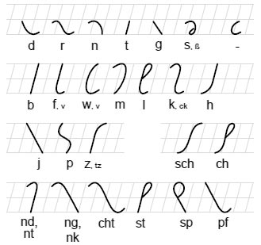  
Die Schreibrichtung der Konsonanten ist immer von oben nach unten)

Man kann die Zeichen anhand von Eigenschaften beschreiben:  
  
- Größe: halb- oder ganzstufig  
- Lage: gerade oder rechtsschräg  
- oben: rund, spitz, Schleife oder gewölbt  
- unten: rund, spitz, Schleife oder gewölbt  
  
Mit diesen Eigenschaften ist jeder der 25 Konsonanten und Zeichen zu beschreiben.  
  
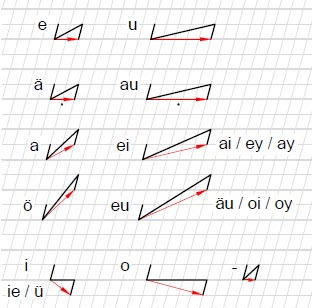 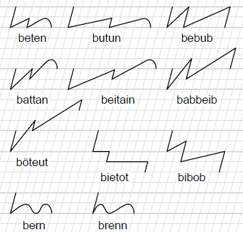  
  
Die Vocale werden lediglich durch die Verbindung und Position der Konsonanten (oben im Beispiel "t") definiert:  
  
- Verbindungsweite:
	- weit, halbweit oder eng  
- Stellung:
	- Grundstellung, Tiefstellung, Hochstellung oder (Doppelthochstellung?)  
	  
In der Übersicht mit den roten Pfeilen sind die Vocalverbindungen zwischen zwei halbstufigen Zeichen (Stiefo-Konsonant für "t") dargestellt.  
  
Ich fange mit einfachen Wörtern an, deren Zeichen wir schon kennen.  
  
folgende Zeichen sind uns schon bekannt:  

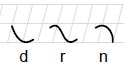  
d, r, n aus denen das Wort "deren" besteht.  

Das e wird durch die halbweite Verbindung zwischen den Konsonanten definiert.  

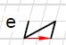  
Hier handelt es sich um das Konsonantzeichen "t", hier steht also "tet"
  

---

### Größen, Abstände und richtige Darstellung der Zeichen und Verbindungen  
  
- Die Kästchen von denen ich rede sind die Kästchen in dem Stiefo-Raster.
- Wer auf karriertes Papier zeichnet, muss die Kästchen halbieren. 
- Wenn ich von einem Kästchen auf dem Stiefo-Raster rede (Stiefo-Kästchen), entspricht es (ca.) einem halben Kästchen auf einem karriertem Papier.  
  
- Die Konsonanten d, r, n, g, p, sp beanspruchen immer ein ganzes Stiefo-Kästchen. Gemessen wird von der obersten bis zur untersten Kante.  
- Die Konsonanten j, ng, cht, pf beanspruchen immer zwei ganzes Stiefo-Kästchen.  
- Alle anderen Konsonanten (t, s, b, f, w, m, l, k, h, z, sch, ch, nd, st) beanspruchen keinen zusätzlichen Platz.  
  
Eine halbweite Verbindung beansprucht zwei Stiefo-Kästchen. Wenn die Ober- oder Unterkante des Konsonantes rund ist, folgt die Verbindung fließend. Bei dem Wort "den" fließt also die Rundheit mit in die Verbindung und sieht aus wie eien Welle.  
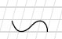  
  
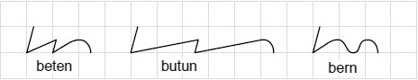  
Übertragung auf einem Karriertem Blatt. So sollte es aussehen.  
  
In der Übersicht der Konsonanten sind die Enden immer überzeichnet. Das heißt, sie scheinen mehr Platz als ein Stiefo-Kästchen ein zu nehmen. Dies dient aber nur zur verdeutlichung der Eigenschaften des Zeichens, so ist eindeutig zu erkennen, dass es z.B. oben rund ist.  
  
Das überzeichnen macht man auch am Wort Anfang und Ende, um die Wiedererkennbarkeit zu unterstützen.  
  
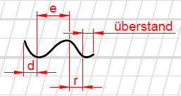  
  
Innerhalb eines Wortes werden die Überstände, die z.B. durch die Rundung entstehen würden, mit zur Verbindung gezählt.  
Beim bemessen der Verbindungen werden also die Überstände mit einbezogen.  

---

## Übung 1.1 

Übersetze folgende Wörter: 

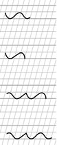  

## Übung 1.2  

Folgende Wörter ohne die Hilfslinien:  

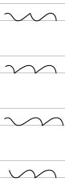  
  
Das letzte Wort kann sowohl  
  
denen,  
dehnen als auch  
Dänen  
  
bedeuten. Dies lässt sich nur, aber sehr einfach, durch den Zusammenhang erschließen.  
  
Allerdings darf man als Hilfe einen Punkt unter der Verbindung setzen damit es eindeutig als ä erkannt wird. Dies wird in Laufe der Zeit aber nicht mehr notwendig sein.  
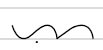  
Dänen  
  

---

  
Die ersten beiden Regeln besagen:  
  
- Schreibe exakt!  
- Schreibe aussprachegemäß  
  
Ersteres sollte selbsterkärend sein. Bei den Übungen geht es nicht um Geschwindigkeit, sondern um exaktheit. Jede Eigenschaft, die oben beschrieben ist muss eindeutig erkennbar sein.  
  
Aussprachegemäß werden verschluckte Buchstaben nicht aufgeführt. So wird auch nicht von Groß- und Kleinschreibung unterschieden:  
  
Stief = stif  
Wehmut = wemut  
kommen = komen  
Saal = sal  
Team = tim  
Cinema = zinema  
Cool = kul  
Qualität = kwalität  
Vogel = fogel  
Volvo = wolwo  
Text = tekst  
Sylt = sült  
Yacht = jacht  
  
Spätestens jetzt sollte die Frage beantwortet sein, warum es kein Zeichen für c, q, v, x, y gibt.  
Dehnungslaute wie h, e bei ie entfallen.  
Doppelkonsonanten werden einfach geschrieben.  
  
  
  
Versuche folgende Wörter auf ein karriertes Papier (oder Drucke [diese Vorlage](https://www.dropbox.com/s/nbks4wzwtogfocn/Stiefo-Blanko-Blatt.pdf?dl=1) aus) in Stiefo zu schreiben. Ein Kästchen auf Karopapier entspricht zwei Kästchen auf dem Rautepapier.  

### Übung 1.3  

Räder  
nennen  
Dänen  
derer  
nähren  
Renner  

Die Konsonanten n, r und d beanspruchen in der Breite ein ganzes Stiefo-Kästchen (ein Halbes Karokästchen), die halbweite Verbindung des e ist zwei Stiefo-Kästchen lang. Die Verbindung zweier Konsonanten ohne Vocal dazwischen ist ein Stiefo-Kästchen lang:  
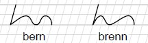  
  

---

  
Wir lernen zwei weitere Konsonanten:  
  
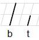  

### Übung 2.1  

übersetze folgende Wörter:  
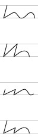  

Bei zwei Konsonanten, ohne ein Vocal dazwischen, wird eine kurze Verbindung gewählt:  
  
  
### Übung 2.2  

Schreibe folgende Wörter in Stiefo:  
Beter  
Reben  
Bert  
derb  
Beeren  

Sehen wir uns zwei weitere Verbindungen, also Vocale an: 

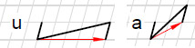  
  
Das u wird also durch eine weite Verbindung dargestellt.  
Das a wird durch eine halbweiten Verbindung aber durch eine Hochstellung des zu verbindenden Konsonants dargestellt.  
  
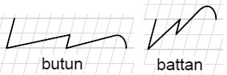  
  
Wichtig:  
==Die Stellung wird immer an den Fußpunkten bemessen. Der Winkel der Verbindungslinie kann sich durch die Größe des Zeichens ändern und bietet somit keine Orientierung. Achte also auf die Lage der Fußpunkte. Im den Beispielen sind diese durch einen roten Pfeil gekennzeichnet.  
Im folgenden Beispiel ist diese "Problematik" zu erkennen:==  

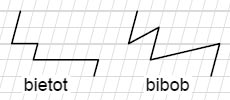  

### Übung 3.1  

übersetze folgende Wörter:  

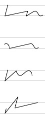  

### Übung 3.2

Schreibe folgende Wörter in Stiefo. Die weite Verbindung ist auf einem karrierten Blatt zweieinhalb Kästchen lang.  
Tube  
Bart  
bunt  
Tuba  

  
Die weite Verbindung kann auch "au" bedeuten. Um dies kenntlich zu machen, kann man für den Anfang (genau wie bei ä und e) einen Punkt darunter setzen:  
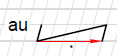  
  

---

  
Und nun noch zwei Konsonante:  
  
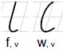  

### Übung 4.1  

übersetze folgende Wörter:  
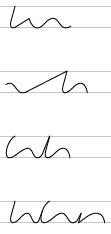  

### Übung 4.2 

Schreibe folgende Wörter in Stiefo:  
fuhren  
rufen  
Waffe  
verweht  

Für die Cracks unter euch, den das hier alles zu einfach ist hab ich hier eine Extraufgabe:  
  
### Übung 5.1  

Übersetze dieses Wort: 

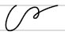  

  
Zuguter Letzt möchte ich noch eine Konsonantenfolge vorstellen:  
  
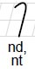  
  
das häufige nd oder nt wäre mit einer engen Verbindung nicht sehr schreibflüssig. Aus diesem Grund wurde dieses Zeichen sowie weitere Zeichen für Konsonantenfolgen erstellt.  

### Übung 6.1
  
übersetze folgende Wörter: 

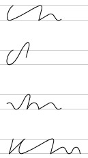  

### Übung 6.2  

Schreibe folgende Wörter in Stiefo:  
  
Fund  
wenden  
rannten  
Bänder  
  
## Von Kästchen auf Linien:  
  
Irgendwann möchtet ihr auf Linien oder sogar Blanko wechseln um die Notizen zu machen. Das lernen auf Kästchen ist sehr gut, damit sich die Abstände in das Nevernsystem einbrennen. Es sollte imm wieder mal geübt werden.
  
Beim Umsteigen neigt man gerne dazu die Weiten und Größen anzugleichen. Hier gilt die Devise:  
  
### Lieber übertreiben als untertreiben!  
  
Die Verwechslungsgefahr sollte unter allen Umständen vermieden werden! Wählt also bei "weit" besonders weit und bei "kurz" noch kürzer. Schreibt die ganzstufigen Zeichen lieber größer und die halbstufigen kleiner. Kontrolliert es immer wieder!

## Alpherbetische Übersicht der Konsonanten: 

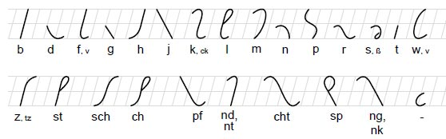  
  
## Strukturelle Übersicht der Konsonanten: 

  
  
## Vocale:

