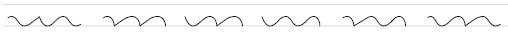
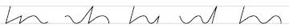
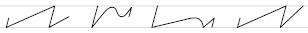
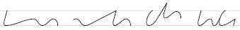
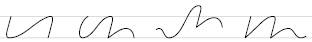

1.1 der, den reden, Reder/Räder  
1.2 reden, nennen, rennen, denen/dehnen/Dänen  
1.3  
  
  
2.1 Beeren/Bären, Beben, Täter, beten/Betten  
2.2  
  
  
3.1 Butter, nur, baden, tabu  
3.2  
  
  
4.1 Feder, rufen, werben/Verben, Verwerten  
4.2  
  
  
5.1 Vase  
  
6.1 Wunder, Wand, Rentner, Bewundern  
6.2  
