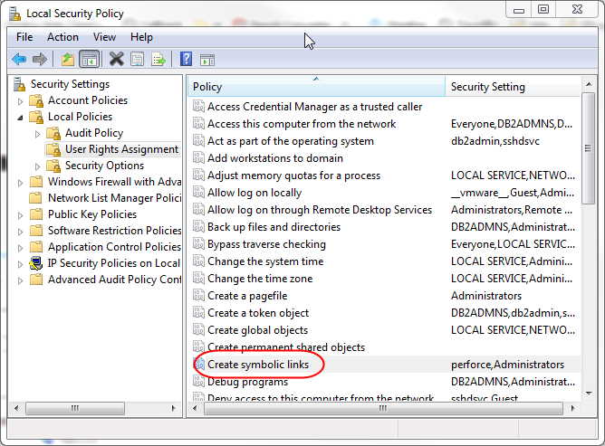
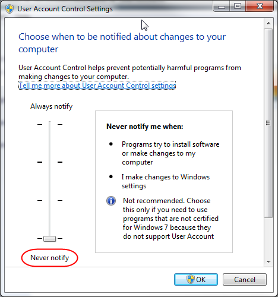
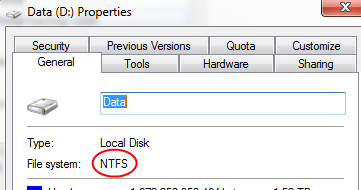

The user must be given the "Create Symbolic Links" privilege or be in a group that has been given that privilege.  
  
If User Account Control (UAC) is **on**, any user with the "Create Symbolic Links" privilege that is not in the Administrators group can simply create a symbolic link.       UAC is normally on.    
  
For users within the Administrators group and with UAC **on**, the user must "Run as Administrator".   For example, right click on your P4V icon (or in the Start menu) and choose "Run as Administrator".   For command line clients, you need to start your command console with "Run as Administrator".     This is normal behavior for Windows - see the "Access Token Changes" section in the msdn article [Windows Vista Application Development Requirements for User Account Control Compatibility](http://msdn.microsoft.com/en-us/library/bb530410.aspx).  
  
If UAC is **off**, any user with the "Create Symbolic Links" privilege can create a symbolic link.   An administrator does not have to "Run as Administrator".

### Create Symbolic Links Privilege

This setting is defined by within your Local Security Policies for User Rights Assignment, Security Setting for Create symbolic links.   Open Control Panel->Administrative Tools and open Local Security Policy. From there, open Local Policies->User Rights Assignment.  
  
  
  
By default, the "Administrators" group has this privilege.   For users not in the Administrators group, add the user.  
  
To refresh Group Policy settings, including security settings, run

gpupdate /force

###   
User Account Control Setting

Microsoft recommends having UAC on.  
  
This setting is found by Control Panel->User Accounts, then click "Change User Account Control settings".   "Never notify" means UAC is off, otherwise it's on.  
  
  
 

### NTFS Filesystem

Viewing the properties of your drive from Windows Explorer will display your file system type.  
